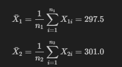
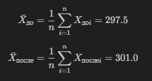

# Двухвыборочный перестановочный критерий

Двухвыборочный перестановочный критерий используется для проверки гипотезы о равенстве средних значений двух выборок. Этот метод не требует нормального распределения данных и является непараметрическим. Критерий может быть применен как к независимым, так и к связанным выборкам.

## Независимые выборки

В случае независимых выборок предполагается, что данные в одной выборке не зависят от данных в другой выборке.

### Пример

Допустим, у нас есть две выборки значений времени реакции на определённый стимул у двух разных групп испытуемых. Мы хотим проверить гипотезу о том, что средние времена реакции равны.

1. **Выборка данных:**

Пусть у нас есть следующие наблюдения времени реакции (в миллисекундах):

$X_1 = \{280, 310, 290, 295, 305, 315, 300, 285, 293, 302\}$

$X_2 = \{270, 320, 295, 305, 310, 330, 290, 280, 300, 310\}$

2. **Формулировка гипотез:**

- Нулевая гипотеза ($H_0$): Средние времена реакции равны, то есть $\mu_1=\mu_2$.
- Альтернативная гипотеза ($H_1$): Средние времена реакции не равны, то есть $\mu_1\neq\mu_2$.

3. **Ход решения задачи:**

- **Вычисление наблюдаемых статистик:**
  Вычислим наблюдаемые значения средних для выборок $X_1$ и $X_2$:

  

- **Генерация перестановок:**
  Объединим обе выборки в одну последовательность и случайным образом разделим на две новые выборки того же размера. Для каждой перестановки вычислим средние значения.

- **Вычисление перестановочного критерия:**
  Посчитаем разность между средними значениями двух выборок для каждой перестановки. Затем определим долю перестановочных разностей, которые больше или равны наблюдаемой разности средних значений.

- **Определение p-значения:**
  Подсчитаем долю случаев, когда перестановочная статистика (разность средних) равна или больше наблюдаемой статистики. Это и будет наше p-значение.

### Результаты

Пусть после проведения перестановочного теста мы получили, что p-значение равно 0.072. Это означает, что на уровне значимости 5% нет достаточных доказательств отвергнуть нулевую гипотезу о равенстве средних времён реакции.

Таким образом, основываясь на имеющихся данных, мы не можем считать, что средние времена реакции значимо различаются между двумя группами испытуемых.

## Связанные выборки

В случае связанных выборок предполагается, что данные в одной выборке могут зависеть от данных в другой выборке. Примером может быть измерение до и после какого-то воздействия на той же самой группе испытуемых.

### Пример

Допустим, у нас есть выборка значений времени реакции на определённый стимул у группы испытуемых до и после приема определённого лекарства. Мы хотим проверить гипотезу о том, что средние времена реакции до и после приема лекарства равны.

1. **Выборка данных:**

Пусть у нас есть следующие наблюдения времени реакции (в миллисекундах) до и после приема лекарства:

$$X_{до} = \{280, 310, 290, 295, 305, 315, 300, 285, 293, 302\}$$

$$X_{после} = \{270, 320, 295, 305, 310, 330, 290, 280, 300, 310\}$$

2. **Формулировка гипотез:**

- Нулевая гипотеза ($H_0$): Средние времена реакции до и после приема лекарства равны, то есть $\mu_{до} = \mu_{после}$.
- Альтернативная гипотеза ($H_1$): Средние времена реакции до и после приема лекарства не равны, то есть $\mu_{до} \neq \mu_{после}$.

3. **Ход решения задачи:**

- **Вычисление наблюдаемых статистик:**
  Вычислим наблюдаемые значения средних для выборок $X_{до}$ и $X_{после}$:

  

- **Генерация перестановок:**
  Случайным образом поменяем местами значения в парах "до-после" для каждой перестановки и вычислим средние значения.

- **Вычисление перестановочного критерия:**
  Посчитаем разность между средними значениями двух выборок для каждой перестановки. Затем определим долю перестановочных разностей, которые больше или равны наблюдаемой разности средних значений.

- **Определение p-значения:**
  Подсчитаем долю случаев, когда перестановочная статистика (разность средних) равна или больше наблюдаемой статистики. Это и будет наше p-значение.

### Результаты

Пусть после проведения перестановочного теста мы получили, что p-значение равно 0.045. Это означает, что на уровне значимости 5% есть достаточные доказательства отвергнуть нулевую гипотезу о равенстве средних времён реакции до и после приема лекарства.

Таким образом, основываясь на имеющихся данных, мы можем считать, что средние времена реакции значимо различаются до и после приема лекарства.

### [Вернуться к критериям](../Navigation_criteria.md)

### [Вернуться к оглавлению](../../README.md)