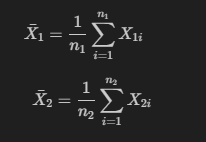

# Критерий Аспина-Уэлша

Критерий Аспина-Уэлша (Aspin-Welch test), также известный как t-критерий Уэлша, используется для сравнения средних значений двух независимых выборок, когда дисперсии выборок не равны. Этот тест является модификацией классического t-теста Стьюдента, который предполагает равенство дисперсий.

## Формулировка задачи

- **Нулевая гипотеза ($H_0$)**: Средние значения двух групп равны ($\mu_1 = \mu_2$).
- **Альтернативная гипотеза ($H_1$)**: Средние значения двух групп не равны ($\mu_1 \neq \mu_2$).

## Формулы

Для проведения критерия Аспина-Уэлша необходимо вычислить несколько величин.

1. **Средние значения выборок**:



где $X_{1i}$ и $X_{2i}$ — наблюдения в выборках 1 и 2 соответственно, $n_1$ и $n_2$ — размер выборок.

2. **Дисперсии выборок**:

$$S_1^2 = \frac{1}{n_1 - 1} \sum_{i=1}^{n_1} (X_{1i} - \bar{X}_1)^2$$ 

$$\quad S_2^2 = \frac{1}{n_2 - 1} \sum_{i=1}^{n_2} (X_{2i} - \bar{X}_2)^2$$

3. **Статистика теста**:

$$
t = \frac{\bar{X}_1 - \bar{X}_2}{\sqrt{\frac{S_1^2}{n_1} + \frac{S_2^2}{n_2}}}
$$

4. **Степени свободы**:

$$
df = \frac{\left( \frac{S_1^2}{n_1} + \frac{S_2^2}{n_2} \right)^2}{\frac{\left( \frac{S_1^2}{n_1} \right)^2}{n_1 - 1} + \frac{\left( \frac{S_2^2}{n_2} \right)^2}{n_2 - 1}}
$$

#### Процедура теста

1. Рассчитайте средние значения и дисперсии для обеих выборок.
2. Вычислите t-статистику с использованием формулы.
3. Найдите степени свободы.
4. Определите критическое значение t из таблицы распределения Стьюдента для заданного уровня значимости и вычисленных степеней свободы.
5. Сравните вычисленное значение t с критическим значением, чтобы принять или отвергнуть нулевую гипотезу.

#### Пример реализации на Python

```python
import numpy as np
import scipy.stats as stats

# Данные
group1 = np.array([85, 87, 90, 91, 89, 95, 92, 88])
group2 = np.array([78, 80, 79, 77, 76, 75, 74, 73])

# Размеры выборок
n1 = len(group1)
n2 = len(group2)

# Средние значения выборок
mean1 = np.mean(group1)
mean2 = np.mean(group2)

# Дисперсии выборок
var1 = np.var(group1, ddof=1)
var2 = np.var(group2, ddof=1)

# Статистика теста
t_stat = (mean1 - mean2) / np.sqrt(var1/n1 + var2/n2)

# Степени свободы
df = (var1/n1 + var2/n2)**2 / ((var1/n1)**2/(n1-1) + (var2/n2)**2/(n2-1))

# Критическое значение для двухстороннего теста
alpha = 0.05
t_critical = stats.t.ppf(1 - alpha/2, df)

# p-значение
p_value = (1 - stats.t.cdf(np.abs(t_stat), df)) * 2

# Вывод результатов
print("Среднее значение группы 1:", mean1)
print("Среднее значение группы 2:", mean2)
print("Дисперсия группы 1:", var1)
print("Дисперсия группы 2:", var2)
print("Статистика t:", t_stat)
print("Степени свободы:", df)
print("Критическое значение t:", t_critical)
print("p-значение:", p_value)

if np.abs(t_stat) > t_critical:
    print("Отвергаем нулевую гипотезу. Средние значения двух групп различаются.")
else:
    print("Не отвергаем нулевую гипотезу. Нет статистически значимых различий между средними значениями двух групп.")
```

### [Вернуться к критериям](../Navigation_criteria.md)

### [Вернуться к оглавлению](../../README.md)