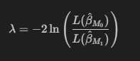

# Критерий отношения правдоподобия

Критерий отношения правдоподобия (likelihood ratio test) — это статистический тест, который используется для сравнения статистических моделей, проверки значимости параметров или выбора наилучшей модели на основе максимального правдоподобия.

## Принцип работы критерия:

1. **Правдоподобие моделей:**
   - Для каждой модели вычисляется функция правдоподобия $L(\theta)$, где $\theta$ — вектор параметров модели.

2. **Статистика отношения правдоподобия:**
   - Статистика отношения правдоподобия $\lambda$ вычисляется как отношение максимального значения функции правдоподобия между двумя моделями:
     
   

3. **Распределение статистики:**
   - При справедливости нулевой гипотезы (что более сложная модель $M_1$ не значимо лучше простой модели $M_0$) статистика $\lambda$ асимптотически имеет распределение Хи-квадрат с числом степеней свободы, равным разнице в числе параметров между моделями.

4. **Принятие решения:**
   - Сравнивается полученное значение статистики $\lambda$ с критическим значением из распределения Хи-квадрат для заданного уровня значимости. Если $\lambda$ превышает критическое значение, то нулевая гипотеза отвергается в пользу альтернативы.

## Пример использования критерия отношения правдоподобия:

Предположим, у нас есть две модели линейной регрессии:
- Простая модель $M_0$: $Y = \beta_0 + \beta_1 X + \varepsilon$
- Сложная модель $M_1$: $Y = \beta_0 + \beta_1 X + \beta_2 X^2 + \varepsilon$

Мы хотим проверить, является ли модель $M_1$ значимо лучше модели $M_0$ на основе критерия отношения правдоподобия.

### Вычисление статистики отношения правдоподобия:

Пусть $\lambda$ — статистика отношения правдоподобия, которая вычисляется как:

где $L(\hat{\beta})$ — максимальное значение функции правдоподобия для оценок $\hat{\beta}$.

Если $\lambda$ превышает критическое значение из распределения Хи-квадрат с числом степеней свободы, равным разнице в числе параметров между моделями, то мы можем отвергнуть нулевую гипотезу о том, что добавление параметра $\beta_2$ не улучшает модель.

### [Вернуться к критериям](../Navigation_criteria.md)

### [Вернуться к оглавлению](../../README.md)