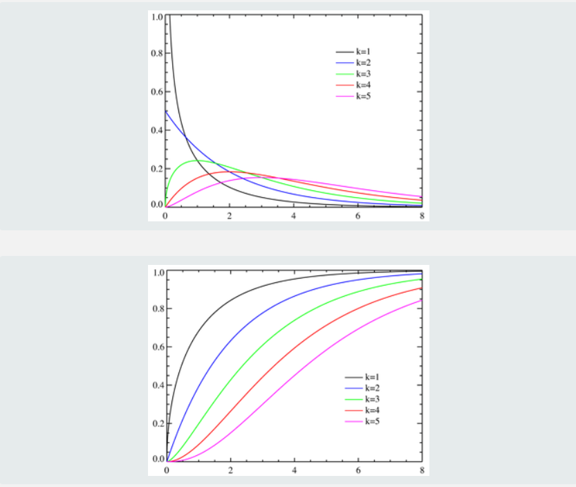

# Критерий Хи-квадрат (критерий Пирсона):

Критерий хи-квадрат — любая статистическая проверка гипотезы, в которой выборочное распределение критерия имеет распределение хи-квадрат при условии верности нулевой гипотезы. Считается, что критерий хи-квадрат — это критерий, который асимптотически верен, то есть, выборочное распределение можно сделать как угодно близким к распределению хи-квадрат путём увеличения размера выборки.

Понятие критерия хи-квадрат общее. В него входят разные методы. Но критерий Пирсона – самый популярный из них, поэтому названия иногда используют как синонимы. Критерий Пирсона помогает проверять гипотезы с помощью таблиц сопряженности, которые уже существуют и рассчитаны для многих распространенных ситуаций. Поэтому его удобно использовать.

## Когда применяют критерий 

Критерий хи-квадрат используют, когда нужно определить наличие или отсутствие связи между двумя категориальными переменными — такими, которые могут принимать ограниченное количество уникальных значений. Категориальные переменные обычно не имеют числовых значений: например, цвет волос или любимое блюдо. Еще употребляют фразу «переменные, распределенные по номинальной шкале» – это означает примерно то же.

Например, исследование может пытаться установить, есть ли связь между образованием и доходом, или между полом и предпочтениями в музыке. В обоих случаях переменные категориальные – значит, критерий хи-квадрат использовать можно.

Есть еще несколько правил:

- С самого начала нужно отобрать правильные показатели – такие, которые вероятнее окажутся наглядными и репрезентативными. Они должны быть качественными и целочисленными, категориальными.
- Группы, которые сравниваются между собой, должны быть независимы друг от друга. Например, для сравнения одной и той же группы «до» и «после» какой-то манипуляции критерий не подойдет.
- Количество наблюдений для точных результатов – не менее 20 (иногда считается, что не менее 50).
- Ожидаемая частота – то, сколько раз значение теоретически должно появиться в выборке – должна быть больше или равна 5-10 для критерия Пирсона. Если она меньше, понадобится критерий Фишера.

## Как выглядит распределение хи-квадрат

В критерии хи-квадрат используют определенное распределение – то, как распределяются показатели из выборки на графике. Распределение хи-квадрат описывается как «распределение суммы квадратов n независимых стандартных нормальных случайных величин». На практике это означает вот что:

Если реальные показатели распределяются по хи-квадрату – значит, наблюдаемые величины независимы друг от друга.

Первая картинка — это плотность распределения (вероятность получить в выборке каждое из чисел на горизонтальной оси), вторая — интегральная функция распределения (вероятность получить значение меньше, чем на горизонтальной оси).

### [Вернуться к критериям](../Navigation_criteria.md)

### [Вернуться к оглавлению](../../README.md)