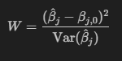

# Критерий Вальда

Критерий Вальда (Wald test) используется для проверки значимости параметров в моделях, таких как регрессионные модели. Он основан на оценках параметров модели и их стандартных ошибках.

## Формулировка критерия Вальда:

Предположим, у нас есть регрессионная модель:

$$Y = X\beta + \varepsilon$$

где:
- $Y$ — зависимая переменная,
- $X$ — матрица объясняющих переменных,
- $\beta$ — вектор параметров модели,
- $\varepsilon$ — случайная ошибка.

Критерий Вальда используется для проверки значимости отдельного параметра $\beta_j$. Статистика критерия Вальда $W$ вычисляется по формуле:

где:
- $\hat{\beta}_j$ — оценка параметра $\beta_j$,
- $\beta_{j,0}$ — нулевая гипотеза для параметра $\beta_j$,
- $\mathrm{Var}(\hat{\beta}_j)$ — дисперсия (или стандартная ошибка) оценки $\hat{\beta}_j$.

## Пример использования критерия Вальда:

Предположим, что мы оценили модель линейной регрессии, и хотим проверить значимость коэффициента наклона $\beta_1$, который соответствует переменной "возраст" (Age). После оценки модели, получим оценку $\hat{\beta}_1$ и её стандартную ошибку $\mathrm{SE}(\hat{\beta}_1)$. Тогда статистика критерия Вальда для проверки значимости параметра $\beta_1$ будет выглядеть так:

$$W = \left( \frac{\hat{\beta}_1}{\mathrm{SE}(\hat{\beta}_1)} \right)^2$$

Если $W$ превышает критическое значение из распределения Хи-квадрат для заданного уровня значимости, то мы можем отвергнуть нулевую гипотезу о незначимости параметра $\beta_1$.

Критерий Вальда позволяет оценивать важность отдельных параметров в моделях и является ключевым инструментом в статистическом анализе данных.

### [Вернуться к критериям](../Navigation_criteria.md)

### [Вернуться к оглавлению](../../README.md)