# Ответы на вопросы по теории

1. [Описание и оценки случайных величин. Характеристики распределений.](#1-описание-и-оценки-случайных-величин-характеристики-распределений)
2. [Нормальное распределение. Стандартное и с параметрами μ, σ. Определение, функция распределения и свойства](#2-нормальное-распределение-стандартное-и-с-параметрами-μ-σ-определение-функция-распределения-и-свойства)
3. [Распределение Бернулли. Биномиальное распределение. Распределение Пуассона.Определение, свойства, моменты.](#3-распределение-бернулли-биномиальное-распределение-распределение-пуассонаопределение-свойства-моменты)
4. [Статистика и оценки центральной тенденции.](#4-статистика-и-оценки-центральной-тенденции)
5. [Точечные оценки. Метод максимума правдоподобия. (САД-Практика (с теорией)-Статистические оценки параметров распределения)](#5-точечные-оценки-метод-максимума-правдоподобия)
6. [Квантили и построение доверительных интервалов. (слайды + САД-Практика (с теорией)-Статистические оценки параметров распределения)](#6-квантили-и-построение-доверительных-интервалов)
7. [Доверительные интервалы. Интервальные оценки с помощью квантилей. Правило двух сигм. Предсказательный интервал. Отличия предсказательного и доверительного интервалов](#7-доверительные-интервалы-интервальные-оценки-с-помощью-квантилей-правило-двух-сигм-предсказательный-интервал-отличия-предсказательного-и-доверительного-интервалов)
8. [Распределения, производные от нормального: хи-квадрат, Стьюдента, Фишера. Определение, свойства, связь с другими распределениями.](#8-распределения-производные-от-нормального-хи-квадрат-стьюдента-фишера-определение-свойства-связь-с-другими-распределениями)
9. [Построение доверительных интервалов для среднего. z-интервал. t-интервал](#9-построение-доверительных-интервалов-для-среднего-z-интервал-t-интервал)
10. [Построение доверительных интервалов для доли.](#10-построение-доверительных-интервалов-для-доли)
11. [Построение доверительных интервалов для двух долей](#11-построение-доверительных-интервалов-для-двух-долей)
12. [Бутстреп и бутстреповский доверительный интервал. (слайды 51-56)](#12-бутстреп-и-бутстреповский-доверительный-интервал)
13. [Проверка параметрических гипотез - общие обозначения. Виды задач. (слайды + САД-Практика-Задачи к практике Проверка статистических гипотез)](#13-проверка-параметрических-гипотез---общие-обозначения-виды-задач)
14. [Z-критерий. Условия для проведения проверки. Пример.(слайды)](#14-z-критерий-условия-для-проведения-проверки-пример)
15. [Критерий хи-квадрат. Условия для проведения проверки. Пример.](#15-критерий-хи-квадрат-условия-для-проведения-проверки-пример)
16. [t-критерий Стьюдента. Условия для проведения проверки. Пример.](#16-t-критерий-стьюдента-условия-для-проведения-проверки-пример)
17. [F-критерий Фишера. Условия для проведения проверки. Пример.](#17-f-критерий-фишера-условия-для-проведения-проверки-пример)
18. [Боксплот. Коэффициент ассиметрии и эксцесса. Критерий Шапиро-Уилка.](#18-боксплот-коэффициент-ассиметрии-и-эксцесса-критерий-шапиро-уилка)
19. [Критерий Харке-Бера. Критерии, основанные на эмпирической функции распределения.](#19-критерий-харке-бера-критерии-основанные-на-эмпирической-функции-распределения)
20. [Проверка непараметрических гипотез. Виды задач и варианты двухвыборочных гипотез.](#20-проверка-непараметрических-гипотез-виды-задач-и-варианты-двухвыборочных-гипотез)
21. [Биномиальный критерий. Параметры. Условия для проведения проверки. Пример.](#21-биномиальный-критерий-параметры-условия-для-проведения-проверки-пример)
22. Одновыборочный критерий знаков. Параметры. Условия для проведения проверки. Пример.
23. Двухвыборочный критерий знаков. Параметры. Условия для проведения проверки. Пример.

## [Вернуться](Navigation_exam.md)

## 1. Описание и оценки случайных величин. Характеристики распределений

### Описание случайных величин

Вероятность случайного события - доля испытаний, завершившихся наступлением события, в бесконечном эксперименте. Вероятность изменяется от 0 до 1. 

Случайные величины являются более обобщенным понятием случайного события. Случайные величины могут быть дискретными или непрерывными. Дискретная случайная величина может принимать только определенные значения с определенной вероятностью.

Дискретная случайная величина 𝑋 принимает счётное множество значений 𝐴= {𝑎1, 𝑎2, ..., 𝑎n} с вероятностями 𝑝1, 𝑝2,...,𝑝n

$\sum_i p_1=1$

𝑓𝑋(𝑎𝑖) = P(𝑋=𝑎𝑖) = 𝑝𝑖— **функция вероятности**. 

Для описания как дискретных, так и непрерывных случайных величин используется **функция распределения вероятности**. Пусть Х - случайная величина и х - ее любое значение. Функция распределения вероятности определяется следующим образом:

$$ F_X(x)=\mathbf{P}(X \leqslant x)$$

Примеры функций распределения вероятности:

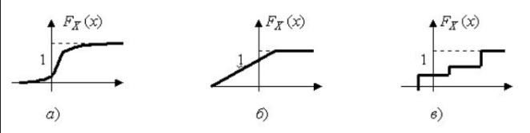

Функция распределения вероятности не всегда удобна для расчетов. Часто удобнее использовать не саму функцию $F_X(x)$, а ее производную. Она называется **плотностью распределения вероятности**.

Физический смысл $f(x)$ состоит в том, что произведение $f(x)dx$ представляет вероятность попадания случайной величины $Х$ в интервал от $х$ до $х+dx$ , т.е.

$$ f(x)dx=\mathbf{P}(x \leqslant X \leqslant x+dx)$$

### Оценки случайных величин

Оценка случайной величины — это численное значение, которое приближенно характеризует ту или иную характеристику случайной величины на основе выборки данных. Основными оценками случайных величин являются:

1. **Выборочное среднее**
2. **Выборочная дисперсия**
3. **Выборочная медиана**
4. **Выборочный интерквартильный размах**

#### 1. Выборочное среднее

Выборочное среднее ($\overline{X}$) оценивает математическое ожидание случайной величины. Оно вычисляется как сумма всех значений выборки, деленная на размер выборки:

$$
\overline{X} = \frac{1}{n} \sum_{i=1}^{n} X_i
$$

где $X_i$ — значения выборки, $n$ — размер выборки.

#### 2. Выборочная дисперсия

Выборочная дисперсия ($s^2$) оценивает разброс данных вокруг выборочного среднего и является оценкой дисперсии случайной величины. Она вычисляется как среднее квадратическое отклонение значений выборки от выборочного среднего:

$$
s^2 = \frac{1}{n-1} \sum_{i=1}^{n} (X_i - \overline{X})^2
$$

где $X_i$ — значения выборки, $\overline{X}$ — выборочное среднее, $n$ — размер выборки.

#### 3. Выборочная медиана

Выборочная медиана — это значение, которое делит упорядоченную выборку на две равные части. Для нечетного размера выборки медиана — это центральное значение, для четного размера — среднее значение двух центральных значений.

#### 4. Выборочный интерквартильный размах

Выборочный интерквартильный размах (IQR) оценивает разброс данных, исключая крайние 25% значений. Он определяется как разница между третьим квартилем ($Q3$) и первым квартилем ($Q1$):

$$
\text{IQR} = Q3 - Q1
$$

- **Первый квартиль ($Q1$)** — это значение, ниже которого находится 25% наблюдений.
- **Третий квартиль ($Q3$)** — это значение, ниже которого находится 75% наблюдений.

### Характеристики распределений

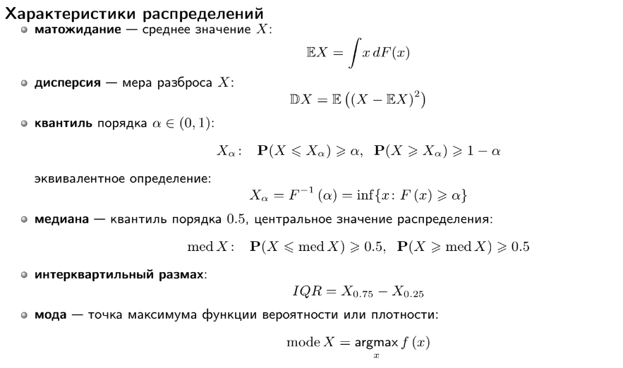

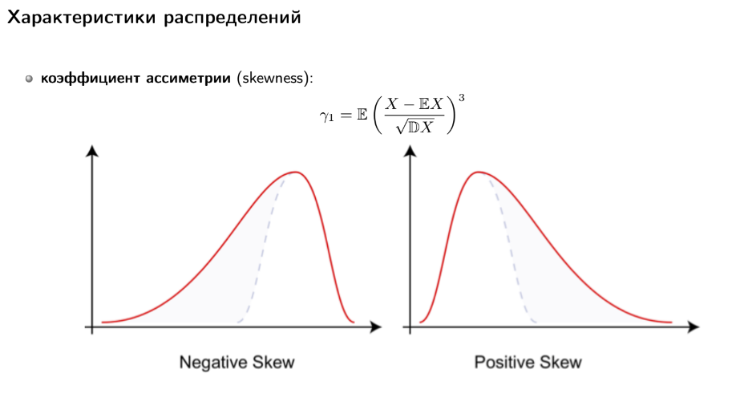

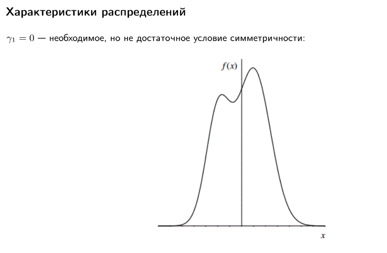

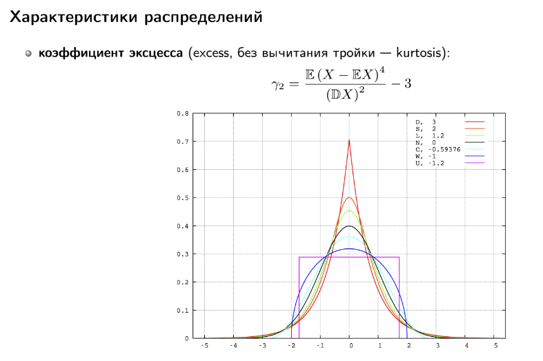

#### Математическое ожидание

Математическое ожидание $E(X)$ случайной величины $X$ — это взвешенная сумма всех возможных значений этой случайной величины, где веса соответствуют вероятностям этих значений.

Для дискретной случайной величины $X$, которая принимает значения $x_1, x_2, ..., x_n$ с вероятностями $p_1, p_2, ..., p_n$, математическое ожидание определяется как:

$$ E(X) = \sum_{i=1}^n x_i p_i $$

Для непрерывной случайной величины $X$ с плотностью вероятности $f_X(x)$, математическое ожидание определяется как:

$$ E(X) = \int_{-\infty}^\infty x f_X(x) \, dx $$

#### Дисперсия

Дисперсия $\mathrm{D}(X)$ случайной величины $X$ — это математическое ожидание квадрата отклонения случайной величины от её математического ожидания.

Для дискретной случайной величины $X$, которая принимает значения $x_1, x_2, \ldots, x_n$ с вероятностями $p_1, p_2, \ldots, p_n$, дисперсия определяется как:

$$
\mathrm{D}(X) = E[(X - E(X))^2] = \sum_{i=1}^n (x_i - E(X))^2 p_i
$$

Для непрерывной случайной величины $X$ с плотностью вероятности $f_X(x)$:

$$
\mathrm{D}(X) = E[(X - E(X))^2] = \int_{-\infty}^{\infty} (x - E(X))^2 f_X(x) \, dx
$$

#### Квантиль и медиана

Квантиль порядка $p$ случайной величины $X$ — это значение $x_p $, такое что вероятность того, что $X$ меньше или равно $x_p $, равна $p$. 

Иными словами, квантиль порядка $p$ — это значение $x_p$, удовлетворяющее следующему условию:

$$
P(X \leq x_p) = p
$$

где $0 < p < 1$.

**Медиана** — квантиль порядка $p = 0.5$: $x_{0.5}$
    Медиана делит распределение случайной величины на две равные части.

#### Интерквартильный размах

Интерквартильный размах определяется как разница между третьим квартилем ($Q_\text{0,75}$) и первым квартилем ($Q_\text{0,25}$):

$$
\text{IQR} = Q_\text{0,75} - Q_\text{0,25}
$$

- **Первый квартиль ($Q_\text{0,25}$)** — это значение, ниже которого находится 25% наблюдений.
- **Третий квартиль ($Q_\text{0,75}$)** — это значение, ниже которого находится 75% наблюдений.

#### Мода

Пусть $X = \{x_1, x_2, \ldots, x_n\}$ — выборка данных. Модой набора данных $X$ называется значение $x_m$, такое что количество элементов в $X$, равных $x_m$, максимально. Формально:

$$
\text{Mode}(X) = \{x_i \mid \forall x_j \neq x_i, \, f(x_i) \geq f(x_j) \}
$$

где $f(x)$ — функция частоты (число вхождений $x$ в набор данных $X$).

#### Коэффициент асимметрии

Коэффициент асимметрии (или коэффициент скошенности) используется для описания степени асимметрии распределения данных относительно его среднего значения. Формула коэффициента асимметрии следующая:

$$\gamma_1 = \frac{\mu_3}{\sigma^3}$$

где $\mu_3$ — третий центральный момент, а $\sigma$ — стандартное отклонение.

Третий центральный момент вычисляется как:

$$\mu_3 = \mathbb {E} \left[(X-\mathbb {E} X)^{3}\right]$$

А стандартное отклонение:
$$\sigma ={\sqrt {\mathrm {D} [X]}}$$

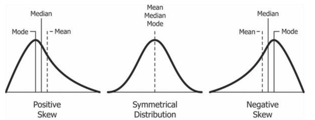

#### Коэффициент эксцесса

Коэффициент эксцесса (или куртозис) измеряет степень пиковости распределения данных. Он вычисляется по следующей формуле:

$$\gamma_2 = \frac{\mu_4}{\sigma^4} - 3$$

где $\mu_4$ — четвертый центральный момент, а $\sigma$ — стандартное отклонение.

Четвертый центральный момент вычисляется как:

$$\mu_4 = \mathbb {E} \left[(X-\mathbb {E} X)^{4}\right]$$

[Вернуться к вопросам](#ответы-на-вопросы-по-теории)

## 2. Нормальное распределение. Стандартное и с параметрами μ, σ. Определение, функция распределения и свойства

Нормальное распределение, также называемое распределением Гаусса или Гаусса — Лапласа — непрерывное распределение вероятностей с пиком в центре и симметричными боковыми сторонами, которое в одномерном случае задаётся функцией плотности вероятности, совпадающей с функцией Гаусса:

$$f(x)={\frac {1}{\sigma {\sqrt {2\pi }}}}e^{-{\frac {1}{2}}\left({\frac {x-\mu }{\sigma }}\right)^{2}}$$

где параметр 𝜇 — математическое ожидание (среднее значение), медиана и мода распределения, а параметр 
𝜎 — среднеквадратическое отклонение, $\sigma ^{2}$ — дисперсия распределения.

### Определение стандартного нормального распределения

Стандартным нормальным распределением называется нормальное распределение с математическим ожиданием $\mu =0$ и стандартным отклонением $\sigma =1$.

### Определение нормального распределения с параметрами μ, σ

Каждое нормальное распределение — это вариант стандартного нормального распределения, область значений которого растягивается множителем $\sigma$ (стандартное отклонение) и переносится на 𝜇 (математическое ожидание):

$$f(x\mid \mu ,\sigma ^{2})={\frac {1}{\sigma }}\varphi \left({\frac {x-\mu }{\sigma }}\right),$$
где 𝜇, 𝜎 являются параметрами нормального распределения. Плотность вероятности должна нормироваться 
${\frac {1}{\sigma }}$, так что интеграл равен 1.

### Функция распределения

Функция распределения стандартного нормального распределения (нормальное интегральное распределение) обычно обозначается заглавной греческой буквой $\Phi$ (фи), ещё называется функцией Лапласа и представляет собой интеграл:
$$\Phi (x)={\frac {1}{\sqrt {2\pi }}}\int \limits _{-\infty }^{x}e^{-t^{2}/2}\,dt$$

### Свойства

#### Моменты
Если 𝑋 имеет нормальное распределение, то для неё существуют (конечные) моменты при всех 𝑝 с действительной частью больше −1. Для неотрицательных целых 𝑝 центральные моменты таковы:

$$\mathbb {E} \left[X^{p}\right]={\begin{cases}0&p=2n+1,\\\sigma ^{p}\,\left(p-1\right)!!&p=2n.\end{cases}}$$

#### Преобразование Фурье и характеристическая функция
Преобразование Фурье нормального распределения дает другую нормальную функцию, а характеристическая функция нормального распределения имеет вид $e^{it\mu - \frac{1}{2}t^2\sigma^2}$, где i - мнимая единица.

#### Бесконечная делимость
Нормальное распределение бесконечно делимо, что означает, что для любого положительного целого числа $n$ можно найти $n$ независимых идентично распределённых случайных величин, сумма которых имеет то же нормальное распределение.

#### Максимальная энтропия
Нормальное распределение имеет максимальную энтропию среди всех непрерывных распределений с заданными средним и дисперсией.

[Вернуться к вопросам](#ответы-на-вопросы-по-теории)

## 3. Распределение Бернулли. Биномиальное распределение. Распределение Пуассона.Определение, свойства, моменты.

### Распределение Бернулли

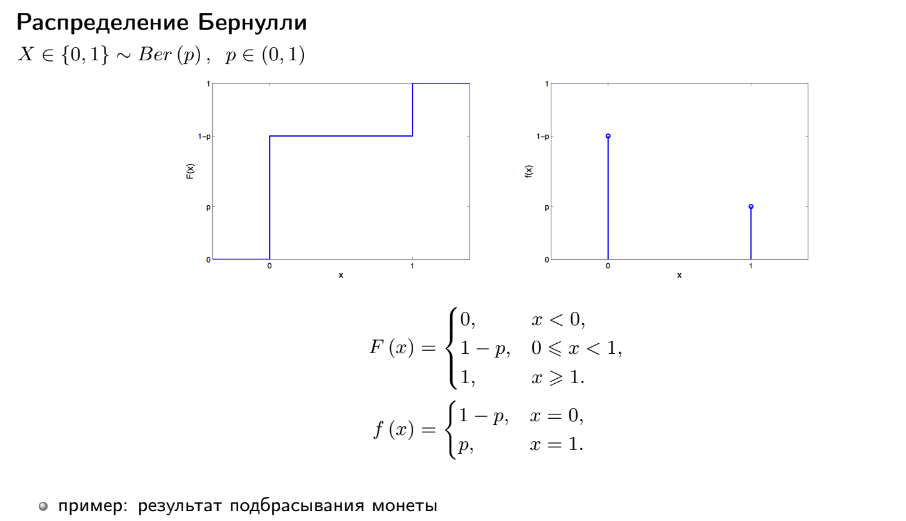

Распределе́ние Берну́лли  — дискретное распределение вероятностей, моделирующее случайный эксперимент произвольной природы, при заранее известной вероятности успеха или неудачи.

Случайная величина 
𝑋 имеет распределение Бернулли, если она принимает всего два значения: 1 и 0 с вероятностями 
𝑝 и $q\equiv 1-p$ соответственно. Таким образом:

$\mathbb {P} (X=1)=p$,

$\mathbb {P} (X=0)=q$.

**Свойства:**

Предельное свойство описывается теоремой Пуассона:

Пусть есть последовательность серий испытаний Бернулли, где 
$p_{n}$ — вероятность «успеха», 
$\mu _{n}$ — количество «успехов».

Тогда если

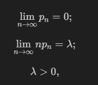

то 

$$\lim _{n\to \infty }P(\omega :\mu _{n}(\omega )=m)=e^{-\lambda }{\cfrac {\lambda ^{m}}{m!}}.$$

**Моменты распределения Бернулли**

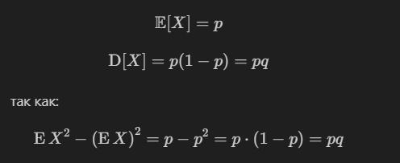

Вообще, легко видеть, что

$$\mathbb {E} \left[X^{n}\right]=\Pr(X=1)\cdot 1^{n}+\Pr(X=0)\cdot 0^{n}=p\cdot 1^{n}+q\cdot 0^{n}=p=\mathbb {E} [X],\forall n\in \mathbb {N}$$

### Биномиальное распределение

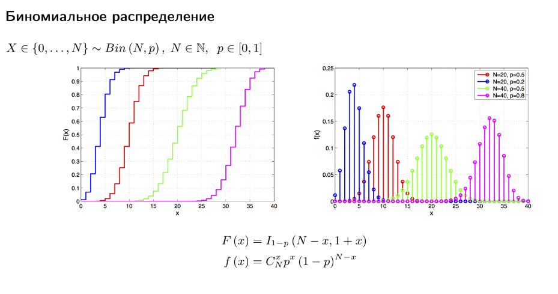

Биномиальное распределение — дискретное распределение вероятностей случайной величины $X$, принимающей целочисленные значения $k=0,1,\ldots,n$ с вероятностями:

$$P(X=k)={n \choose k}p^k(1-p)^{n-k}.$$

Данное распределение характеризуется двумя параметрами: целым числом n>0, называемым числом испытаний, и вещественным числом $p, 0\le p\le 1$, называемом вероятностью успеха в одном испытании. Биномиальное распределение — одно из основных распределений вероятностей, связанных с последовательностью независимых испытаний. Если проводится серия из $n$ независимых испытаний, в каждом из которых может произойти "успех" с вероятностью $p$, то случайная величина, равная числу успехов во всей серии, имеет указанное распределение. 

**Основные свойства и моменты**

Характеристическая функция: $\phi(t)=(1+p(e^{it}-1))^n.$

Моменты:

Математическое ожидание: $MX=np$.

Дисперсия: $DX=np(1-p)$.

Асимметрия: $\gamma_1=\frac{1-2p}{\sqrt{np(1-p)}}$; при $p=0.5$ распределение симметрично относительно центра $n/2$.

### Распределение Пуассона

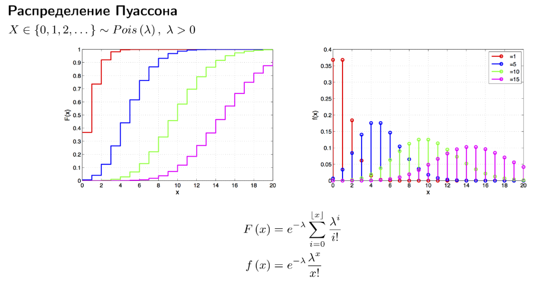

Распределе́ние Пуассо́на — распределение дискретного типа случайной величины, представляющей собой число событий, произошедших за фиксированное время, при условии, что данные события происходят с некоторой фиксированной средней интенсивностью и независимо друг от друга.

Выберем фиксированное число 
$\lambda >0$ и определим дискретное распределение, задаваемое следующей функцией вероятности:

$$p(k)\equiv \mathbb {P} (Y=k)={\frac {\lambda ^{k}}{k!}}\,e^{-\lambda }$$

где

𝑘 — количество событий,

𝜆 — математическое ожидание случайной величины (среднее количество событий за фиксированный промежуток времени),

𝑘! — обозначает факториал числа 𝑘,

$e=2{,}718281828\ldots$ — основание натурального логарифма.

**Моменты:**

Производящая функция моментов распределения Пуассона имеет вид:

$$E_{Y}(t)=e^{\lambda \left(e^{t}-1\right)}$$

откуда $\mathbb {M} [Y]=\lambda$, $\mathbb {D} [Y]=\lambda$.

Для момента 𝑘-го порядка справедлива общая формула:

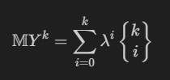

где $k=1,2,...$. 

**Свойства распределения Пуассона**

- Сумма независимых пуассоновских случайных величин с параметрами $\lambda_1, \lambda_2, \ldots, \lambda_n$ имеет распределение Пуассона с параметром $\lambda = \lambda_1 + \lambda_2 + \ldots + \lambda_n$.

- При $\lambda \to \infty$ распределение Пуассона с параметром $\lambda$ сходится к нормальному распределению $N(\lambda, \lambda)$ в соответствии с центральной предельной теоремой.

- Производящая функция распределения Пуассона с параметром $\lambda$ имеет вид $G(t) = e^{\lambda(t - 1)}$.

[Вернуться к вопросам](#ответы-на-вопросы-по-теории)

## 4. Статистика и оценки центральной тенденции.

### Статистика

**Статистика** — это любая измеримая функция выборки.

- Выборочное среднее

Выборочное среднее $\overline{X}$ для выборки размера $n$ вычисляется как:
$$\overline{X} = \frac{1}{n} \sum_{i=1}^{n} X_i$$
где $X_i$ — элементы выборки.

- Выборочная дисперсия

Выборочная дисперсия $S^2$ для выборки размера $n$ вычисляется как:
$$S^2 = \frac{1}{n-1} \sum_{i=1}^{n} (X_i - \overline{X})^2$$

**Вариационный ряд и ранг элемента выборки**

Вариационный ряд — это упорядоченный список элементов выборки.
Ранг элемента — это позиция элемента в упорядоченном вариационном ряду.

- k-я порядковая статистика

$k$-я порядковая статистика $X_{(k)}$ — это $k$-й по величине элемент в выборке после упорядочивания.

- Выборочный $\alpha$-квантиль

Выборочный $\alpha$-квантиль $Q_\alpha$ — это значение, которое делит упорядоченную выборку так, что доля элементов выборки, меньших $Q_\alpha$, равна $\alpha$.

- Выборочная медиана

Выборочная медиана $Q_{0.5}$ — это значение, которое делит упорядоченную выборку пополам.

- Выборочный интерквартильный размах

Выборочный интерквартильный размах $IQR$ — это разница между верхним и нижним квартилями выборки.

- Выборочный коэффициент ассиметрии

Выборочный коэффициент ассиметрии $g_1$ вычисляется как:
$$g_1 = \frac{\frac{1}{n} \sum_{i=1}^{n} (X_i - \overline{X})^3}{S^3}$$

- Выборочный коэффициент эксцесса

Выборочный коэффициент эксцесса $g_2$ вычисляется как:
$$g_2 = \frac{\frac{1}{n} \sum_{i=1}^{n} (X_i - \overline{X})^4}{S^4} - 3$$

### Оценки центральной тенденции

**Выборочное среднее**

Выборочное среднее $\overline{X}$ — среднее арифметическое элементов выборки.

**Выборочная медиана**

Выборочная медиана $Q_{0.5}$ — значение, разделяющее упорядоченную выборку на две равные части.

**Выборочная мода**

Выборочная мода — значение, которое встречается наиболее часто в выборке.

[Вернуться к вопросам](#ответы-на-вопросы-по-теории)

## 5. Точечные оценки. Метод максимума правдоподобия.

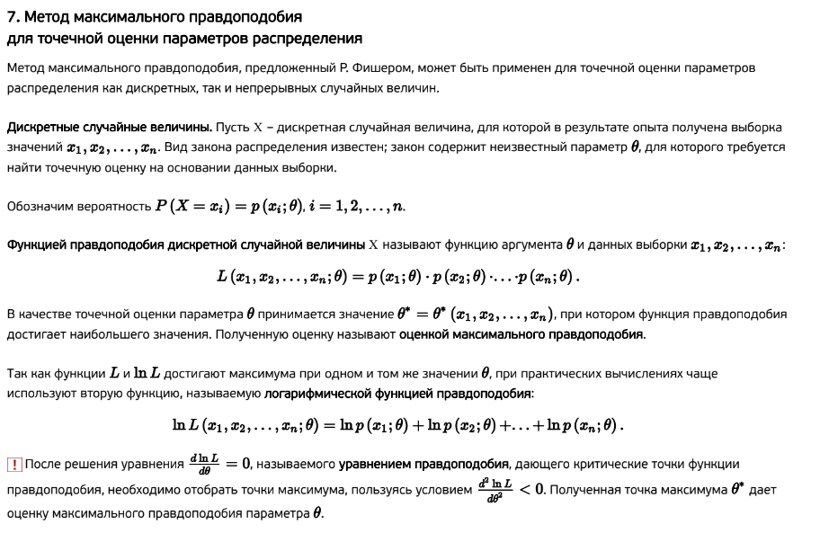

Из лекций:

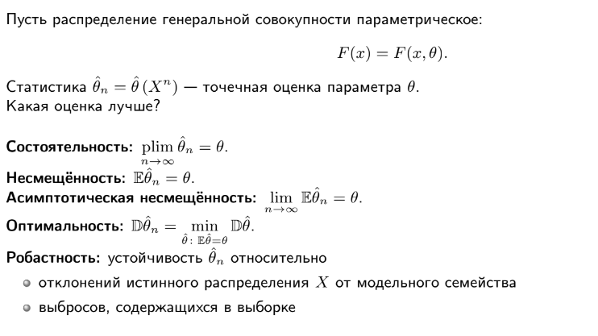

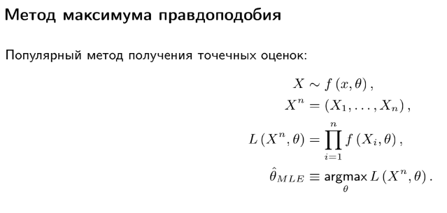

[Вернуться к вопросам](#ответы-на-вопросы-по-теории)

## 6. Квантили и построение доверительных интервалов.

### Квантили

**Квантили** — это значения, разделяющие упорядоченный набор данных на равные доли. Например, медиана является вторым квартилем (т.е. 50%-квантилью).

### Выборочный $\alpha$-квантиль
Выборочный $\alpha$-квантиль $Q_\alpha$ — это значение, которое делит упорядоченную выборку так, что доля элементов выборки, меньших $Q_\alpha$, равна $\alpha$.

### Построение доверительных интервалов

**Доверительный интервал** — это интервал, который оценивает неизвестный параметр генеральной совокупности на основе выборочных данных с заданной вероятностью.

#### Параметрический метод

Параметрический метод используется, когда предполагается известная форма распределения данных и известные параметры этого распределения. Например, если данные приближаются нормальным распределением, то используются формулы для построения доверительных интервалов на основе стандартного нормального распределения или распределения Стьюдента в зависимости от известности или неизвестности дисперсии.

**Пример**

Доверительный интервал для среднего с известной дисперсией:
  $$\left( \overline{X} - z_{\alpha/2} \frac{\sigma}{\sqrt{n}}, \; \overline{X} + z_{\alpha/2} \frac{\sigma}{\sqrt{n}} \right)$$
  
  где $\overline{X}$ — выборочное среднее, $\sigma$ — известное стандартное отклонение, $z_{\alpha/2}$ — квантиль стандартного нормального распределения.

#### Наивный метод

Наивный метод (или метод "по-быстрому") используется без предположений о распределении данных или их параметрах. Он основывается на статистической интуиции и может быть применен в ситуациях, когда нет точной информации о распределении или мало данных для более сложных методов.

**Пример:**

Доверительный интервал для доли:
  $$\left( \hat{p} - z_{\alpha/2} \sqrt{\frac{\hat{p}(1 - \hat{p})}{n}}, \; \hat{p} + z_{\alpha/2} \sqrt{\frac{\hat{p}(1 - \hat{p})}{n}} \right)$$

  где $\hat{p}$ — выборочная доля, $z_{\alpha/2}$ — квантиль стандартного нормального распределения.

#### Бутстрэп

Бутстрэп — это метод, который позволяет оценить распределение выборочной статистики путем повторного выбора элементов из исходной выборки с возвращением. Этот метод особенно полезен, когда данные сложно распределены или необходимо оценить нестандартные статистики.

**Пример:**

Процесс бутстрэпа:
  1. Сгенерировать много подвыборок (бутстреп-выборок) из исходной выборки.
  2. Для каждой бутстреп-выборки вычислить интересующую статистику (например, среднее, медиану, долю и т.д.).
  3. Построить распределение статистики на основе бутстреп-выборок и вычислить доверительный интервал, например, через квантили полученного распределения.

Бутстрэп позволяет оценить доверительные интервалы для статистик даже в случае сложных данных или нестандартных распределений, где параметрические методы могут быть неприменимы.

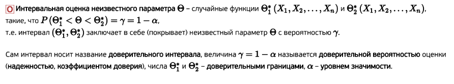

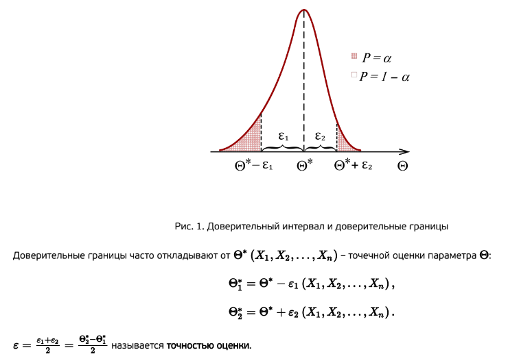

[Вернуться к вопросам](#ответы-на-вопросы-по-теории)

## 7. Доверительные интервалы. Интервальные оценки с помощью квантилей. Правило двух сигм. Предсказательный интервал. Отличия предсказательного и доверительного интервалов.

### Доверительные интервалы

**Определение**

Доверительный интервал — это интервал значений, который с заданной вероятностью содержит истинное значение параметра генеральной совокупности. Он используется для оценки неизвестных параметров на основе выборочных данных.

### Интервальные оценки с помощью квантилей

**Определение**

Интервальные оценки с помощью квантилей используются для оценки диапазона значений параметра с заданной вероятностью.

**Пример использования**

Интервальная оценка с использованием квантилей может быть построена для среднего значения, медианы или других параметров на основе выборочных данных и соответствующих квантилей распределений.

### Правило двух сигм

Правило двух сигм основано на нормальном распределении данных и гласит, что примерно 95% всех наблюдений лежат в интервале, равном двум стандартным отклонениям в обе стороны от выборочного среднего.

### Предсказательный интервал

Предсказательный интервал используется для оценки диапазона значений будущего наблюдения или значения случайной величины с учетом неопределенности в данных или модели.

### Отличия предсказательного и доверительного интервалов
**Суть различия**

**Доверительный интервал** оценивает параметры генеральной совокупности с заданной вероятностью.

**Предсказательный интервал** оценивает будущие наблюдения или значения с учетом неопределенности в данных или модели.

[Вернуться к вопросам](#ответы-на-вопросы-по-теории)

## 8. Распределения, производные от нормального: хи-квадрат, Стьюдента, Фишера. Определение, свойства, связь с другими распределениями.

### Хи-квадрат распределение

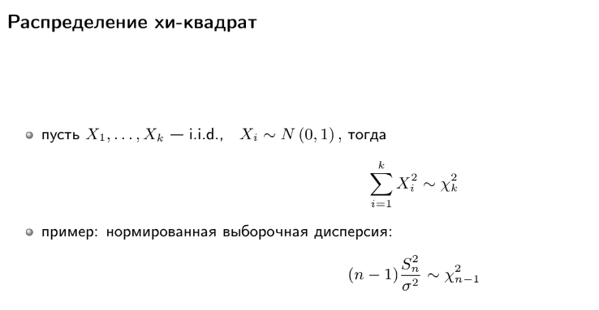

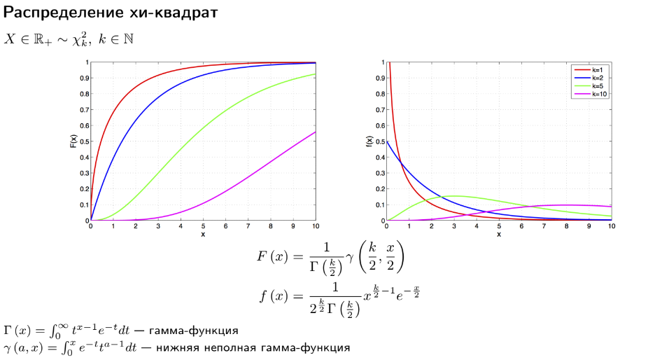

Пусть $z_{1},\ldots ,z_{k}$ — совместно независимые стандартные нормальные случайные величины, то есть: 

$$ z_{i}\sim N(0,1).$$ 

Тогда случайная величина $x=z_{1}^{2}+\ldots +z_{k}^{2}$ имеет распределение хи-квадрат с 𝑘 степенями свободы, то есть

$$x\sim f_{\chi ^{2}(k)}(x),$$ 

или, если записать по-другому:

$$x=\sum \limits _{i=1}^{k}z_{i}^{2}\sim \chi ^{2}(k).$$

#### Свойства хи-квадрат распределения

- Распределение хи-квадрат устойчиво относительно суммирования

Если $X_1, X_2, \ldots, X_k$ являются независимыми случайными величинами, распределенными по стандартному нормальному закону ($N(0, 1)$), то сумма их квадратов имеет хи-квадрат распределение с $k$ степенями свободы:

$$Y = \sum_{i=1}^k X_i^2 \sim \chi^2(k)$$

- Моменты хи-квадрат распределения

Из определения легко получить моменты хи-квадрат распределения. Если $Y \sim \chi^2(k)$, то математическое ожидание:
  $E[Y] = k$, дисперсия:
  $\text{D}[Y] = 2k$

- Приближение нормальным распределением

В силу центральной предельной теоремы, при большом числе степеней свободы $k$ распределение хи-квадрат $\chi^2(k)$ можно приблизить нормальным распределением:

$$Y \approx N(k, 2k)$$

#### Связь с другими распределениями
Хи-квадрат распределение связано с другими распределениями:
- **Нормальное распределение**: Если $X \sim N(0, 1)$, то $X^2 \sim \chi^2(1)$.
- **Распределение Стьюдента**: Если $X \sim N(0, 1)$ и $Y \sim \chi^2(k)$, то $T = \frac{X}{\sqrt{Y/k}} \sim t(k)$ (распределение Стьюдента с $k$ степенями свободы).
- **F-распределение**: Если $X_1 \sim \chi^2(n)$ и $X_2 \sim \chi^2(m)$ независимы, то $\frac{X_1/n}{X_2/m} \sim F(n, m)$ (F-распределение с $n$ и $m$ степенями свободы).

### Распределение Стьюдента

Пусть $Y_{0},Y_{1},\ldots ,Y_{n}$ — независимые стандартные нормальные случайные величины, такие что $Y_{i}\sim {\mathcal {N}}(0,1),\;i=0,\ldots ,n$. Тогда распределение случайной величины 𝑡, где

$$t={\frac {Y_{0}}{\sqrt {{\frac {1}{n}}\sum \limits _{i=1}^{n}Y_{i}^{2}}}},$$

называется распределением Стьюдента с 𝑛 степенями свободы $t\sim \mathrm {t} (n).$

#### Свойства

- Распределение Стьюдента симметрично
- Существуют только моменты порядка $k<n$, и не существуют моменты порядка $k\geq n$. При этом все существующие моменты нечетного порядка равны нулю.
- Математическое ожидание $\mathbb {E} [t]=0$, если $n>1$.
- Дисперсия $\mathrm {D} [t]={n \over n-2}$, если $n>2$.

#### Связь с другими распределениями

**Нормальное распределение**

Если $X \sim N(0, 1)$ и $Y \sim \chi^2(k)$, где $X$ и $Y$ независимы, то случайная величина

$$T = \frac{X}{\sqrt{Y/k}} \sim t(k)$$

где $t(k)$ — распределение Стьюдента с $k$ степенями свободы.

**Хи-квадрат распределение**

Если $X \sim N(0, 1)$ и $Y \sim \chi^2(k)$, тогда $T = \frac{X}{\sqrt{Y/k}}$ имеет распределение Стьюдента с $k$ степенями свободы.

**F-распределение**

Если $T_1 \sim t(n_1)$ и $T_2 \sim t(n_2)$, то отношение квадратов этих величин имеет F-распределение:

$$\frac{T_1^2}{T_2^2} \sim F(n_1, n_2)$$

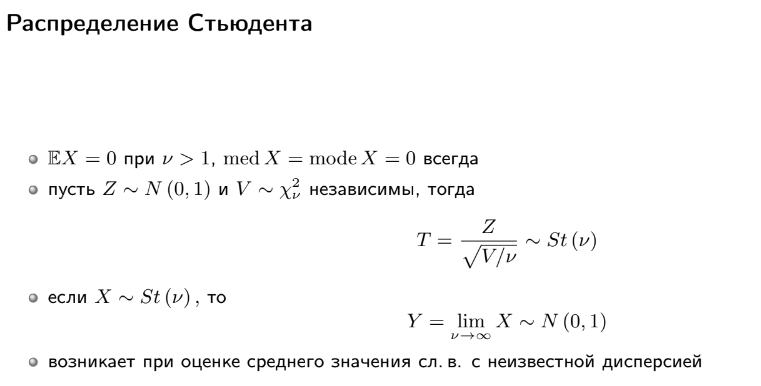

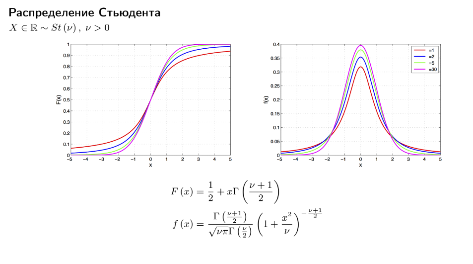

### Распределение Фишера

Пусть $Y_{1},Y_{2}$ — две независимые случайные величины, имеющие распределение хи-квадрат: 

$$Y_{i}\sim \chi ^{2}(d_{i}),$$

где $d_{i}\in \mathbb {N} ,\;i=1,2$. Тогда распределение случайной величины

$$F={\frac {Y_{1}/d_{1}}{Y_{2}/d_{2}}}$$ 

называется распределением Фишера со степенями свободы $d_{1}$ и $d_{2}$. Пишут 
$F\sim \mathrm {F} (d_{1},d_{2})$.

#### Свойства

- Если $F\sim \mathrm {F} (d_{1},d_{2})$, то ${\frac {1}{F}}\sim \mathrm {F} (d_{2},d_{1})$.
- Распределение Фишера сходится к единице.

#### Связь с другими распределениями

**Хи-квадрат распределение**

Распределение Фишера связано с хи-квадрат распределением следующим образом:
- Если $X_1 \sim \chi^2(n_1)$ и $X_2 \sim \chi^2(n_2)$, где $X_1$ и $X_2$ независимы, то случайная величина
  $F = \frac{(X_1/n_1)}{(X_2/n_2)} \sim F(n_1, n_2)$
  где $F(n_1, n_2)$ — F-распределение с $n_1$ и $n_2$ степенями свободы.

**Нормальное распределение**

Распределение Фишера можно вывести из нормальных распределений:
- Если $X_1, X_2, \ldots, X_{n_1} \sim N(0, 1)$ и $Y_1, Y_2, \ldots, Y_{n_2} \sim N(0, 1)$ независимы, то 
  $\frac{\left(\sum_{i=1}^{n_1} X_i^2/n_1\right)}{\left(\sum_{i=1}^{n_2} Y_i^2/n_2\right)} \sim F(n_1, n_2)$

**t-распределение (Стьюдента)**

Распределение Фишера связано с распределением Стьюдента следующим образом:
- Если $T \sim t(n)$, то $T^2$ имеет F-распределение с $1$ и $n$ степенями свободы:
  $T^2 \sim F(1, n)$

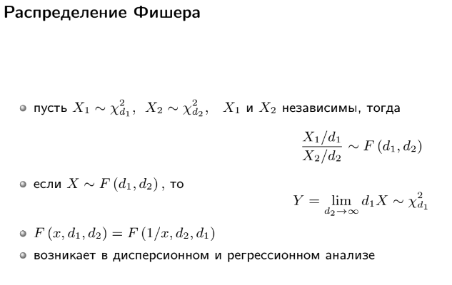

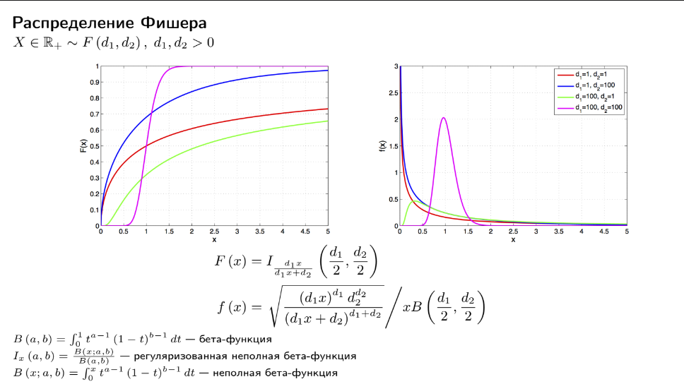

[Вернуться к вопросам](#ответы-на-вопросы-по-теории)

## 9. Построение доверительных интервалов для среднего. z-интервал. t-интервал

### Построение доверительных интервалов для среднего

Построение доверительных интервалов для среднего состоит в нахождении интервала значений, в котором с определенной степенью уверенности (обычно 95% или 99%) находится истинное среднее значение генеральной совокупности. Этот процесс включает несколько шагов в зависимости от того, известна ли дисперсия генеральной совокупности и от размера выборки. 

### z-интервал

z-интервал используется для построения доверительного интервала для среднего, когда известна дисперсия генеральной совокупности и размер выборки достаточно большой (обычно $n > 30$).

#### Формула
Если $X_1, X_2, \ldots, X_n$ — выборка из нормального распределения с известной дисперсией $\sigma^2$, то доверительный интервал для среднего $\mu$ с уровнем доверия $(1 - \alpha)$ вычисляется по формуле:

$$\left( \overline{X} - z_{\alpha/2} \frac{\sigma}{\sqrt{n}}, \; \overline{X} + z_{\alpha/2} \frac{\sigma}{\sqrt{n}} \right)$$

- $\overline{X}$ — выборочное среднее,
- $\sigma$ — известное стандартное отклонение,
- $n$ — размер выборки,
- $z_{\alpha/2}$ — квантиль стандартного нормального распределения уровня $1 - \frac{\alpha}{2}$.

#### Пример
Пусть $\overline{X} = 100$, $\sigma = 15$, $n = 50$, и уровень доверия $95\%$ ($\alpha = 0.05$):

$$z_{0.025} \approx 1.96$$

$$\left( 100 - 1.96 \cdot \frac{15}{\sqrt{50}}, \; 100 + 1.96 \cdot \frac{15}{\sqrt{50}} \right)$$

$$\left( 100 - 4.15, \; 100 + 4.15 \right)$$

$$\left( 95.85, \; 104.15 \right)$$

### t-интервал

t-интервал используется для построения доверительного интервала для среднего, когда дисперсия генеральной совокупности неизвестна и размер выборки малый (обычно $n \leq 30$).

#### Формула
Если $X_1, X_2, \ldots, X_n$ — выборка из нормального распределения с неизвестной дисперсией, то доверительный интервал для среднего $\mu$ с уровнем доверия $(1 - \alpha)$ вычисляется по формуле:

$$ \left( \overline{X} - t_{\alpha/2, n-1} \frac{S}{\sqrt{n}}, \; \overline{X} + t_{\alpha/2, n-1} \frac{S}{\sqrt{n}} \right) $$

- $\overline{X}$ — выборочное среднее,
- $S$ — выборочное стандартное отклонение,
- $n$ — размер выборки,
- $t_{\alpha/2, n-1}$ — квантиль распределения Стьюдента с $n-1$ степенями свободы.

#### Пример
Пусть $\overline{X} = 100$, $S = 15$, $n = 20$, и уровень доверия $95\%$ ($\alpha = 0.05$):

$$t_{0.025, 19} \approx 2.093$$

$$\left( 100 - 2.093 \cdot \frac{15}{\sqrt{20}}, \; 100 + 2.093 \cdot \frac{15}{\sqrt{20}} \right)$$

$$\left( 100 - 7.01, \; 100 + 7.01 \right)$$

$$\left( 92.99, \; 107.01 \right)$$

[Вернуться к вопросам](#ответы-на-вопросы-по-теории)

## 10. Построение доверительных интервалов для доли.

Построение доверительного интервала для доли используется для оценки истинной доли (пропорции) в генеральной совокупности на основе выборочных данных. Доверительный интервал дает диапазон значений, в котором с заданной вероятностью находится истинная доля.

### Формула

Если $p$ — выборочная доля, $n$ — размер выборки, и $z_{\alpha/2}$ — квантиль стандартного нормального распределения уровня $1 - \frac{\alpha}{2}$, то доверительный интервал для истинной доли $P$ с уровнем доверия $(1 - \alpha)$ вычисляется по формуле:

$$\left( p - z_{\alpha/2} \sqrt{\frac{p(1 - p)}{n}}, \; p + z_{\alpha/2} \sqrt{\frac{p(1 - p)}{n}} \right)$$

где:
- $p = \frac{x}{n}$ — выборочная доля (отношение числа успехов $x$ к общему числу наблюдений $n$),
- $z_{\alpha/2}$ — квантиль стандартного нормального распределения уровня $1 - \frac{\alpha}{2}$.

### Пример
Пусть $x = 120$ — число успехов, $n = 200$ — размер выборки, и уровень доверия $95\%$ ($\alpha = 0.05$):

- Выборочная доля:

  $$p = \frac{120}{200} = 0.60$$

- Квантиль стандартного нормального распределения:

  $$z_{0.025} \approx 1.96$$

- Доверительный интервал:

  $$\left( 0.60 - 1.96 \sqrt{\frac{0.60 \cdot (1 - 0.60)}{200}}, \; 0.60 + 1.96 \sqrt{\frac{0.60 \cdot (1 - 0.60)}{200}} \right)$$

  $$\left( 0.60 - 1.96 \sqrt{\frac{0.24}{200}}, \; 0.60 + 1.96 \sqrt{\frac{0.24}{200}} \right)$$

  $$\left( 0.60 - 1.96 \sqrt{0.0012}, \; 0.60 + 1.96 \sqrt{0.0012} \right)$$

  $$\left( 0.60 - 1.96 \cdot 0.0346, \; 0.60 + 1.96 \cdot 0.0346 \right)$$

  $$\left( 0.60 - 0.0678, \; 0.60 + 0.0678 \right)$$

  $$\left( 0.5322, \; 0.6678 \right)$$

Таким образом, с уровнем доверия $95\%$ истинная доля находится в интервале от $0.5322$ до $0.6678$.

## Условия применения
- Размер выборки должен быть достаточно большим, чтобы центральная предельная теорема была применима (обычно $np \geq 5$ и $n(1 - p) \geq 5$).
- Выборка должна быть случайной и независимой.

[Вернуться к вопросам](#ответы-на-вопросы-по-теории)

## 11. Построение доверительных интервалов для двух долей

Построение доверительного интервала для разности двух долей используется для оценки разности между двумя пропорциями (долями) в двух независимых выборках. Доверительный интервал дает диапазон значений, в котором с заданной вероятностью находится истинная разность долей.

### Формула
Пусть $p_1$ и $p_2$ — выборочные доли из двух независимых выборок размером $n_1$ и $n_2$ соответственно, и $z_{\alpha/2}$ — квантиль стандартного нормального распределения уровня $1 - \frac{\alpha}{2}$. Тогда доверительный интервал для разности истинных долей $P_1 - P_2$ с уровнем доверия $(1 - \alpha)$ вычисляется по формуле:

$$\left( (p_1 - p_2) - z_{\alpha/2} \sqrt{\frac{p_1(1 - p_1)}{n_1} + \frac{p_2(1 - p_2)}{n_2}}, \; (p_1 - p_2) + z_{\alpha/2} \sqrt{\frac{p_1(1 - p_1)}{n_1} + \frac{p_2(1 - p_2)}{n_2}} \right)$$

где:
- $p_1 = \frac{x_1}{n_1}$ — выборочная доля первой выборки (отношение числа успехов $x_1$ к общему числу наблюдений $n_1$),
- $p_2 = \frac{x_2}{n_2}$ — выборочная доля второй выборки (отношение числа успехов $x_2$ к общему числу наблюдений $n_2$),
- $z_{\alpha/2}$ — квантиль стандартного нормального распределения уровня $1 - \frac{\alpha}{2}$.

### Пример
Пусть $x_1 = 120$ — число успехов в первой выборке размером $n_1 = 200$, $x_2 = 150$ — число успехов во второй выборке размером $n_2 = 250$, и уровень доверия $95\%$ ($\alpha = 0.05$):
- Выборочная доля первой выборки:

  $$p_1 = \frac{120}{200} = 0.60$$

- Выборочная доля второй выборки:

  $$p_2 = \frac{150}{250} = 0.60$$

- Квантиль стандартного нормального распределения:

  $$z_{0.025} \approx 1.96$$

- Доверительный интервал:

  $$\left( (0.60 - 0.60) - 1.96 \sqrt{\frac{0.60(1 - 0.60)}{200} + \frac{0.60(1 - 0.60)}{250}}, \; (0.60 - 0.60) + 1.96 \sqrt{\frac{0.60(1 - 0.60)}{200} + \frac{0.60(1 - 0.60)}{250}} \right)$$

  $$\left( 0 - 1.96 \sqrt{\frac{0.24}{200} + \frac{0.24}{250}}, \; 0 + 1.96 \sqrt{\frac{0.24}{200} + \frac{0.24}{250}} \right)$$

  $$\left( 0 - 1.96 \sqrt{0.0012 + 0.00096}, \; 0 + 1.96 \sqrt{0.0012 + 0.00096} \right)$$

  $$\left( 0 - 1.96 \sqrt{0.00216}, \; 0 + 1.96 \sqrt{0.00216} \right)$$

  $$\left( 0 - 1.96 \cdot 0.0465, \; 0 + 1.96 \cdot 0.0465 \right)$$

  $$\left( -0.0911, \; 0.0911 \right)$$

Таким образом, с уровнем доверия $95\%$ истинная разность долей находится в интервале от $-0.0911$ до $0.0911$.

### Условия применения
- Размер выборок должен быть достаточно большим, чтобы центральная предельная теорема была применима (обычно $n_1 p_1 \geq 5$, $n_1 (1 - p_1) \geq 5$, $n_2 p_2 \geq 5$, и $n_2 (1 - p_2) \geq 5$).
- Выборки должны быть случайными и независимыми.

[Вернуться к вопросам](#ответы-на-вопросы-по-теории)

## 12. Бутстреп и бутстреповский доверительный интервал.

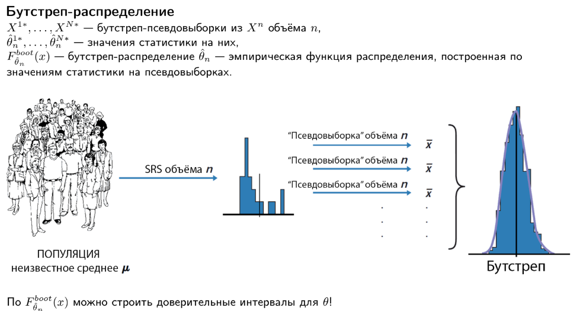

## Бутстреп и бутстреповский доверительный интервал

Бутстреп (bootstrap) — это метод, который используется для оценки распределения выборочной статистики путём многократного извлечения выборок из исходной выборки с возвращением. Он позволяет оценивать стандартные ошибки и доверительные интервалы для различных статистик без необходимости предполагать конкретное распределение исходной генеральной совокупности.

### Принцип работы бутстрепа:

1. **Исходная выборка**: Представляет собой набор данных, доступных для анализа.

2. **Ресемплирование с замещением**: Из исходной выборки случайным образом выбираются выборки того же размера, что и исходная, с замещением (то есть одни и те же элементы могут попасть в бутстрепную выборку несколько раз).

3. **Вычисление статистики интереса**: На каждой бутстрепной выборке вычисляется статистика интереса (например, среднее значение, медиана, стандартное отклонение и т.д.).

4. **Формирование распределения**: Собираются значения статистики интереса из множества бутстрепных выборок.

5. **Оценка доверительного интервала**: На основе полученного распределения вычисляются квантили для получения доверительного интервала заданного уровня.

### Преимущества бутстрепа:

- **Непараметрический метод**: Не требует предположений о форме распределения исходной генеральной совокупности.
- **Универсальность**: Может быть применён для оценки практически любой статистики, включая квантили, корреляции, регрессионные коэффициенты и другие.
- **Робастность**: Обычно дает хорошие результаты даже при наличии небольших выборок или выбросов.

### Пример бутстреповского доверительного интервала:

Предположим, что у нас есть выборка размера $n$, и мы хотим построить 95%-й бутстреповский доверительный интервал для среднего значения. Мы бы ресемплировали выборки из исходной выборки, вычисляли бы среднее значение на каждой бутстрепной выборке и затем находили бы 2.5% и 97.5% квантили полученного распределения для получения доверительного интервала.

[Вернуться к вопросам](#ответы-на-вопросы-по-теории)

## 13. Проверка параметрических гипотез - общие обозначения. Виды задач.

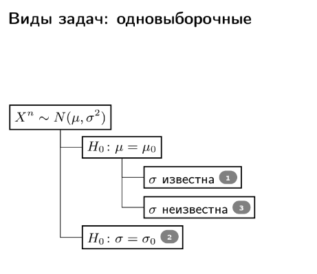

[Вернуться к вопросам](#ответы-на-вопросы-по-теории)

## 14. Z-критерий. Условия для проведения проверки. Пример.

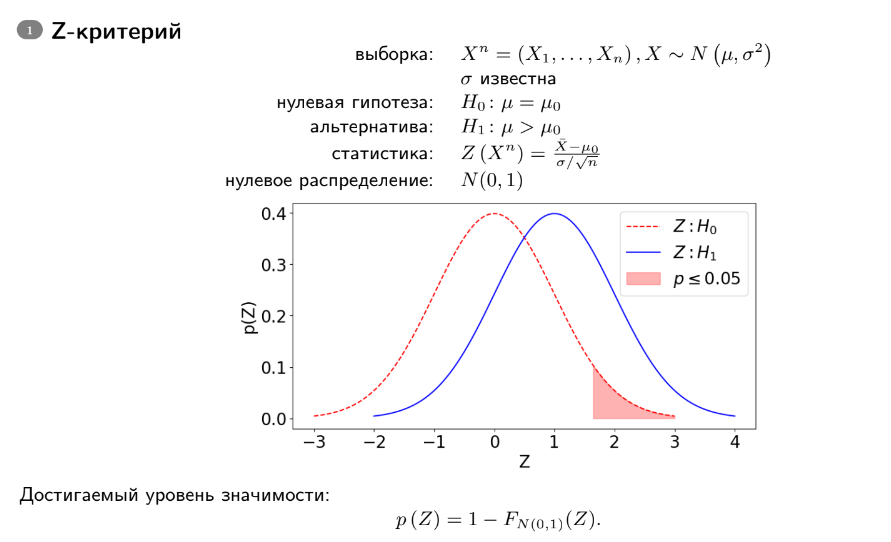

Z-тест, известный также как z-критерий Фишера, представляет собой набор статистических методов для проверки гипотез, которые базируются на предположении о нормальном распределении данных. Эти методы часто используются для анализа, являются ли средние значения двух наборов данных одинаковыми, при условии, что дисперсия генеральной совокупности известна. Расчёт Z-статистики производится путём деления разности между анализируемой случайной величиной и её математическим ожиданием на стандартную ошибку этой величины:

$$z={\frac {{\overline {X}}-\,m}{\mathrm {SE} }}$$

где X случайная величина выборочного среднего, m - значение математического ожидания, SE - стандартная ошибка этой величины.

### Условия для проведения теста

Чтобы результаты Z-теста были валидными, необходимо использовать случайную выборку из генеральной совокупности. Случайная выборка дает репрезентативность данных, что важно для точности выводов, сделанных на основе статистического анализа.

Z-тест требует, чтобы анализируемые данные были непрерывными. Непрерывные данные могут принимать любое значение внутри определенного диапазона и часто измеряются с использованием дробных или десятичных чисел.

Данные должны следовать нормальному распределению. Однако благодаря центральной предельной теореме, это предположение можно игнорировать, если размер выборки достаточно велик , что позволяет распределению средних выборочных значений приближаться к нормальному распределению даже если распределение в генеральной совокупности отличается от нормального.

В случае сравнения двух выборок, Z-тест требует, чтобы выборки были независимы. Это означает, что данные одной выборки не должны влиять на данные другой.

Ну и наконец, необходимо знать стандартное отклонение генеральной совокупности. Это требование отличает Z-тест от t-теста, который используется, когда стандартное отклонение генеральной совокупности неизвестно.

### Пример

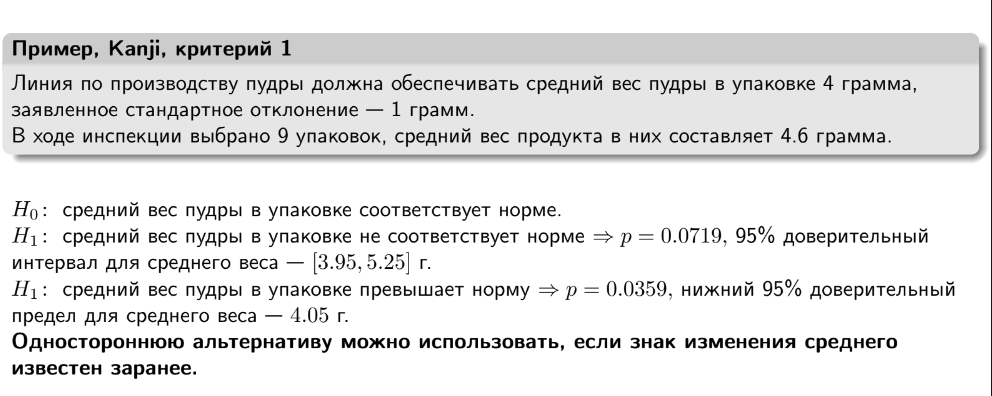

### Шаги решения задачи с помощью Z-критерия:

1. **Формулировка гипотез:**
   - **H0 (нулевая гипотеза):** Средний вес пудры в упаковке равен 4 граммам.
   - **H1 (альтернативная гипотеза):** Средний вес пудры в упаковке не равен 4 граммам.

2. **Известные данные:**
   - Средний вес в выборке (среднее выборочное) $\bar{x} = 4.6$ грамма.
   - Заявленное стандартное отклонение $\sigma = 1$ грамм.
   - Число наблюдений $n = 9$.

3. **Расчёт статистики Z:**
   Статистика Z для среднего значения вычисляется по формуле:
   
   $$Z = \frac{\bar{x} - \mu}{\frac{\sigma}{\sqrt{n}}}$$

   Где:
   - $\bar{x}$ — среднее выборочное (наблюдаемое среднее).
   - $\mu$ — гипотетическое среднее (в данном случае 4 грамма).
   - $\sigma$ — стандартное отклонение генеральной совокупности.
   - $n$ — размер выборки.

   Подставляя известные значения:

   $$Z = \frac{4.6 - 4}{\frac{1}{\sqrt{9}}} = \frac{0.6}{\frac{1}{3}} = 1.8$$

4. **Принятие решения:**
   - Для двусторонней альтернативы (когда проверяется не равенство 4 граммам) критическое значение Z для уровня значимости $\alpha = 0.05$ (двусторонняя проверка) составляет приблизительно 1.96.
   - Так как полученное значение Z (1.8) меньше критического значения (1.96), нет оснований отвергать нулевую гипотезу на уровне значимости 0.05. Это означает, что средний вес пудры в упаковке не отличается статистически значимо от заявленного норматива 4 грамма.

5. **Вывод:**
   - На основе Z-критерия можно заключить, что данных недостаточно, чтобы отвергнуть заявленную нулевую гипотезу о том, что средний вес пудры в упаковке равен 4 граммам.

[Вернуться к вопросам](#ответы-на-вопросы-по-теории)

## 15. Критерий хи-квадрат. Условия для проведения проверки. Пример.

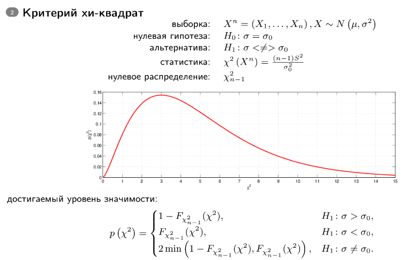

Критерий хи-квадрат (χ²) — это статистический метод, используемый для определения того, согласуется ли наблюдаемая частота с ожидаемой частотой в распределении категорий переменной. Он основан на сравнении фактической и ожидаемой частот в таблице сопряжённости.

### Формула

$$\chi^2(X^n) = \frac{(n-1)S^2}{\sigma_0^2}$$

### Условия для проведения проверки критерием хи-квадрат

Для применения критерия хи-квадрат необходимо соблюдение следующих условий:

1. **Тип переменной:** Переменная должна быть категориальной, то есть иметь несколько уровней или категорий.

2. **Независимость наблюдений:** Наблюдения, использованные для формирования таблицы сопряжённости, должны быть независимыми.

3. **Размер выборки:** Количество наблюдений должно быть достаточным для каждой категории. Обычно рекомендуется, чтобы ожидаемая частота в каждой ячейке таблицы сопряжённости была не менее 5.

[Вернуться к вопросам](#ответы-на-вопросы-по-теории)

## 16. t-критерий Стьюдента. Условия для проведения проверки. Пример.

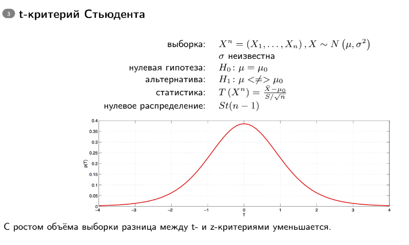

t-критерий Стьюдента — общее название для класса методов статистической проверки гипотез (статистических критериев), основанных на распределении Стьюдента. Наиболее частые случаи применения t-критерия связаны с проверкой равенства средних значений в двух выборках.

t-статистика строится обычно по следующему общему принципу: в числителе — случайная величина с нулевым математическим ожиданием (при выполнении нулевой гипотезы), а в знаменателе — выборочное стандартное отклонение этой случайной величины, получаемое как квадратный корень из несмещённой оценки дисперсии.

### Условия для проведения проверки

Для применения данного критерия необходимо, чтобы выборочные средние имели нормальное распределение. При маленьких выборках это означает требование нормальности исходных значений. В случае применения двухвыборочного критерия для независимых выборок также необходимо соблюдение условия равенства дисперсий. Существуют, однако, альтернативы критерию Стьюдента для ситуации с неравными дисперсиями.

Также не вполне корректно применять t-критерий Стьюдента при наличии в данных значительного числа выбросов. При несоблюдении этих условий при сравнении выборочных средних должны использоваться аналогичные методы непараметрической статистики, среди которых наиболее известными являются U-критерий Манна — Уитни (в качестве двухвыборочного критерия для независимых выборок), а также критерий знаков и критерий Уилкоксона (используются в случаях зависимых выборок).

### Пример

1. **Формулировка гипотез:**
   - **H0 (нулевая гипотеза):** Программа не влияет на вес детей, средний вес равен 2800 г.
   - **H1 (альтернативная гипотеза):** Программа влияет на вес детей, средний вес отличается от 2800 г.

2. **Известные данные:**
   - Средний вес детей при рождении в контрольной группе (матери живут за чертой бедности): $\bar{x} = 3075$ г.
   - Выборочное стандартное отклонение в контрольной группе: $s = 500$ г.
   - Размер выборки (число наблюдений): $n = 25$.
   - Гипотетическое среднее (для нулевой гипотезы): $\mu_0 = 2800$ г.

3. **Вычисление статистики t:**
   Статистика t для среднего значения вычисляется по формуле:
   
   $$t = \frac{\bar{x} - \mu_0}{\frac{s}{\sqrt{n}}}$$

   Где:
   - $\bar{x}$ — среднее выборочное (наблюдаемое среднее).
   - $\mu_0$ — гипотетическое среднее (в данном случае 2800 г).
   - $s$ — выборочное стандартное отклонение.
   - $n$ — размер выборки.

   Подставляя известные значения:
   
   $$t = \frac{3075 - 2800}{\frac{500}{\sqrt{25}}} = \frac{275}{100} = 2.75$$

4. **Определение критической области и принятие решения:**
   - Для двусторонней альтернативы (когда проверяется не равенство 2800 г) и уровня значимости $\alpha = 0.05$, критическое значение t с 24 степенями свободы составляет примерно 2.064.
   - Так как полученное значение t (2.75) больше критического значения (2.064), мы отвергаем нулевую гипотезу на уровне значимости 0.05.
   - Это означает, что есть статистически значимые доказательства в пользу того, что программа влияет на вес детей, чьи матери живут за чертой бедности.

5. **Вывод:**
   - На основе t-критерия Стьюдента можно сделать вывод о статистической значимости эффекта программы на вес новорожденных детей.

## 17. F-критерий Фишера. Условия для проведения проверки. Пример.

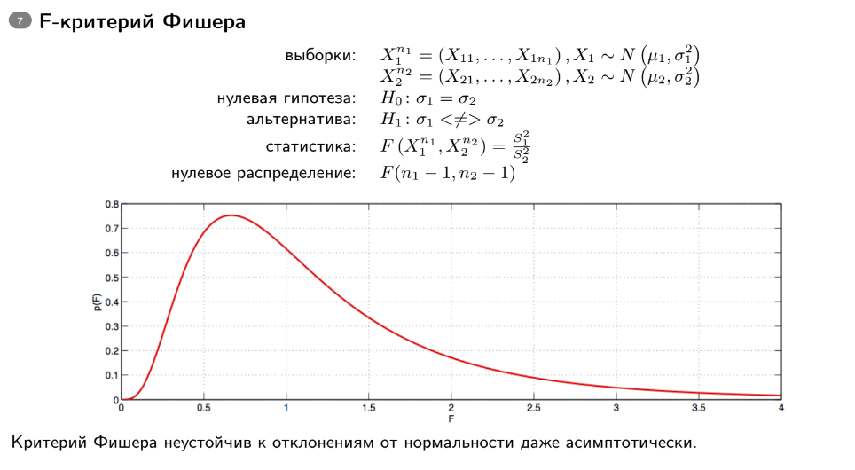

F-тест или критерий Фишера (F-критерий, φ*-критерий) — статистический критерий, тестовая статистика которого при выполнении нулевой гипотезы имеет распределение Фишера (F-распределение).

Статистика теста так или иначе сводится к отношению выборочных дисперсий (сумм квадратов, деленных на «степени свободы»). Чтобы статистика имела распределение Фишера, необходимо, чтобы числитель и знаменатель были независимыми случайными величинами и соответствующие суммы квадратов имели распределение Хи-квадрат. Для этого требуется, чтобы данные имели нормальное распределение. Кроме того, предполагается, что дисперсия случайных величин, квадраты которых суммируются, одинакова.

### Условия для проведения проверки F-критерием Фишера:

1. **Нормальность распределения:** Каждая из групп, между которыми проводится сравнение, должна иметь нормальное распределение данных. Это условие особенно важно, когда размеры выборок малы (<30).

2. **Гомогенность дисперсий:** Дисперсии внутри каждой из групп должны быть приблизительно равны. Это условие можно проверить с помощью тестов на равенство дисперсий, например, теста Левена или теста Бартлетта.

3. **Независимость выборок:** Выборки в каждой из групп должны быть независимыми друг от друга.

### Пример использования:

Предположим, у нас есть две группы студентов, и мы хотим проверить, есть ли статистически значимые различия в их средних оценках по математике.

- Группа 1: Студенты, которые прошли обучение по новой методике (образовательная программа A).
- Группа 2: Студенты, которые прошли обучение по стандартной методике (образовательная программа B).

Для этого мы собрали данные о результате математического теста у каждой группы:

- Группа A: $x_{11}, x_{12}, \ldots, x_{1n}$
- Группа B: $x_{21}, x_{22}, \ldots, x_{2m}$

**Шаги решения:**

1. **Формулировка гипотез:**
   - **H0 (нулевая гипотеза):** Средние оценки в группах A и B равны.
   - **H1 (альтернативная гипотеза):** Средние оценки в группах A и B различаются.

2. **Проверка условий:**
   - Проверим нормальность распределения оценок в каждой группе (например, с помощью критерия Шапиро-Уилка).
   - Проверим гомогенность дисперсий между группами (например, с помощью теста Левена или Бартлетта).

3. **Вычисление статистики F:**
   Статистика F вычисляется как отношение дисперсии между группами к дисперсии внутри групп:

   $$F = \frac{s_{A}^2}{s_{B}^2}$$

   Где:
   - $s_{A}^2$ — выборочная дисперсия группы A.
   - $s_{B}^2$ — выборочная дисперсия группы B.

4. **Определение критической области и принятие решения:**
   - Для заданного уровня значимости $\alpha$ и соответствующих степеней свободы в числителе и знаменателе определяется критическое значение F.
   - Если вычисленное значение F превышает критическое значение, мы отвергаем нулевую гипотезу и делаем вывод о статистически значимом различии средних между группами.

5. **Вывод:**
   - На основе F-критерия Фишера можно сделать вывод о наличии или отсутствии статистически значимых различий в средних оценках студентов, прошедших разные образовательные программы.

## 18. Боксплот. Коэффициент ассиметрии и эксцесса. Критерий Шапиро-Уилка.

### Боскплот

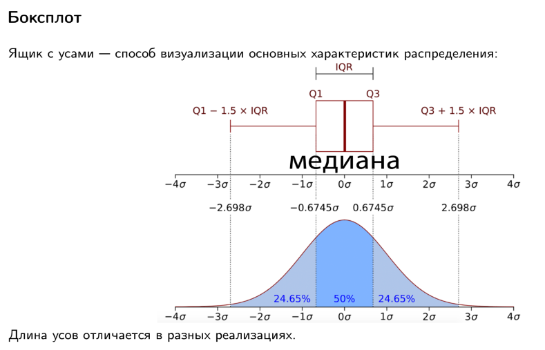

Боксплот (или ящик с усами) — это графическое представление, используемое для визуализации распределения данных через показатели центра (медиана), разброса (квартили) и наличие выбросов. Внешне боксплот представляет собой прямоугольник (ящик), высота которого показывает интерквартильный размах (разницу между верхним и нижним квартилями), внутри которого находится линия, отображающая медиану. От ящика выходят "усы", которые простираются до минимального и максимального наблюдаемого значения, за исключением выбросов.

### Коэффициент ассиметрии и эксцесса

1. **Коэффициент ассиметрии (skewness)** отражает степень ассиметрии распределения данных относительно среднего значения. Положительное значение коэффициента указывает на сильную скошенность данных вправо (больше значений справа от среднего), а отрицательное — влево.

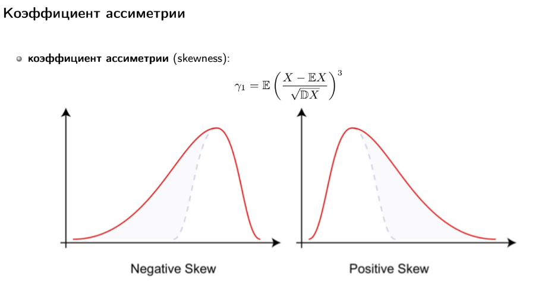

2. **Коэффициент эксцесса (kurtosis)** измеряет остроту пика распределения данных (пикообразность) и наличие "тяжелых" хвостов (выбросов) в сравнении с нормальным распределением:
   - Положительное значение указывает на более острую и высокую плотность данных вокруг среднего значения (более высокий и узкий пик).
   - Отрицательное значение указывает на более плоский пик и легкие хвосты (более широкое распределение).

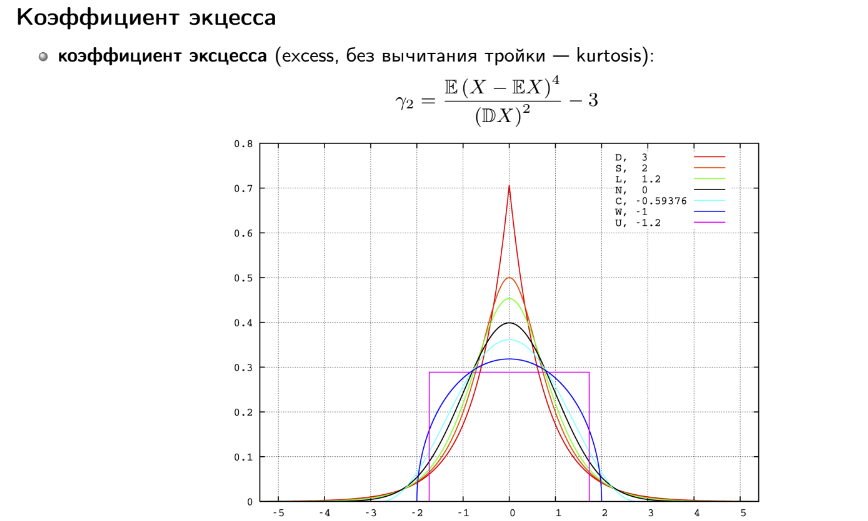

### Критерий Шапиро-Уилка

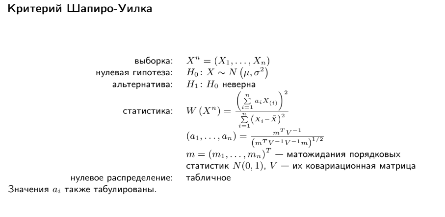

Критерий Шапиро-Уилка используется для проверки нормальности распределения данных. Основные моменты:

- **Нулевая гипотеза (H0):** Данные распределены нормально.
- **Альтернативная гипотеза (H1):** Данные не распределены нормально.
- Критерий основан на сравнении наблюдаемых данных с тем, что можно было бы ожидать в случае нормального распределения.
- Результаты критерия выражаются в виде статистики критерия и соответствующего p-value.

Формула статистики критерия Шапиро-Уилка:

$$W = \frac{\left( \sum_{i=1}^{n} a_i x_{(i)} \right)^2}{\sum_{i=1}^{n} (x_i - \bar{x})^2}$$

Где:
- $x_{(i)}$ — упорядоченные по возрастанию выборочные значения,
- $\bar{x}$ — выборочное среднее,
- $a_i$ — коэффициенты, зависящие от числа $n$ (размера выборки), используемые для вычисления статистики критерия.

## 19. Критерий Харке-Бера. Критерии, основанные на эмпирической функции распределения.

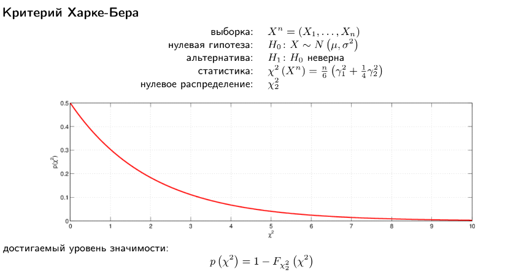

Тест Ха́рке—Бе́ра — это статистический тест, проверяющий ошибки наблюдений на нормальность посредством сверки их третьего момента (асимметрия) и четвёртого момента (эксцесс) с моментами нормального распределения, у которого $S=0$, $K=3$.

В тесте Харке—Бера проверяется нулевая гипотеза ${\mathcal {H}}_{0}\colon$ $S=0$, $K=3$ против гипотезы ${\mathcal {H}}_{1}\colon S\neq 0,\ K\neq 3$, где 
𝑆 — коэффициент асимметрии (Skewness), 
𝐾 — коэффициент эксцесса (Kurtosis)

Тест выглядит следующим образом: 

$$JB=n\left({\frac {S^{2}}{6}}+{\frac {(K-3)^{2}}{24}}\right),$$ 

где $S={\frac {\sum e_{i}^{3}}{n{\hat {\sigma }}_{ML}^{3}}}$, 
$K={\frac {\sum e_{i}^{4}}{n{\hat {\sigma }}_{ML}^{4}}}$, $e_{i}$ — остатки модели, $n$ — количество наблюдений, ${\hat {\sigma }}_{ML}^{2}={\frac {\sum e_{i}^{2}}{n}}$, ML — обозначение метода максимального правдоподобия (Maximal Likelihood). 

Данная статистика имеет распределение хи-квадрат с двумя степенями свободы (
$\chi _{2}^{2}$), поскольку коэффициенты 
𝑆 и 𝐾 асимптотически нормальны, следовательно, их квадраты при нормировке дадут две случайные величины, распределённые как $\chi _{1}^{2}$. Чем ближе распределение ошибок к нормальному, тем меньше статистика Харке—Бера отличается от нуля. При достаточно большом значении статистики p-value будет мало, и тогда будет основание отвергнуть нулевую гипотезу (статистика попала в «хвост» распределения).

Тест Харке—Бера является асимптотическим тестом, то есть применим к большим выборкам. Если ошибки распределены нормально, то в соответствии с теоремой Гаусса—Маркова оценки метода наименьших квадратов будут лучшими (иметь наименьшую дисперсию в классе линейных несмещённых оценок), и коэффициенты регрессии будут также распределены асимптотически нормально.

### Критерии, основанные на эмпирической функции распределения.

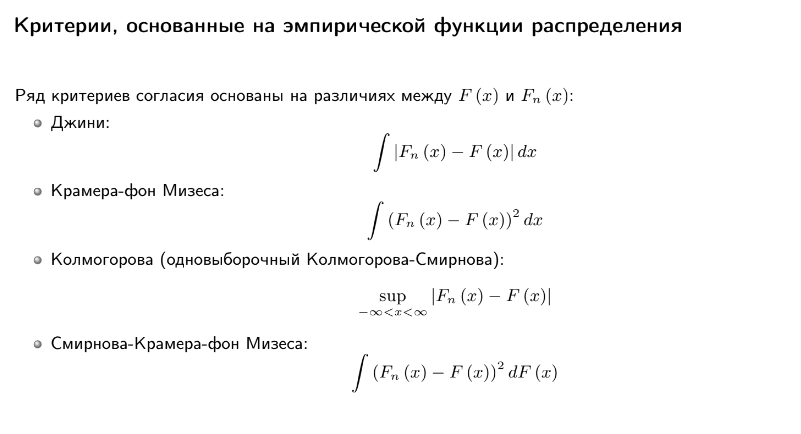

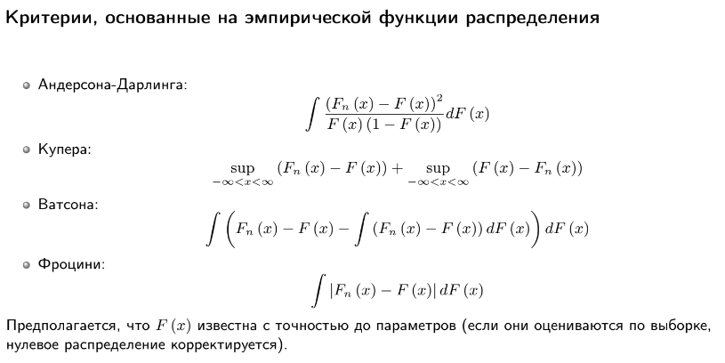

## 20. Проверка непараметрических гипотез. Виды задач и варианты двухвыборочных гипотез.

Непараметрические гипотезы в статистике касаются тестов, которые не предполагают конкретную форму распределения данных. В отличие от параметрических методов, которые предполагают, что данные следуют определенному распределению (например, нормальному), непараметрические методы более гибки и могут использоваться для анализа данных, которые не подчиняются этим предположениям.

Вот несколько ключевых моментов о непараметрических гипотезах:

- Отсутствие предположений о распределении: Непараметрические методы не требуют предположений о форме распределения данных, что делает их полезными в ситуациях, когда форма распределения неизвестна или не является нормальной.

- Применение к малым выборкам: Эти методы часто применяются к малым выборкам, где параметрические методы могут быть ненадежными.

- Примеры тестов: К наиболее известным непараметрическим тестам относятся критерий знаков, критерий Манна-Уитни, критерий Краскела-Уоллиса и критерий Каплана-Мейера. Эти тесты используются для сравнения медиан, рангов или выживаемости между группами.

- Использование рангов: Многие непараметрические тесты основаны на ранжировании данных, что позволяет им быть устойчивыми к выбросам и отклонениям от нормальности.

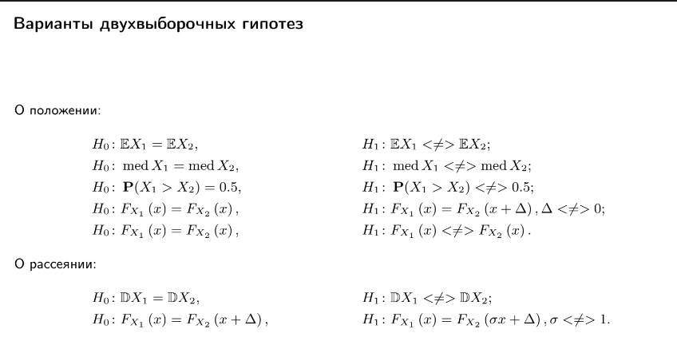

## 21. Биномиальный критерий. Параметры. Условия для проведения проверки. Пример.

Биномиальный критерий сравнивает наблюденные частоты для двух категорий дихотомической переменной с частотами, ожидаемыми для биномиального распределения с заданным значением параметра вероятности. По умолчанию значение параметра вероятности для обеих групп равно 0.5. Чтобы изменить эти вероятности, можно ввести значение проверяемой доли для первой группы. Значение вероятности для второй группы будет равно 1 минус заданное значение вероятности для первой группы.

Проверяемые переменные должны быть числовыми и дихотомическими. Для преобразования текстовых переменных в числовые используйте процедуру Автоматическая перекодировка, вызываемую в меню Преобразовать. Дихотомическая переменная - это переменная, которая может принимать только два возможных значения: да или нет, истина или ложь, 0 или 1 и так далее. Первое встреченное значение в наборе данных определяет первую группу, а остальные значения определяют вторую группу. Если переменные не дихотомические, необходимо задать пороговое значение. Наблюдения со значениями, равными или меньшими порогового, попадают в одну группу, а остальные наблюдения - в другую группу.

### Параметры биномиального критерия:

1. **n** - количество испытаний (наблюдений).
2. **k** - количество успехов в этих n испытаниях.
3. **p** - предполагаемая вероятность успеха в каждом испытании.
4. **α** - уровень значимости теста (обычно 0.05 или 5%).

Здесь тоже параметры:

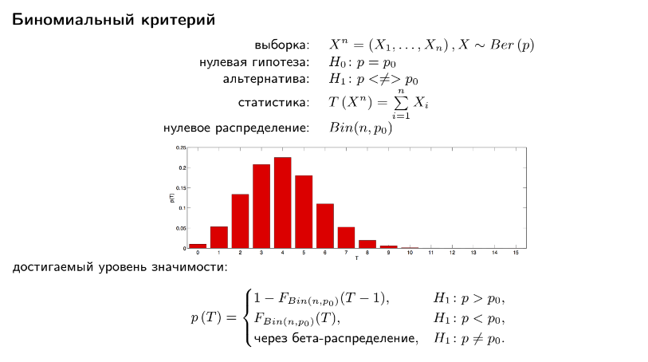

### Условия для проведения проверки:

1. **Дихотомический результат**: Каждый испытательный результат должен быть одним из двух возможных исходов (например, успех или неудача, да или нет).
2. **Независимость испытаний**: Результаты каждого испытания должны быть независимы от других.
3. **Постоянная вероятность успеха**: Вероятность успеха $p$ должна быть одинаковой для всех испытаний.

### Пример

#### Условие:
Предположим, что вы хотите проверить, является ли монета честной, то есть вероятность выпадения "орла" равна 0.5. Вы подбросили монету 20 раз и "орел" выпал 14 раз.

#### Формулировка гипотез:
- **Нулевая гипотеза (H₀)**: $p = 0.5$ (монета честная).
- **Альтернативная гипотеза (H₁)**: $p ≠ 0.5$ (монета нечестная).

#### Проведение теста:
1. **Количество испытаний (n)**: 20.
2. **Количество успехов (k)**: 14 (успех - выпадение "орла").
3. **Предполагаемая вероятность успеха (p)**: 0.5.

Используя биномиальный тест, мы можем рассчитать вероятность получения 14 или более успехов из 20 при условии, что вероятность успеха в каждом испытании равна 0.5.

#### Расчет p-значения:
Для выполнения биномиального теста можно использовать статистические пакеты или таблицы биномиального распределения. Однако можно и наглядно:

$$P(X \geq 14) = \sum_{i=14}^{20} \binom{20}{i} \cdot 0.5^{20}$$

Если полученное p-значение меньше уровня значимости (обычно 0.05), то мы отвергаем нулевую гипотезу в пользу альтернативной.

#### Интерпретация:
Если p-значение меньше 0.05, мы можем заключить, что монета, вероятно, нечестная. Если p-значение больше 0.05, у нас нет достаточных оснований отвергать нулевую гипотезу, и мы предполагаем, что монета честная.

Таким образом, биномиальный критерий позволяет проверять гипотезы о вероятности успеха в биномиальном распределении при соблюдении условий независимости испытаний и постоянной вероятности успеха.

## 22. Одновыборочный критерий знаков. Параметры. Условия для проведения проверки. Пример.

Одновыборочный критерий знаков – это непараметрический статистический тест, используемый для проверки гипотезы о медиане симметричного распределения. Этот тест особенно полезен, когда не выполняется предположение о нормальности распределения данных.

### Параметры одновыборочного критерия знаков:

1. **n** - общее количество наблюдений.
2. **$m_0$** - предполагаемая медиана.

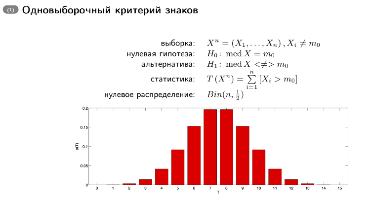

### Условия для проведения проверки:

1. **Симметричное распределение**: Данные должны быть симметрично распределены относительно медианы.
2. **Независимость наблюдений**: Наблюдения должны быть независимыми друг от друга.
3. **Дихотомическое кодирование**: Наблюдения преобразуются в знаки (положительные или отрицательные), указывающие на то, превышает ли значение предполагаемую медиану.

### Пример

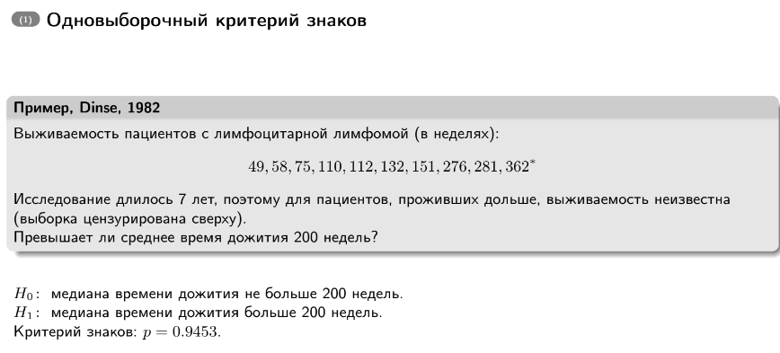

#### Данные
Исходные данные о времени дожития пациентов (в неделях):
49, 58, 75, 110, 112, 132, 151, 276, 281, 362

#### Условие задачи
Исследование длилось 7 лет (364 недели), поэтому для пациентов, проживших дольше, выживаемость неизвестна (выборка цензурирована сверху).

#### Формулировка гипотез:
- **Нулевая гипотеза (H₀)**: Медиана времени дожития не больше 200 недель.
- **Альтернативная гипотеза (H₁)**: Медиана времени дожития больше 200 недель.

#### Применение одновыборочного критерия знаков:
1. Определяем медиану и преобразуем данные в знаки относительно 200 недель:
   - Если значение больше 200 недель, присваиваем знак "+";
   - Если значение меньше или равно 200 недель, присваиваем знак "-".
2. Вычисляем количество положительных и отрицательных знаков.

#### Преобразование данных:
- 49 (-)
- 58 (-)
- 75 (-)
- 110 (-)
- 112 (-)
- 132 (-)
- 151 (-)
- 276 (+)
- 281 (+)
- 362 (+)

#### Расчет:
- Количество положительных знаков: 3
- Количество отрицательных знаков: 7

#### Расчет p-значения:
Для выполнения критерия знаков используем биномиальное распределение с $ p = 0.5 $.

$$P(X \geq 3) = \sum_{i=3}^{10} \binom{10}{i} \cdot 0.5^{10}$$

#### Использование биномиального распределения:
Для n = 10, количество положительных знаков = 3.

Используем биномиальный тест для расчета p-значения. В данном случае p-значение уже дано и составляет 0.9453.

#### Интерпретация результатов:
- Если p-значение меньше уровня значимости (обычно 0.05), то отвергаем нулевую гипотезу в пользу альтернативной.
- В нашем случае p-значение = 0.9453, что значительно больше 0.05.

#### Вывод:
Поскольку p-значение = 0.9453 больше 0.05, у нас нет достаточных оснований для отвергания нулевой гипотезы. Таким образом, мы не можем заключить, что медиана времени дожития пациентов с лимфоцитарной лимфомой превышает 200 недель.

## 23. Двухвыборочный критерий знаков. Параметры. Условия для проведения проверки. Пример.

Двухвыборочный критерий знаков — это непараметрический тест, используемый для сравнения медиан двух связанных выборок (парных наблюдений). Этот тест применяется, когда не выполняется предположение о нормальности распределения данных.

### Параметры двухвыборочного критерия знаков:

1. **n** - количество парных наблюдений.
2. **d** - различия между парными наблюдениями.
3. **+** - количество положительных различий (где первое значение больше второго).
4. **-** - количество отрицательных различий (где первое значение меньше второго).

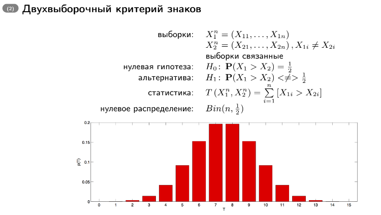

### Условия для проведения проверки:

1. **Связанные выборки**: Наблюдения в выборках должны быть связаны (парные данные).
2. **Независимость пар**: Каждая пара наблюдений должна быть независима от других пар.
3. **Дихотомическое кодирование различий**: Различия между парными наблюдениями кодируются как положительные или отрицательные.

### Пример

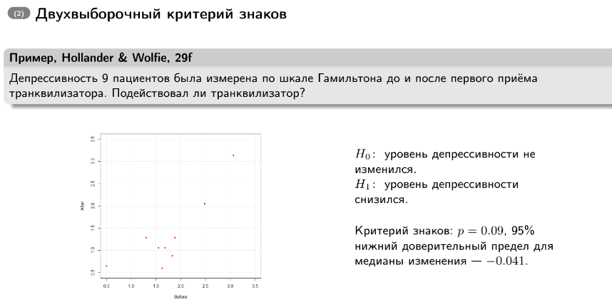

#### Данные
Уровень депрессивности 9 пациентов был измерен по шкале Гамильтона до и после первого приёма транквилизатора.

#### Формулировка гипотез:
- **Нулевая гипотеза (H₀)**: Уровень депрессивности не изменился.
- **Альтернативная гипотеза (H₁)**: Уровень депрессивности снизился.

#### Применение двухвыборочного критерия знаков:
1. Определяем различия в уровне депрессивности до и после приёма транквилизатора.
2. Преобразуем различия в знаки:
   - Если уровень депрессивности снизился (различие отрицательное), присваиваем знак "-".
   - Если уровень депрессивности повысился (различие положительное), присваиваем знак "+".
   - Если различие равно нулю, исключаем это наблюдение из анализа.

#### Шаги решения:
1. **Сбор данных**:
   - До приёма транквилизатора: $X_1, X_2, X_3, \ldots, X_9$
   - После приёма транквилизатора: $Y_1, Y_2, Y_3, \ldots, Y_9$

2. **Вычисление различий ($d$)**:
   $ d_i = Y_i - X_i $

3. **Преобразование различий в знаки**:
   - $d_1$, $d_2$, $d_3$, $d_4$, $d_5$, $d_6$, $d_7$, $d_8$, $d_9$
   - Положительные различия ($+$): количество положительных различий
   - Отрицательные различия ($-$): количество отрицательных различий

4. **Расчет**:
   - Количество положительных знаков: $n_+$
   - Количество отрицательных знаков: $n_-$

5. **Применение биномиального теста**:
   Используем биномиальное распределение для расчета p-значения с вероятностью успеха (отрицательный знак) $p = 0.5$.

#### Результаты:
- **p-значение**: 0.09
- **95% нижний доверительный предел для медианы изменения**: $-0.041$

#### Интерпретация результатов:
- Если p-значение меньше уровня значимости (обычно 0.05), то отвергаем нулевую гипотезу в пользу альтернативной.
- В нашем случае p-значение = 0.09, что больше 0.05.

#### Вывод:
Поскольку p-значение = 0.09 больше 0.05, у нас нет достаточных оснований для отвергания нулевой гипотезы. Таким образом, мы не можем заключить, что уровень депрессивности пациентов существенно снизился после приёма транквилизатора.

Кроме того, нижний доверительный предел для медианы изменения ($-0.041$) показывает, что снижение уровня депрессивности статистически незначительно.

