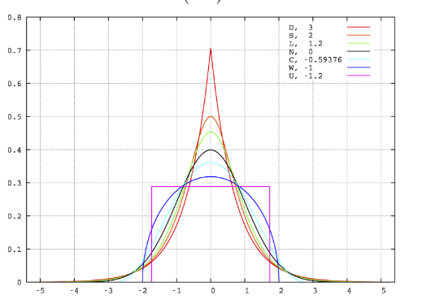
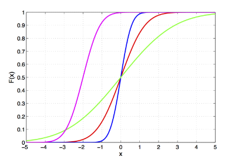
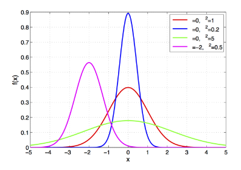
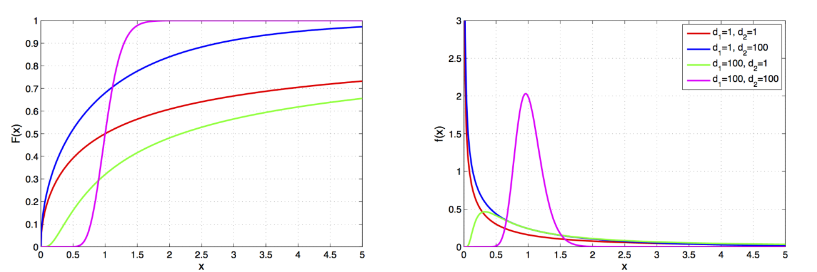
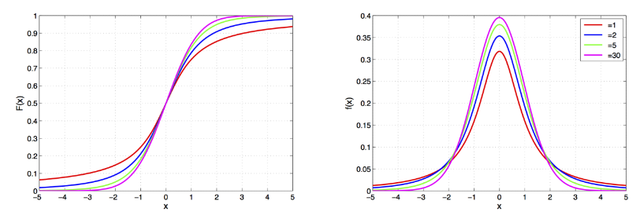
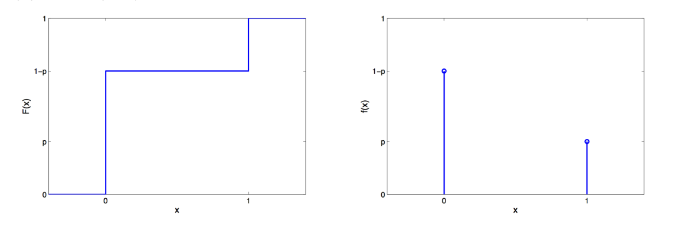
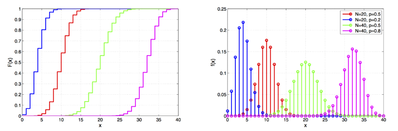

# Введение в курс

## Зачем нужен этот курс

- Изучение специфических статистических методов для конкретных постановок задач

- Определение границ применимости методов

  (Marriott, 1974): If the results disagree with informed opinion, do not admit a simple logical interpretation, and do not show up clearly in a graphical presentation, they are probably wrong. There is no magic about numerical methods, and many ways in which they can break down. They are a valuable aid to the interpretation of data, not sausage machines automatically transforming bodies of numbers into packets of scientific fact.

- Развитие статистического мышления
  
  (Begg et al., 1992): Понимание механизмов работы статистики позволяет находить менее стереотипные и более осознанные решения повседневных задач.

## Изучение случайности

**Вероятность события** — доля испытаний, завершившихся наступлением события, в бесконечном эксперименте.

**Закон больших чисел (ЗБЧ)** — принцип, описывающий результат выполнения одного и того же эксперимента много раз. Согласно закону, среднее значение конечной выборки из фиксированного распределения близко к математическому ожиданию этого распределения.

Другими словами, чем больше объём выборки, тем чаще проводятся измерения какого-либо параметра, тем выше вероятность, что результаты окажутся близки к ожидаемым.

Закон больших чисел важен, поскольку он гарантирует устойчивость для средних значений некоторых случайных событий при достаточно длинной серии экспериментов.

Важно помнить, что закон применим только тогда, когда рассматривается большое количество испытаний.

Дискретная случайная величина 𝑋 принимает счётное множество значений 𝐴= {𝑎1, 𝑎2, ..., 𝑎n} с вероятностями 𝑝1, 𝑝2,...,𝑝n

$\sum_i p_1=1$

𝑓𝑋(𝑎𝑖) = P(𝑋=𝑎𝑖) = 𝑝𝑖— **функция вероятности**. 

Для описания как дискретных, так и непрерывных случайных величин используется **функция распределения вероятности**. Пусть Х - случайная величина и х - ее любое значение. Функция распределения вероятности определяется следующим образом:

$$ F_X(x)=\mathbf{P}(X \leqslant x)$$

Поскольку функция распределения вероятности представляет собой вероятность, то она удовлетворяет следующим свойствам:

Примеры функций распределения вероятности:

Функция распределения вероятности не всегда удобна для расчетов. Часто удобнее использовать не саму функцию $F_X(x)$, а ее производную. Она называется **плотностью распределения вероятности**.

Физический смысл $f(x)$ состоит в том, что произведение $f(x)dx$ представляет вероятность попадания случайной величины $Х$ в интервал от $х$ до $х+dx$ , т.е.

$$ f(x)dx=\mathbf{P}(x \leqslant X \leqslant x+dx)$$

Свойства плотности распределения вероятности имеют вид:

## Характеристики распределений

Важнейшими среди них являются математическое ожидание, дисперсия, среднее квадратическое отклонение, коэффициент вариации, моменты, центральные моменты, коэффициент асимметрии, коэффициент эксцесса, медиана, мода, первая квартиль, третья квартиль, интерквартильный размах, квантили.

### Математическое ожидание

**Математическое ожидание** (или среднее значение) случайной величины является одной из наиболее фундаментальных характеристик её распределения. Оно описывает центральную тенденцию значений, которые случайная величина принимает.

#### Определение

Математическое ожидание $E(X)$ случайной величины $X$ — это взвешенная сумма всех возможных значений этой случайной величины, где веса соответствуют вероятностям этих значений.

Для дискретной случайной величины $X$, которая принимает значения $x_1, x_2, ..., x_n$ с вероятностями $p_1, p_2, ..., p_n$, математическое ожидание определяется как:

$$ E(X) = \sum_{i=1}^n x_i p_i $$

Для непрерывной случайной величины $X$ с плотностью вероятности $f_X(x)$, математическое ожидание определяется как:

$$ E(X) = \int_{-\infty}^\infty x f_X(x) \, dx $$

#### Свойства математического ожидания

1. **Линейность**:
   
   Если $X$ и $Y$ — случайные величины, а $a$ и $b$ — константы, то:
     $ E(aX + bY) = aE(X) + bE(Y) $

2. **Математическое ожидание константы**:
   
   Если $C$ — константа, то:
     $ E(C) = C $

3. **Математическое ожидание суммы**:
   
   Для случайных величин $X_1, X_2, \ldots, X_n$:
     $ E\left(\sum_{i=1}^n X_i\right) = \sum_{i=1}^n E(X_i) $

### Дисперсия

Дисперсия случайной величины является одной из основных характеристик её распределения. Она измеряет степень разброса значений случайной величины относительно её математического ожидания.

#### Определение

Дисперсия $ \mathrm{Var}(X) $ случайной величины $ X $ — это математическое ожидание квадрата отклонения случайной величины от её математического ожидания.

Для дискретной случайной величины $ X $, которая принимает значения $ x_1, x_2, \ldots, x_n $ с вероятностями $ p_1, p_2, \ldots, p_n $, дисперсия определяется как:

$$
\mathrm{Var}(X) = E[(X - E(X))^2] = \sum_{i=1}^n (x_i - E(X))^2 p_i
$$

Для непрерывной случайной величины $ X $ с плотностью вероятности $ f_X(x) $:

$$
\mathrm{Var}(X) = E[(X - E(X))^2] = \int_{-\infty}^{\infty} (x - E(X))^2 f_X(x) \, dx
$$

#### Альтернативное выражение

Дисперсию можно также выразить через математическое ожидание квадрата случайной величины:

$$
\mathrm{Var}(X) = E[X^2] - (E[X])^2
$$

#### Свойства дисперсии

1. **Неотрицательность**: Дисперсия всегда неотрицательна, то есть $ \mathrm{Var}(X) \geq 0 $. Она равна нулю тогда и только тогда, когда случайная величина является константой почти наверное.
2. **Линейность**: Для любых двух случайных величин $ X $ и $ Y $ и чисел $ a $ и $ b $ справедливо:
    $$
    \mathrm{Var}(aX + bY) = a^2 \mathrm{Var}(X) + b^2 \mathrm{Var}(Y) + 2ab \, \mathrm{Cov}(X, Y)
    $$
    где $ \mathrm{Cov}(X, Y) $ — ковариация случайных величин $ X $ и $ Y $.
3. **Смещение и масштабирование**: Для любой случайной величины $ X $ и чисел $ a $ и $ b $:
    $$
    \mathrm{Var}(aX + b) = a^2 \mathrm{Var}(X)
    $$

Дисперсия является важной характеристикой, так как она показывает, насколько сильно значения случайной величины разбросаны относительно её среднего значения.

### Квантиль

**Квантиль** — это значение, которое делит распределение случайной величины на части с заданной вероятностью. Квантили используются для описания распределения случайной величины и для оценки вероятностей.

#### Определение

Квантиль порядка $ p $ случайной величины $ X $ — это значение $ x_p $, такое что вероятность того, что $ X $ меньше или равно $ x_p $, равна $ p $. 

Иными словами, квантиль порядка $ p $ — это значение $ x_p $, удовлетворяющее следующему условию:

$$
P(X \leq x_p) = p
$$

где $ 0 < p < 1 $.

#### Примеры квантилей

1. **Медиана** — квантиль порядка $ p = 0.5 $:
    $ x_{0.5} $
    Медиана делит распределение случайной величины на две равные части.
   
2. **Квартили**:
   - Первый квартиль (нижний квартиль) — квантиль порядка $ p = 0.25 $:
     $
     x_{0.25}
     $
   - Третий квартиль (верхний квартиль) — квантиль порядка $ p = 0.75 $:
     $
     x_{0.75}
     $

3. **Перцентили**: Перцентили — это квантили, определяющие значения, ниже которых падает определённый процент распределения. Например, 90-й перцентиль — квантиль порядка $ p = 0.90 $:
    $
    x_{0.90}
    $

#### Свойства квантилей

1. **Уникальность**: Для непрерывного распределения функция распределения $ F_X(x) $ строго возрастает, что гарантирует уникальность квантиля $ x_p $ для каждого $ p $.
2. **Инвариантность при монотонных преобразованиях**: Если $ Y = g(X) $, где $ g $ — строго возрастающая функция, то квантиль порядка $ p $ для $ Y $ равен $ g(x_p) $, где $ x_p $ — квантиль порядка $ p $ для $ X $.
3. **Масштабирование и сдвиг**: Для любой случайной величины $ X $ и чисел $ a > 0 $ и $ b $:
    $$
    Q_{X}(p) = x_p \implies Q_{aX + b}(p) = a x_p + b
    $$

Квантили дают важную информацию о распределении данных и широко используются в статистике и анализе данных для описания и сравнения распределений.

### Интерквартильный размах

Интерквартильный размах (IQR, Interquartile Range) — это мера статистического разброса, которая показывает диапазон значений средней половины данных. Он используется для оценки вариативности и выявления выбросов в данных.

#### Определение

Интерквартильный размах определяется как разница между третьим квартилем ($Q3$) и первым квартилем ($Q1$):

$$
\text{IQR} = Q3 - Q1
$$

- **Первый квартиль ($Q1$)** — это значение, ниже которого находится 25% наблюдений.
- **Третий квартиль ($Q3$)** — это значение, ниже которого находится 75% наблюдений.

#### Вычисление

Для вычисления интерквартильного размаха необходимо:

1. Упорядочить данные в порядке возрастания.
2. Найти первый квартиль ($Q1$) и третий квартиль ($Q3$).
3. Вычесть $Q1$ из $Q3$.

### Мода 

В статистике **мода** (от фр. mode) — это значение, которое встречается в наборе данных наиболее часто. Она является одной из мер центральной тенденции наряду с медианой и средним арифметическим.

#### Определение

Пусть $X = \{x_1, x_2, \ldots, x_n\}$ — выборка данных. Модой набора данных $X$ называется значение $x_m$, такое что количество элементов в $X$, равных $x_m$, максимально. Формально:

$$
\text{Mode}(X) = \{x_i \mid \forall x_j \neq x_i, \, f(x_i) \geq f(x_j) \}
$$

где $f(x)$ — функция частоты (число вхождений $x$ в набор данных $X$).

#### Свойства

1. **Множественные моды**: В некоторых наборах данных может быть более одной моды. Такие наборы данных называются мультимодальными.
2. **Отсутствие моды**: Если все значения в наборе данных встречаются одинаково часто, говорят, что мода отсутствует.
3. **Применимость**: Мода полезна для описания данных, которые имеют категорические или номинальные значения.

### Коэффициент асимметрии

Коэффициент асимметрии (или коэффициент скошенности) используется для описания степени асимметрии распределения данных относительно его среднего значения. Формула коэффициента асимметрии следующая:

$$
\gamma_1 = \frac{\mu_3}{\sigma^3}
$$

где $\mu_3$ — третий центральный момент, а $\sigma$ — стандартное отклонение.

Третий центральный момент вычисляется как:

$$
\mu_3 = \mathbb {E} \left[(X-\mathbb {E} X)^{3}\right]
$$

А стандартное отклонение:
$$
\sigma ={\sqrt {\mathrm {D} [X]}}
$$

### Коэффициент эксцесса

Коэффициент эксцесса (или куртозис) измеряет степень пиковости распределения данных. Он вычисляется по следующей формуле:

$$
\gamma_2 = \frac{\mu_4}{\sigma^4} - 3
$$

где $\mu_4$ — четвертый центральный момент, а $\sigma$ — стандартное отклонение.

Четвертый центральный момент вычисляется как:

$$
\mu_4 = \mathbb {E} \left[(X-\mathbb {E} X)^{4}\right]
$$

## Нормальное распределение

- $X \in \mathbb{R} \sim N\left(\mu, \sigma^2\right), \sigma^2>0$​

  $F(x)=\Phi\left(\frac{x-\mu}{\sigma}\right)$

  $f(x)=\frac{1}{\sigma} \phi\left(\frac{x-\mu}{\sigma}\right)$​

  $\Phi(x)=\frac{1}{\sqrt{2 \pi}} \int_{-\infty}^x e^{-\frac{t^2}{2}} d t$

  $\phi(x)=\frac{1}{\sqrt{2 \pi}} e^{-\frac{x^2}{2}}$

- Предельное распределение суммы слабо взаимозависимых сл. в.

- E𝑋= med 𝑋= mode 𝑋= 𝜇, D𝑋= 𝜎2, все моменты более высокого порядка нулевые

- Пусть 𝑋1*, . . . , 𝑋*𝑛 независимы, $X_i \sim N\left(\mu_i, \sigma_i^2\right)$​ тогда ∀𝑎1, . . . , 𝑎𝑛

  $\sum_{i=1}^n a_i X_i \sim N\left(\sum_{i=1}^n a_i \mu_i, \sum_{i=1}^n a_i^2 \sigma_i^2\right)$

  центральная предельная теорема: пусть 𝑋1*, . . . , 𝑋*𝑛 i.i.d. с E𝑋 и D𝑋 < ∞, тогда
  $\frac{1}{n} \sum_{i=1}^n X_i \sim \approx N\left(\mathbb{E} X, \frac{\mathbb{D} X}{n}\right)$​

- Пример: погрешность измерения

Нормальное распределение, также называемое распределением Гаусса или Гаусса — Лапласа — непрерывное распределение вероятностей с пиком в центре и симметричными боковыми сторонами, которое в одномерном случае задаётся функцией плотности вероятности, совпадающей с функцией Гаусса:

$$f(x)={\frac {1}{\sigma {\sqrt {2\pi }}}}e^{-{\frac {1}{2}}\left({\frac {x-\mu }{\sigma }}\right)^{2}}$$

где параметр 𝜇 — математическое ожидание (среднее значение), медиана и мода распределения, а параметр 
𝜎 — среднеквадратическое отклонение, $\sigma ^{2}$ — дисперсия распределения.

### Определение стандартного нормального распределения

Стандартным нормальным распределением называется нормальное распределение с математическим ожиданием $\mu =0$ и стандартным отклонением $\sigma =1$.

### Определение нормального распределения с параметрами μ, σ

Каждое нормальное распределение — это вариант стандартного нормального распределения, область значений которого растягивается множителем $\sigma$ (стандартное отклонение) и переносится на 𝜇 (математическое ожидание):

$$f(x\mid \mu ,\sigma ^{2})={\frac {1}{\sigma }}\varphi \left({\frac {x-\mu }{\sigma }}\right),$$
где 𝜇, 𝜎 являются параметрами нормального распределения. Плотность вероятности должна нормироваться 
${\frac {1}{\sigma }}$, так что интеграл равен 1.

### Функция распределения

Функция распределения стандартного нормального распределения (нормальное интегральное распределение) обычно обозначается заглавной греческой буквой $\Phi$ (фи), ещё называется функцией Лапласа и представляет собой интеграл:
$$\Phi (x)={\frac {1}{\sqrt {2\pi }}}\int \limits _{-\infty }^{x}e^{-t^{2}/2}\,dt$$

### Свойства

#### Моменты
Если 𝑋 имеет нормальное распределение, то для неё существуют (конечные) моменты при всех 𝑝 с действительной частью больше −1. Для неотрицательных целых 𝑝 центральные моменты таковы:

$$\mathbb {E} \left[X^{p}\right]={\begin{cases}0&p=2n+1,\\\sigma ^{p}\,\left(p-1\right)!!&p=2n.\end{cases}}$$

#### Преобразование Фурье и характеристическая функция
Преобразование Фурье нормального распределения дает другую нормальную функцию, а характеристическая функция нормального распределения имеет вид $e^{it\mu - \frac{1}{2}t^2\sigma^2}$, где i - мнимая единица.

#### Бесконечная делимость
Нормальное распределение бесконечно делимо, что означает, что для любого положительного целого числа $n$ можно найти $n$ независимых идентично распределённых случайных величин, сумма которых имеет то же нормальное распределение.

#### Максимальная энтропия
Нормальное распределение имеет максимальную энтропию среди всех непрерывных распределений с заданными средним и дисперсией.

## Распределение Хи-Квадрат

- пусть 𝑋1*, . . . , 𝑋*𝑘 — i.i.d., 𝑋𝑖∼𝑁(0, 1) , тогда

  $\sum_{i=1}^k X_i^2 \sim \chi_k^2$

- пример: нормированная выборочная дисперсия:

  $(n-1) \frac{S_n^2}{\sigma^2} \sim \chi_{n-1}^2$

𝑋 ∈ R+ ∼ 𝜒 2 𝑘, 𝑘 ∈ N

  

  $F(x)=\frac{1}{\Gamma\left(\frac{k}{2}\right)} \gamma\left(\frac{k}{2}, \frac{x}{2}\right)$​

$f(x)=\frac{1}{2^{\frac{k}{2}} \Gamma\left(\frac{k}{2}\right)} x^{\frac{k}{2}-1} e^{-\frac{\pi}{2}}$

$(n-1) \frac{S_n^2}{\sigma^2} \sim \chi_{n-1}^2$ — гамма-функция
$\gamma(a, x)=\int_0^x e^{-t} t^{a-1} d t$ — нижняя неполная гамма-функция

Критерий хи-квадрат (χ²) — это статистический метод, используемый для определения того, согласуется ли наблюдаемая частота с ожидаемой частотой в распределении категорий переменной. Он основан на сравнении фактической и ожидаемой частот в таблице сопряжённости.

### Условия для проведения проверки критерием хи-квадрат

Для применения критерия хи-квадрат необходимо соблюдение следующих условий:

1. **Тип переменной:** Переменная должна быть категориальной, то есть иметь несколько уровней или категорий.

2. **Независимость наблюдений:** Наблюдения, использованные для формирования таблицы сопряжённости, должны быть независимыми.

3. **Размер выборки:** Количество наблюдений должно быть достаточным для каждой категории. Обычно рекомендуется, чтобы ожидаемая частота в каждой ячейке таблицы сопряжённости была не менее 5.

## Распределение Фишера

- пусть $X_1 \sim \chi_{d_1}^2, \quad X_2 \sim \chi_{d_2}^2$, 𝑋1 и 𝑋2 независимы, тогда

  $\frac{X_1 / d_1}{X_2 / d_2} \sim F\left(d_1, d_2\right)$

- если 𝑋∼𝐹(𝑑1, 𝑑2) , то
                                      $Y=\lim _{d_2 \rightarrow \infty} d_1 X \sim \chi_{d_1}^2$

- 𝐹(𝑥, 𝑑1, 𝑑2) = 𝐹(1/𝑥, 𝑑2, 𝑑1)

- возникает в дисперсионном и регрессионном анализе

𝑋∈R+ ∼𝐹(𝑑1, 𝑑2) , 𝑑1, 𝑑2 > 0

$F(x)=I \frac{d_1 x}{d_1 x+d_2}\left(\frac{d_1}{2}, \frac{d_2}{2}\right)$​

$f(x)=\sqrt{\frac{\left(d_1 x\right)^{d_1} d_2^{d_2}}{\left(d_1 x+d_2\right)^{d_1+d_2}}}/ x B\left(\frac{d_1}{2}, \frac{d_2}{2}\right)$

- $B(a, b)=\int_0^1 t^{a-1}(1-t)^{b-1}$  — бета-функция
- $I_x(a, b)=\frac{B(x ; a, b)}{B(a, b)}$ — регуляризованная неполная бета-функция

- $B(x ; a, b)=\int_0^x t^{a-1}(1-t)^{b-1}$ — неполная бета-функция

F-тест или критерий Фишера (F-критерий, φ*-критерий) — статистический критерий, тестовая статистика которого при выполнении нулевой гипотезы имеет распределение Фишера (F-распределение).

Статистика теста так или иначе сводится к отношению выборочных дисперсий (сумм квадратов, деленных на «степени свободы»). Чтобы статистика имела распределение Фишера, необходимо, чтобы числитель и знаменатель были независимыми случайными величинами и соответствующие суммы квадратов имели распределение Хи-квадрат. Для этого требуется, чтобы данные имели нормальное распределение. Кроме того, предполагается, что дисперсия случайных величин, квадраты которых суммируются, одинакова.

### Условия для проведения проверки F-критерием Фишера:

1. **Нормальность распределения:** Каждая из групп, между которыми проводится сравнение, должна иметь нормальное распределение данных. Это условие особенно важно, когда размеры выборок малы (<30).

2. **Гомогенность дисперсий:** Дисперсии внутри каждой из групп должны быть приблизительно равны. Это условие можно проверить с помощью тестов на равенство дисперсий, например, теста Левена или теста Бартлетта.

3. **Независимость выборок:** Выборки в каждой из групп должны быть независимыми друг от друга.

## Распределение Стьюдента

- E𝑋= 0 при 𝜈> 1, med 𝑋= mode 𝑋 = 0 всегда

- пусть 𝑍∼𝑁(0, 1) и $V \sim \chi_\nu^2$ независимы, тогда
$T=\frac{Z}{\sqrt{V / \nu}} \sim S t(\nu)$

- если 𝑋∼𝑆𝑡(𝜈) , то
$Y=\lim _{\nu \rightarrow \infty} X \sim N(0,1)$

- возникает при оценке среднего значения сл. в. с неизвестной дисперсией

𝑋∈R ∼𝑆𝑡(𝜈) *, 𝜈>* 0

$$F(x)=\frac{1}{2}+x\Gamma\left(\frac{\nu+1}{2}\right)$$

$$f\left(x\right)=\frac{\Gamma\left(\frac{\nu+1}{2}\right)}{\sqrt{\nu\pi}\Gamma\left(\frac{\nu}{2}\right)}\left(1+\frac{x^{2}}{\nu}\right)^{-\frac{\nu+1}{2}}$$

t-критерий Стьюдента — общее название для класса методов статистической проверки гипотез (статистических критериев), основанных на распределении Стьюдента. Наиболее частые случаи применения t-критерия связаны с проверкой равенства средних значений в двух выборках.

t-статистика строится обычно по следующему общему принципу: в числителе — случайная величина с нулевым математическим ожиданием (при выполнении нулевой гипотезы), а в знаменателе — выборочное стандартное отклонение этой случайной величины, получаемое как квадратный корень из несмещённой оценки дисперсии.

### Условия для проведения проверки

Для применения данного критерия необходимо, чтобы выборочные средние имели нормальное распределение. При маленьких выборках это означает требование нормальности исходных значений. В случае применения двухвыборочного критерия для независимых выборок также необходимо соблюдение условия равенства дисперсий. Существуют, однако, альтернативы критерию Стьюдента для ситуации с неравными дисперсиями.

Также не вполне корректно применять t-критерий Стьюдента при наличии в данных значительного числа выбросов. При несоблюдении этих условий при сравнении выборочных средних должны использоваться аналогичные методы непараметрической статистики, среди которых наиболее известными являются U-критерий Манна — Уитни (в качестве двухвыборочного критерия для независимых выборок), а также критерий знаков и критерий Уилкоксона (используются в случаях зависимых выборок).

## Распределение Бернулли

𝑋∈{0, 1} ∼ 𝐵𝑒𝑟(𝑝) , 𝑝∈(0, 1)

$$F\left(x\right)=\begin{cases}0,&x<0,\\ 1-p,&0\leqslant x<1,\\ 1,&x\geqslant1.\end{cases}$$

$$F\left(x\right)=\begin{cases}1-p,&x=0,\\ 1,&x=1.\end{cases}$$

Пример: Результат Подбрасывания Монеты

Распределе́ние Берну́лли  — дискретное распределение вероятностей, моделирующее случайный эксперимент произвольной природы, при заранее известной вероятности успеха или неудачи.

Случайная величина 
𝑋 имеет распределение Бернулли, если она принимает всего два значения: 1 и 0 с вероятностями 
𝑝 и $q\equiv 1-p$ соответственно. Таким образом:

$\mathbb {P} (X=1)=p$,

$\mathbb {P} (X=0)=q$.

## Биномиальное распределение

$𝑋∈{0, . . . , 𝑁} ∼𝐵𝑖𝑛(𝑁, 𝑝) , 𝑁∈N, 𝑝∈[0, 1]$​

$$\begin{array}{l}{{F\left(x\right)=I_{1-p}\left(N-x,1+x\right)}}\\ {{f\left(x\right)=C_{N}^{x}p^{x}\left(1-p\right)^{N-x}}}\end{array}$$

- пусть 𝑋1*, . . . , 𝑋*𝑛 независимы, 𝑋𝑖∼𝐵𝑒𝑟(𝑝), тогда
  $\sum_{i=1}^n X_i \sim \operatorname{Bin}(n, p)$​
- 𝐵𝑖𝑛(1, 𝑝) = *𝐵𝑒𝑟*(𝑝)

- если 𝑁> 20 и 𝑝 не слишком близко к нулю или единице, то для 𝑋∼𝐵𝑖𝑛(*𝑁, 𝑝*) справедлива нормальная аппроксимация:
  $F_X(x) \approx \Phi\left(\frac{x-N p}{\sqrt{N p(1-p)}}\right)$​

- Пример: Число Попаданий Из 𝑁 бросков В Баскетбольное Кольцо

Биномиальное распределение — дискретное распределение вероятностей случайной величины $X$, принимающей целочисленные значения $k=0,1,\ldots,n$ с вероятностями:

$$P(X=k)={n \choose k}p^k(1-p)^{n-k}.$$

Данное распределение характеризуется двумя параметрами: целым числом n>0, называемым числом испытаний, и вещественным числом $p, 0\le p\le 1$, называемом вероятностью успеха в одном испытании. Биномиальное распределение — одно из основных распределений вероятностей, связанных с последовательностью независимых испытаний. Если проводится серия из $n$ независимых испытаний, в каждом из которых может произойти "успех" с вероятностью $p$, то случайная величина, равная числу успехов во всей серии, имеет указанное распределение. 

**Основные свойства и моменты**

Характеристическая функция: $\phi(t)=(1+p(e^{it}-1))^n.$

Моменты:

Математическое ожидание: $MX=np$.

Дисперсия: $DX=np(1-p)$.

Асимметрия: $\gamma_1=\frac{1-2p}{\sqrt{np(1-p)}}$; при $p=0.5$ распределение симметрично относительно центра $n/2$.

