# Введение в курс

Содержание:

1. [**Зачем нужен этот курс**](#зачем-нужен-этот-курс)
2. [**Изучение случайности**](#изучение-случайности)
3. [**Характеристики распределений**](#характеристики-распределений)
4. [**Нормальное распределение**](#нормальное-распределение)
5. [**Распределение Хи-Квадрат**](#распределение-хи-квадрат)
6. [**Распределение Стьюдента**](#распределение-стьюдента)
7. [**Распределение Бернулли**](#распределение-бернулли)
8. [**Биномиальное распределение**](#биномиальное-распределение)
9. [**Распределение Пуассона**](#распределение-пуассона)
10. [**Выборка**](#выборка)
11. [**Функция распределения**](#функция-распределения)
12. [**Статистика**](#статистика)
13. [**Оценки центральной тенденции**](#оценки-центральной-тенденции)
14. [**Точечные оценки**](#точечные-оценки)
15. [**Метод максимума правдоподобия**](#метод-максимума-правдоподобия)
16. [**Производные функции правдоподобия**](#производные-функции-правдоподобия)
17. [**Свойства ОМП**](#свойства-омп)
18. [**Интервальные оценки**](#интервальные-оценки)
19. [**Квантили**](#квантили)
20. [**Построение доверительных интервалов**](#построение-доверительных-интервалов)
21. [**Бутстреп**](#бутстреп)
22. [**Бутстреп-распределение**](#бутстреп-распределение)
23. [**Доверительные интервалы**](#доверительные-интервалы)
24. [**Достигаемый уровень значимости**](#достигаемый-уровень-значимости)
25. [**Ошибки I И II Рода**](#ошибки-i-и-ii-рода)
26. [**Интерпретация результата**](#интерпретация-результата)
27. [**Статистическая и практическая значимость**](#статистическая-и-практическая-значимость)
28. [**Односторонняя альтернатива**](#односторонняя-альтернатива)
29. [**Двусторонняя альтернатива**](#двусторонняя-альтернатива)

----
### [Вернуться ко всем лекциям](Navigation_lections.md)

## Зачем нужен этот курс

- Изучение специфических статистических методов для конкретных постановок задач

- Определение границ применимости методов

  (Marriott, 1974): If the results disagree with informed opinion, do not admit a simple logical interpretation, and do not show up clearly in a graphical presentation, they are probably wrong. There is no magic about numerical methods, and many ways in which they can break down. They are a valuable aid to the interpretation of data, not sausage machines automatically transforming bodies of numbers into packets of scientific fact.

- Развитие статистического мышления
  
  (Begg et al., 1992): Понимание механизмов работы статистики позволяет находить менее стереотипные и более осознанные решения повседневных задач.

## Изучение случайности

**Вероятность события** — доля испытаний, завершившихся наступлением события, в бесконечном эксперименте.

**Закон больших чисел (ЗБЧ)** — принцип, описывающий результат выполнения одного и того же эксперимента много раз. Согласно закону, среднее значение конечной выборки из фиксированного распределения близко к математическому ожиданию этого распределения.

Другими словами, чем больше объём выборки, тем чаще проводятся измерения какого-либо параметра, тем выше вероятность, что результаты окажутся близки к ожидаемым.

Закон больших чисел важен, поскольку он гарантирует устойчивость для средних значений некоторых случайных событий при достаточно длинной серии экспериментов.

Важно помнить, что закон применим только тогда, когда рассматривается большое количество испытаний.

Дискретная случайная величина 𝑋 принимает счётное множество значений 𝐴= {𝑎1, 𝑎2, ..., 𝑎n} с вероятностями 𝑝1, 𝑝2,...,𝑝n

$\sum_i p_1=1$

𝑓𝑋(𝑎𝑖) = P(𝑋=𝑎𝑖) = 𝑝𝑖— **функция вероятности**. 

Для описания как дискретных, так и непрерывных случайных величин используется **функция распределения вероятности**. Пусть Х - случайная величина и х - ее любое значение. Функция распределения вероятности определяется следующим образом:

$$ F_X(x)=\mathbf{P}(X \leqslant x)$$

Поскольку функция распределения вероятности представляет собой вероятность, то она удовлетворяет следующим свойствам:

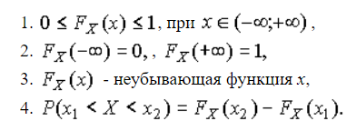

Примеры функций распределения вероятности:

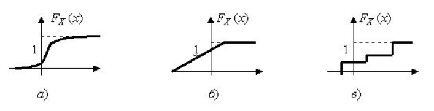

Функция распределения вероятности не всегда удобна для расчетов. Часто удобнее использовать не саму функцию $F_X(x)$, а ее производную. Она называется **плотностью распределения вероятности**.

Физический смысл $f(x)$ состоит в том, что произведение $f(x)dx$ представляет вероятность попадания случайной величины $Х$ в интервал от $х$ до $х+dx$ , т.е.

$$ f(x)dx=\mathbf{P}(x \leqslant X \leqslant x+dx)$$

Свойства плотности распределения вероятности имеют вид:

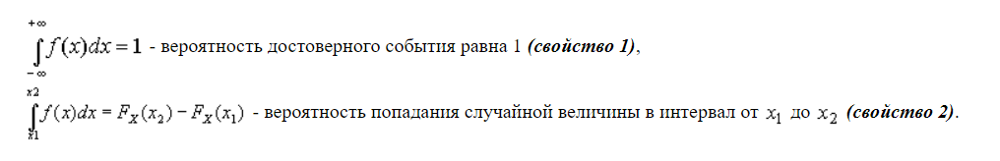

## Характеристики распределений

Важнейшими среди них являются математическое ожидание, дисперсия, среднее квадратическое отклонение, коэффициент вариации, моменты, центральные моменты, коэффициент асимметрии, коэффициент эксцесса, медиана, мода, первая квартиль, третья квартиль, интерквартильный размах, квантили.

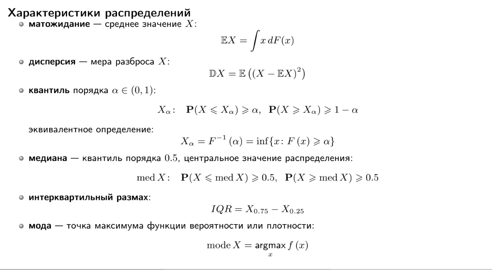

### Математическое ожидание

**Математическое ожидание** (или среднее значение) случайной величины является одной из наиболее фундаментальных характеристик её распределения. Оно описывает центральную тенденцию значений, которые случайная величина принимает.

#### Определение

Математическое ожидание $E(X)$ случайной величины $X$ — это взвешенная сумма всех возможных значений этой случайной величины, где веса соответствуют вероятностям этих значений.

Для дискретной случайной величины $X$, которая принимает значения $x_1, x_2, ..., x_n$ с вероятностями $p_1, p_2, ..., p_n$, математическое ожидание определяется как:

$$ E(X) = \sum_{i=1}^n x_i p_i $$

Для непрерывной случайной величины $X$ с плотностью вероятности $f_X(x)$, математическое ожидание определяется как:

$$ E(X) = \int_{-\infty}^\infty x f_X(x) \, dx $$

#### Свойства математического ожидания

1. **Линейность**:
   
   Если $X$ и $Y$ — случайные величины, а $a$ и $b$ — константы, то:
     $ E(aX + bY) = aE(X) + bE(Y) $

2. **Математическое ожидание константы**:
   
   Если $C$ — константа, то:
     $ E(C) = C $

3. **Математическое ожидание суммы**:
   
   Для случайных величин $X_1, X_2, \ldots, X_n$:
     $ E\left(\sum_{i=1}^n X_i\right) = \sum_{i=1}^n E(X_i) $

### Дисперсия

Дисперсия случайной величины является одной из основных характеристик её распределения. Она измеряет степень разброса значений случайной величины относительно её математического ожидания.

#### Определение

Дисперсия $ \mathrm{Var}(X) $ случайной величины $ X $ — это математическое ожидание квадрата отклонения случайной величины от её математического ожидания.

Для дискретной случайной величины $ X $, которая принимает значения $ x_1, x_2, \ldots, x_n $ с вероятностями $ p_1, p_2, \ldots, p_n $, дисперсия определяется как:

$$
\mathrm{Var}(X) = E[(X - E(X))^2] = \sum_{i=1}^n (x_i - E(X))^2 p_i
$$

Для непрерывной случайной величины $ X $ с плотностью вероятности $ f_X(x) $:

$$
\mathrm{Var}(X) = E[(X - E(X))^2] = \int_{-\infty}^{\infty} (x - E(X))^2 f_X(x) \, dx
$$

#### Альтернативное выражение

Дисперсию можно также выразить через математическое ожидание квадрата случайной величины:

$$
\mathrm{Var}(X) = E[X^2] - (E[X])^2
$$

#### Свойства дисперсии

1. **Неотрицательность**: Дисперсия всегда неотрицательна, то есть $\mathrm{Var}(X) \geq 0$. Она равна нулю тогда и только тогда, когда случайная величина является константой почти наверное.
2. **Линейность**: Для любых двух случайных величин $X$ и $Y$ и чисел $a$ и $b$ справедливо:

$$\mathrm{Var}(aX + bY) = a^2 \mathrm{Var}(X) + b^2 \mathrm{Var}(Y) + 2ab \, \mathrm{Cov}(X, Y)$$

где $\mathrm{Cov}(X, Y)$ — ковариация случайных величин $X$ и $Y$.

3. **Смещение и масштабирование**: Для любой случайной величины $X$ и чисел $a$ и $b$:

$$\mathrm{Var}(aX + b) = a^2 \mathrm{Var}(X)$$

Дисперсия является важной характеристикой, так как она показывает, насколько сильно значения случайной величины разбросаны относительно её среднего значения.

### Квантиль

**Квантиль** — это значение, которое делит распределение случайной величины на части с заданной вероятностью. Квантили используются для описания распределения случайной величины и для оценки вероятностей.

#### Определение

Квантиль порядка $p$ случайной величины $X$ — это значение $x_p$, такое что вероятность того, что $X$ меньше или равно $x_p$, равна $p$. 

Иными словами, квантиль порядка $p$ — это значение $x_p$, удовлетворяющее следующему условию:

$$P(X \leq x_p) = p$$

где $0 < p < 1$.

#### Примеры квантилей

1. **Медиана** — квантиль порядка $p = 0.5$:
    $x_{0.5}$
    Медиана делит распределение случайной величины на две равные части.
   
2. **Квартили**:
   - Первый квартиль (нижний квартиль) — квантиль порядка $p = 0.25$:
     $x_{0.25}$

   - Третий квартиль (верхний квартиль) — квантиль порядка $p = 0.75$:
     $x_{0.75}$

3. **Перцентили**: Перцентили — это квантили, определяющие значения, ниже которых падает определённый процент распределения. Например, 90-й перцентиль — квантиль порядка $p = 0.90$:
    $x_{0.90}$

#### Свойства квантилей

1. **Уникальность**: Для непрерывного распределения функция распределения $F_X(x)$ строго возрастает, что гарантирует уникальность квантиля $x_p$ для каждого $p$.
2. **Инвариантность при монотонных преобразованиях**: Если $Y = g(X)$, где $g$ — строго возрастающая функция, то квантиль порядка $p$ для $Y$ равен $ g(x_p)$, где $x_p$ — квантиль порядка $p$ для $X$.
3. **Масштабирование и сдвиг**: Для любой случайной величины $X$ и чисел $ a > 0$ и $b$:

$$Q_{X}(p) = x_p \implies Q_{aX + b}(p) = a x_p + b$$

Квантили дают важную информацию о распределении данных и широко используются в статистике и анализе данных для описания и сравнения распределений.

### Интерквартильный размах

Интерквартильный размах (IQR, Interquartile Range) — это мера статистического разброса, которая показывает диапазон значений средней половины данных. Он используется для оценки вариативности и выявления выбросов в данных.

#### Определение

Интерквартильный размах определяется как разница между третьим квартилем ($Q3$) и первым квартилем ($Q1$):

$$
\text{IQR} = Q3 - Q1
$$

- **Первый квартиль ($Q1$)** — это значение, ниже которого находится 25% наблюдений.
- **Третий квартиль ($Q3$)** — это значение, ниже которого находится 75% наблюдений.

#### Вычисление

Для вычисления интерквартильного размаха необходимо:

1. Упорядочить данные в порядке возрастания.
2. Найти первый квартиль ($Q1$) и третий квартиль ($Q3$).
3. Вычесть $Q1$ из $Q3$.

### Мода 

В статистике **мода** (от фр. mode) — это значение, которое встречается в наборе данных наиболее часто. Она является одной из мер центральной тенденции наряду с медианой и средним арифметическим.

#### Определение

Пусть $X = \{x_1, x_2, \ldots, x_n\}$ — выборка данных. Модой набора данных $X$ называется значение $x_m$, такое что количество элементов в $X$, равных $x_m$, максимально. Формально:

$$
\text{Mode}(X) = \{x_i \mid \forall x_j \neq x_i, \, f(x_i) \geq f(x_j) \}
$$

где $f(x)$ — функция частоты (число вхождений $x$ в набор данных $X$).

#### Свойства

1. **Множественные моды**: В некоторых наборах данных может быть более одной моды. Такие наборы данных называются мультимодальными.
2. **Отсутствие моды**: Если все значения в наборе данных встречаются одинаково часто, говорят, что мода отсутствует.
3. **Применимость**: Мода полезна для описания данных, которые имеют категорические или номинальные значения.

### Коэффициент асимметрии

Коэффициент асимметрии (или коэффициент скошенности) используется для описания степени асимметрии распределения данных относительно его среднего значения. Формула коэффициента асимметрии следующая:

$$
\gamma_1 = \frac{\mu_3}{\sigma^3}
$$

где $\mu_3$ — третий центральный момент, а $\sigma$ — стандартное отклонение.

Третий центральный момент вычисляется как:

$$
\mu_3 = \mathbb {E} \left[(X-\mathbb {E} X)^{3}\right]
$$

А стандартное отклонение:
$$
\sigma ={\sqrt {\mathrm {D} [X]}}
$$

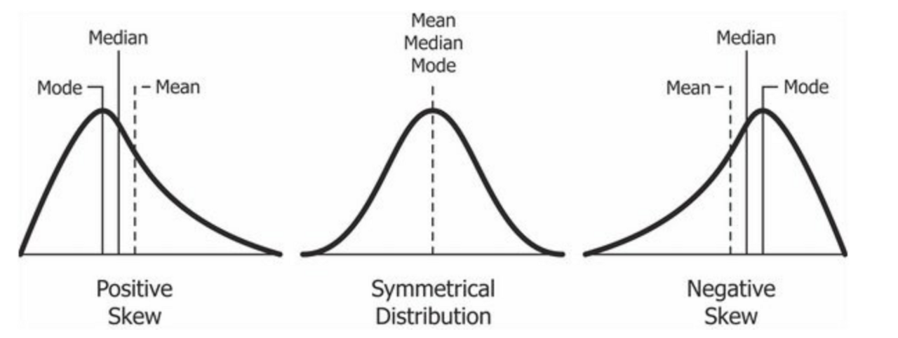

### Коэффициент эксцесса

Коэффициент эксцесса (или куртозис) измеряет степень пиковости распределения данных. Он вычисляется по следующей формуле:

$$
\gamma_2 = \frac{\mu_4}{\sigma^4} - 3
$$

где $\mu_4$ — четвертый центральный момент, а $\sigma$ — стандартное отклонение.

Четвертый центральный момент вычисляется как:

$$
\mu_4 = \mathbb {E} \left[(X-\mathbb {E} X)^{4}\right]
$$

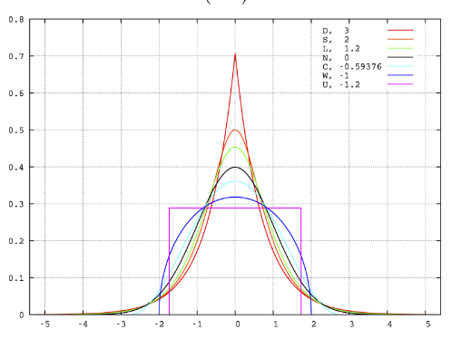

## Нормальное распределение

- $X \in \mathbb{R} \sim N\left(\mu, \sigma^2\right), \sigma^2>0$​

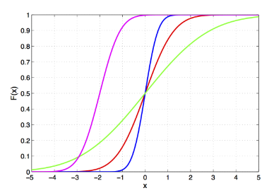

  $F(x)=\Phi\left(\frac{x-\mu}{\sigma}\right)$

  $f(x)=\frac{1}{\sigma} \phi\left(\frac{x-\mu}{\sigma}\right)$​

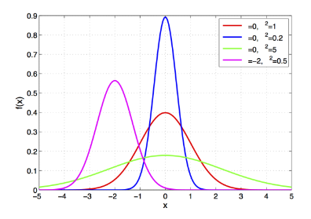

  $\Phi(x)=\frac{1}{\sqrt{2 \pi}} \int_{-\infty}^x e^{-\frac{t^2}{2}} d t$

  $\phi(x)=\frac{1}{\sqrt{2 \pi}} e^{-\frac{x^2}{2}}$

- Предельное распределение суммы слабо взаимозависимых сл. в.

- E𝑋= med 𝑋= mode 𝑋= 𝜇, D𝑋= 𝜎2, все моменты более высокого порядка нулевые

- Пусть 𝑋1*, . . . , 𝑋*𝑛 независимы, $X_i \sim N\left(\mu_i, \sigma_i^2\right)$​ тогда ∀𝑎1, . . . , 𝑎𝑛

  $\sum_{i=1}^n a_i X_i \sim N\left(\sum_{i=1}^n a_i \mu_i, \sum_{i=1}^n a_i^2 \sigma_i^2\right)$

  центральная предельная теорема: пусть 𝑋1*, . . . , 𝑋*𝑛 i.i.d. с E𝑋 и D𝑋 < ∞, тогда
  $\frac{1}{n} \sum_{i=1}^n X_i \sim \approx N\left(\mathbb{E} X, \frac{\mathbb{D} X}{n}\right)$​

- Пример: погрешность измерения

Нормальное распределение, также называемое распределением Гаусса или Гаусса — Лапласа — непрерывное распределение вероятностей с пиком в центре и симметричными боковыми сторонами, которое в одномерном случае задаётся функцией плотности вероятности, совпадающей с функцией Гаусса:

$$f(x)={\frac {1}{\sigma {\sqrt {2\pi }}}}e^{-{\frac {1}{2}}\left({\frac {x-\mu }{\sigma }}\right)^{2}}$$

где параметр 𝜇 — математическое ожидание (среднее значение), медиана и мода распределения, а параметр 
𝜎 — среднеквадратическое отклонение, $\sigma ^{2}$ — дисперсия распределения.

### Определение стандартного нормального распределения

Стандартным нормальным распределением называется нормальное распределение с математическим ожиданием $\mu =0$ и стандартным отклонением $\sigma =1$.

### Определение нормального распределения с параметрами μ, σ

Каждое нормальное распределение — это вариант стандартного нормального распределения, область значений которого растягивается множителем $\sigma$ (стандартное отклонение) и переносится на 𝜇 (математическое ожидание):

$$f(x\mid \mu ,\sigma ^{2})={\frac {1}{\sigma }}\varphi \left({\frac {x-\mu }{\sigma }}\right),$$
где 𝜇, 𝜎 являются параметрами нормального распределения. Плотность вероятности должна нормироваться 
${\frac {1}{\sigma }}$, так что интеграл равен 1.

### Функция распределения нормального распределения

Функция распределения стандартного нормального распределения (нормальное интегральное распределение) обычно обозначается заглавной греческой буквой $\Phi$ (фи), ещё называется функцией Лапласа и представляет собой интеграл:
$$\Phi (x)={\frac {1}{\sqrt {2\pi }}}\int \limits _{-\infty }^{x}e^{-t^{2}/2}\,dt$$

### Свойства

#### Моменты
Если 𝑋 имеет нормальное распределение, то для неё существуют (конечные) моменты при всех 𝑝 с действительной частью больше −1. Для неотрицательных целых 𝑝 центральные моменты таковы:

$$\mathbb {E} \left[X^{p}\right]={\begin{cases}0&p=2n+1,\\\sigma ^{p}\,\left(p-1\right)!!&p=2n.\end{cases}}$$

#### Преобразование Фурье и характеристическая функция
Преобразование Фурье нормального распределения дает другую нормальную функцию, а характеристическая функция нормального распределения имеет вид $e^{it\mu - \frac{1}{2}t^2\sigma^2}$, где i - мнимая единица.

#### Бесконечная делимость
Нормальное распределение бесконечно делимо, что означает, что для любого положительного целого числа $n$ можно найти $n$ независимых идентично распределённых случайных величин, сумма которых имеет то же нормальное распределение.

#### Максимальная энтропия
Нормальное распределение имеет максимальную энтропию среди всех непрерывных распределений с заданными средним и дисперсией.

## Распределение Хи-Квадрат

- пусть 𝑋1*, . . . , 𝑋*𝑘 — i.i.d., 𝑋𝑖∼𝑁(0, 1) , тогда

  $\sum_{i=1}^k X_i^2 \sim \chi_k^2$

- пример: нормированная выборочная дисперсия:

  $(n-1) \frac{S_n^2}{\sigma^2} \sim \chi_{n-1}^2$

𝑋 ∈ R+ ∼ 𝜒 2 𝑘, 𝑘 ∈ N

  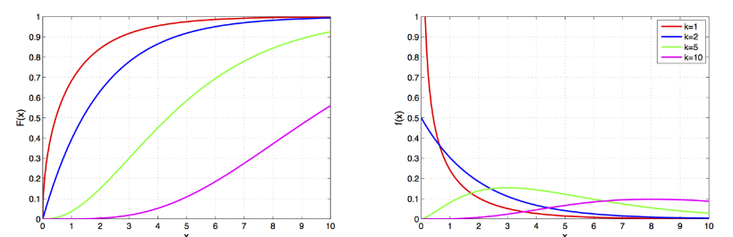

  $F(x)=\frac{1}{\Gamma\left(\frac{k}{2}\right)} \gamma\left(\frac{k}{2}, \frac{x}{2}\right)$​

$f(x)=\frac{1}{2^{\frac{k}{2}} \Gamma\left(\frac{k}{2}\right)} x^{\frac{k}{2}-1} e^{-\frac{\pi}{2}}$

$(n-1) \frac{S_n^2}{\sigma^2} \sim \chi_{n-1}^2$ — гамма-функция
$\gamma(a, x)=\int_0^x e^{-t} t^{a-1} d t$ — нижняя неполная гамма-функция

Критерий хи-квадрат (χ²) — это статистический метод, используемый для определения того, согласуется ли наблюдаемая частота с ожидаемой частотой в распределении категорий переменной. Он основан на сравнении фактической и ожидаемой частот в таблице сопряжённости.

### Условия для проведения проверки критерием хи-квадрат

Для применения критерия хи-квадрат необходимо соблюдение следующих условий:

1. **Тип переменной:** Переменная должна быть категориальной, то есть иметь несколько уровней или категорий.

2. **Независимость наблюдений:** Наблюдения, использованные для формирования таблицы сопряжённости, должны быть независимыми.

3. **Размер выборки:** Количество наблюдений должно быть достаточным для каждой категории. Обычно рекомендуется, чтобы ожидаемая частота в каждой ячейке таблицы сопряжённости была не менее 5.

## Распределение Фишера

- пусть $X_1 \sim \chi_{d_1}^2, \quad X_2 \sim \chi_{d_2}^2$, 𝑋1 и 𝑋2 независимы, тогда

  $\frac{X_1 / d_1}{X_2 / d_2} \sim F\left(d_1, d_2\right)$

- если 𝑋∼𝐹(𝑑1, 𝑑2) , то

$Y=\lim _{d_2 \rightarrow \infty} d_1 X \sim \chi_{d_1}^2$

- 𝐹(𝑥, 𝑑1, 𝑑2) = 𝐹(1/𝑥, 𝑑2, 𝑑1)

- возникает в дисперсионном и регрессионном анализе

𝑋∈R+ ∼𝐹(𝑑1, 𝑑2) , 𝑑1, 𝑑2 > 0

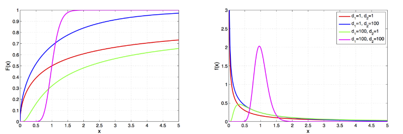

$F(x)=I \frac{d_1 x}{d_1 x+d_2}\left(\frac{d_1}{2}, \frac{d_2}{2}\right)$​

$f(x)=\sqrt{\frac{\left(d_1 x\right)^{d_1} d_2^{d_2}}{\left(d_1 x+d_2\right)^{d_1+d_2}}}/ x B\left(\frac{d_1}{2}, \frac{d_2}{2}\right)$

- $B(a, b)=\int_0^1 t^{a-1}(1-t)^{b-1}$  — бета-функция
- $I_x(a, b)=\frac{B(x ; a, b)}{B(a, b)}$ — регуляризованная неполная бета-функция

- $B(x ; a, b)=\int_0^x t^{a-1}(1-t)^{b-1}$ — неполная бета-функция

F-тест или критерий Фишера (F-критерий, φ*-критерий) — статистический критерий, тестовая статистика которого при выполнении нулевой гипотезы имеет распределение Фишера (F-распределение).

Статистика теста так или иначе сводится к отношению выборочных дисперсий (сумм квадратов, деленных на «степени свободы»). Чтобы статистика имела распределение Фишера, необходимо, чтобы числитель и знаменатель были независимыми случайными величинами и соответствующие суммы квадратов имели распределение Хи-квадрат. Для этого требуется, чтобы данные имели нормальное распределение. Кроме того, предполагается, что дисперсия случайных величин, квадраты которых суммируются, одинакова.

### Условия для проведения проверки F-критерием Фишера:

1. **Нормальность распределения:** Каждая из групп, между которыми проводится сравнение, должна иметь нормальное распределение данных. Это условие особенно важно, когда размеры выборок малы (<30).

2. **Гомогенность дисперсий:** Дисперсии внутри каждой из групп должны быть приблизительно равны. Это условие можно проверить с помощью тестов на равенство дисперсий, например, теста Левена или теста Бартлетта.

3. **Независимость выборок:** Выборки в каждой из групп должны быть независимыми друг от друга.

## Распределение Стьюдента

- E𝑋= 0 при 𝜈> 1, med 𝑋= mode 𝑋 = 0 всегда

- пусть 𝑍∼𝑁(0, 1) и $V \sim \chi_\nu^2$ независимы, тогда
$T=\frac{Z}{\sqrt{V / \nu}} \sim S t(\nu)$

- если 𝑋∼𝑆𝑡(𝜈) , то
$Y=\lim _{\nu \rightarrow \infty} X \sim N(0,1)$

- возникает при оценке среднего значения сл. в. с неизвестной дисперсией

𝑋∈R ∼𝑆𝑡(𝜈) *, 𝜈>* 0

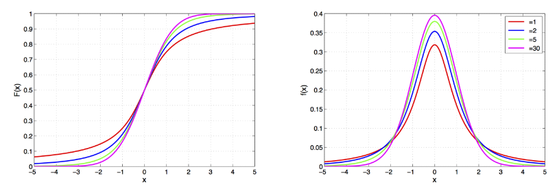

$$F(x)=\frac{1}{2}+x\Gamma\left(\frac{\nu+1}{2}\right)$$

$$f\left(x\right)=\frac{\Gamma\left(\frac{\nu+1}{2}\right)}{\sqrt{\nu\pi}\Gamma\left(\frac{\nu}{2}\right)}\left(1+\frac{x^{2}}{\nu}\right)^{-\frac{\nu+1}{2}}$$

t-критерий Стьюдента — общее название для класса методов статистической проверки гипотез (статистических критериев), основанных на распределении Стьюдента. Наиболее частые случаи применения t-критерия связаны с проверкой равенства средних значений в двух выборках.

t-статистика строится обычно по следующему общему принципу: в числителе — случайная величина с нулевым математическим ожиданием (при выполнении нулевой гипотезы), а в знаменателе — выборочное стандартное отклонение этой случайной величины, получаемое как квадратный корень из несмещённой оценки дисперсии.

### Условия для проведения проверки

Для применения данного критерия необходимо, чтобы выборочные средние имели нормальное распределение. При маленьких выборках это означает требование нормальности исходных значений. В случае применения двухвыборочного критерия для независимых выборок также необходимо соблюдение условия равенства дисперсий. Существуют, однако, альтернативы критерию Стьюдента для ситуации с неравными дисперсиями.

Также не вполне корректно применять t-критерий Стьюдента при наличии в данных значительного числа выбросов. При несоблюдении этих условий при сравнении выборочных средних должны использоваться аналогичные методы непараметрической статистики, среди которых наиболее известными являются U-критерий Манна — Уитни (в качестве двухвыборочного критерия для независимых выборок), а также критерий знаков и критерий Уилкоксона (используются в случаях зависимых выборок).

## Распределение Бернулли

𝑋∈{0, 1} ∼ 𝐵𝑒𝑟(𝑝) , 𝑝∈(0, 1)

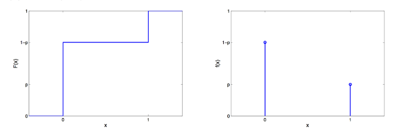

$$F\left(x\right)=\begin{cases}0,&x<0,\\ 1-p,&0\leqslant x<1,\\ 1,&x\geqslant1.\end{cases}$$

$$F\left(x\right)=\begin{cases}1-p,&x=0,\\ 1,&x=1.\end{cases}$$

Пример: Результат Подбрасывания Монеты

Распределе́ние Берну́лли  — дискретное распределение вероятностей, моделирующее случайный эксперимент произвольной природы, при заранее известной вероятности успеха или неудачи.

Случайная величина 
𝑋 имеет распределение Бернулли, если она принимает всего два значения: 1 и 0 с вероятностями 
𝑝 и $q\equiv 1-p$ соответственно. Таким образом:

$\mathbb {P} (X=1)=p$,

$\mathbb {P} (X=0)=q$.

## Биномиальное распределение

$𝑋∈{0, . . . , 𝑁} ∼𝐵𝑖𝑛(𝑁, 𝑝) , 𝑁∈N, 𝑝∈[0, 1]$​

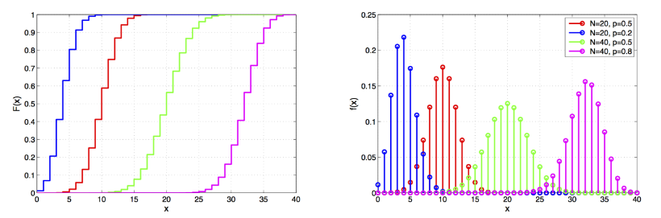

$$\begin{array}{l}{{F\left(x\right)=I_{1-p}\left(N-x,1+x\right)}}\\ {{f\left(x\right)=C_{N}^{x}p^{x}\left(1-p\right)^{N-x}}}\end{array}$$

- пусть 𝑋1*, . . . , 𝑋*𝑛 независимы, 𝑋𝑖∼𝐵𝑒𝑟(𝑝), тогда

  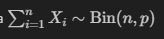

- 𝐵𝑖𝑛(1, 𝑝) = *𝐵𝑒𝑟*(𝑝)

- если 𝑁> 20 и 𝑝 не слишком близко к нулю или единице, то для 𝑋∼𝐵𝑖𝑛(*𝑁, 𝑝*) справедлива нормальная аппроксимация:
  $F_X(x) \approx \Phi\left(\frac{x-N p}{\sqrt{N p(1-p)}}\right)$​

- Пример: Число Попаданий Из 𝑁 бросков В Баскетбольное Кольцо

Биномиальное распределение — дискретное распределение вероятностей случайной величины $X$, принимающей целочисленные значения $k=0,1,\ldots,n$ с вероятностями:

$$P(X=k)={n \choose k}p^k(1-p)^{n-k}.$$

Данное распределение характеризуется двумя параметрами: целым числом n>0, называемым числом испытаний, и вещественным числом $p, 0\le p\le 1$, называемом вероятностью успеха в одном испытании. Биномиальное распределение — одно из основных распределений вероятностей, связанных с последовательностью независимых испытаний. Если проводится серия из $n$ независимых испытаний, в каждом из которых может произойти "успех" с вероятностью $p$, то случайная величина, равная числу успехов во всей серии, имеет указанное распределение. 

**Основные свойства и моменты**

Характеристическая функция: $\phi(t)=(1+p(e^{it}-1))^n.$

Моменты:

Математическое ожидание: $MX=np$.

Дисперсия: $DX=np(1-p)$.

Асимметрия: $\gamma_1=\frac{1-2p}{\sqrt{np(1-p)}}$; при $p=0.5$ распределение симметрично относительно центра $n/2$.

## Распределение Пуассона

𝑋∈{0, 1, 2, . . . } ∼𝑃𝑜𝑖𝑠(𝜆) *, 𝜆>* 0

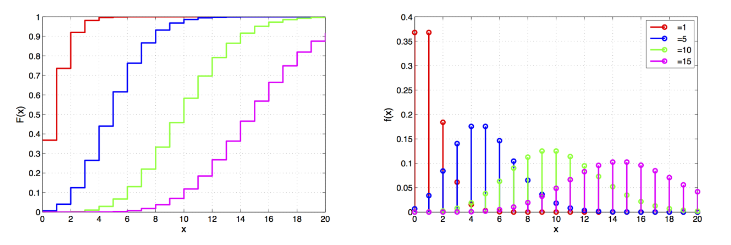

$F(x)=e^{-\lambda} \sum_{i=0}^{\lfloor x\rfloor} \frac{\lambda^i}{i !}$

$f(x)=e^{-\lambda} \frac{\lambda^x}{x !}$

- распределение числа независимых событий в фиксированном временном или пространственном интервале

- E𝑋= D𝑋= 𝜆

- пусть 𝑋1*, . . . , 𝑋*𝑛независимы, 𝑋𝑖∼*𝑃𝑜𝑖𝑠*(𝜆𝑖) , тогда

  $\sum_{i=1}^n X_i \sim$ Pois $\left(\sum_{i=1}^n \lambda_i\right)$

- если 𝑋∼𝑃𝑜𝑖𝑠(𝜆) , $Y=√X$​ то при больших 𝜆

  $F_Y(x) \approx \Phi\left(\frac{x-\sqrt{\lambda}}{\sqrt{\lambda}}\right)$

- 𝐵𝑖𝑛(𝑛, 𝑝) →𝑛→∞*𝑃𝑜𝑖𝑠*(𝜆) при постоянном 𝑛𝑝

- Пример: Количество Изюма В Булочке С Изюмом

Распределе́ние Пуассо́на — распределение дискретного типа случайной величины, представляющей собой число событий, произошедших за фиксированное время, при условии, что данные события происходят с некоторой фиксированной средней интенсивностью и независимо друг от друга.

Выберем фиксированное число 
$\lambda >0$ и определим дискретное распределение, задаваемое следующей функцией вероятности:

$$p(k)\equiv \mathbb {P} (Y=k)={\frac {\lambda ^{k}}{k!}}\,e^{-\lambda }$$

где

𝑘 — количество событий,

𝜆 — математическое ожидание случайной величины (среднее количество событий за фиксированный промежуток времени),

𝑘! — обозначает факториал числа 𝑘,

$e=2{,}718281828\ldots$ — основание натурального логарифма.

**Моменты:**

Производящая функция моментов распределения Пуассона имеет вид:

$$E_{Y}(t)=e^{\lambda \left(e^{t}-1\right)}$$

откуда $\mathbb {M} [Y]=\lambda$, $\mathbb {D} [Y]=\lambda$.

Для момента 𝑘-го порядка справедлива общая формула:

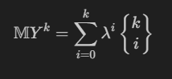

где $k=1,2,...$. 

**Свойства распределения Пуассона**

- Сумма независимых пуассоновских случайных величин с параметрами $\lambda_1, \lambda_2, \ldots, \lambda_n$ имеет распределение Пуассона с параметром $\lambda = \lambda_1 + \lambda_2 + \ldots + \lambda_n$.

- При $\lambda \to \infty$ распределение Пуассона с параметром $\lambda$ сходится к нормальному распределению $N(\lambda, \lambda)$ в соответствии с центральной предельной теоремой.

- Производящая функция распределения Пуассона с параметром $\lambda$ имеет вид $G(t) = e^{\lambda(t - 1)}$.

## Выборка

**Генеральная Совокупность** — множество объектов, свойства которых подлежат изучению в рассматриваемой задаче

**Выборка** — конечное множество объектов, отобранных из генеральной совокупности для проведения измерений.

$X^n = (𝑋1, . . . , 𝑋𝑛)$​

𝑛— **объём выборки**.

𝑋𝑛— **простая выборка**, если 𝑋1*, . . . , 𝑋*𝑛 — независимые одинаково распределённые случайные величины
(i.i.d.).

Основная Задача Статистики - Описание $𝐹_𝑋(𝑥)$ По Реализации Выборки.

## Функция распределения

$𝐹𝑛(𝑥) = 1/n\sum_{i=1}^{n}[𝑋𝑖⩽𝑥]$​ - **эмпирическая функция распределения**.

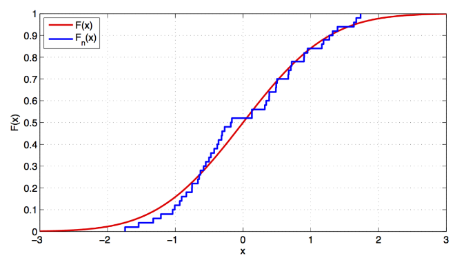

#### Основные свойства CDF:

1. **Монотонность:** CDF не убывает, т.е., если \( x_1 < x_2 \), то \( F(x_1) \leq F(x_2) \).
2. **Диапазон значений:** Значения CDF лежат в интервале от 0 до 1, то есть \( 0 \leq F(x) \leq 1 \).
3. **Границы:** \( F(x) \) стремится к 0, когда \( x \) стремится к минус бесконечности, и к 1, когда \( x \) стремится к плюс бесконечности.

## Статистика

Статистика $𝑇(𝑋^𝑛)$ - любая измеримая функция выборки.

выборочное среднее:

$${\bar{X}}={\frac{1}{n}}\sum_{i=1}^{n}X_{i},$$
выборочная дисперсия:

$$S^{2}=\frac{1}{n-1}\,\sum_{i=1}^{n}\left(X_{i}-\bar{X}\right)^{2}$$

**вариационный ряд**:

$$X_{(1)}\leqslant X_{(2)}\leqslant\ldots\leqslant X_{(n)}$$
ранг элемента выборки 𝑋𝑖:
$rank (X_{i}) = 𝑟: 𝑋_{𝑖}= X_{(r)}$
𝑘-я порядковая статистика: $X_{(k)}$
выборочный 𝛼-квантиль: $𝑋_{([𝑛𝛼])}$
выборочная медиана:

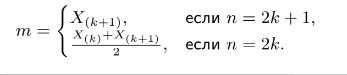

выборочный интерквартильный размах:

$𝐼𝑄𝑅_{𝑛}= 𝑋_{([0.75𝑛])} −𝑋_{([0.25𝑛])}$

выборочный коэффициент ассиметрии:

$$g_{1}={\frac{\sqrt{n}\sum\limits_{i=1}^{n}}{\left(\sum\limits_{i=1}^{n}\left(X_{i}\,-\,{\bar{X}}\right)^{2}\right)^{3/2}}}$$
выборочный коэффициент эксцесса:
$$g_{2}=\frac{n\sum\limits_{i=1}^{n}{\left(X_{i}\,-\,{\bar{X}}\right)^{4}}}{\left(\sum\limits_{i=1}^{n}{\left(X_{i}\,-\,{\bar{X}}\right)^{2}}\right)^{2}}\,-\,3$$

## Оценки центральной тенденции

**Выборочное среднее**

Выборочное среднее $\overline{X}$ — среднее арифметическое элементов выборки.

**Выборочная медиана**

Выборочная медиана $Q_{0.5}$ — значение, разделяющее упорядоченную выборку на две равные части.

**Выборочная мода**

Выборочная мода — значение, которое встречается наиболее часто в выборке.

## Об ограниченности статистик

### Основные ограничения статистик:

1. **Выборка:**
   - **Размер выборки:** Маленькие выборки могут не отражать реальную популяцию и увеличивают вероятность случайных ошибок. Большие выборки более репрезентативны, но могут быть трудными и дорогостоящими для сбора.
   - **Случайность выборки:** Выборка должна быть случайной и репрезентативной для того, чтобы выводы могли быть обобщены на всю популяцию.

2. **Смещение (Bias):**
   - **Систематическое смещение:** Может возникать из-за некорректного метода сбора данных, например, выборка только определенной группы населения.
   - **Смещение выборки:** Смещение может возникнуть, если некоторые элементы популяции имеют меньшую вероятность быть включенными в выборку.

3. **Ошибки измерения:**
   - **Точность данных:** Данные могут содержать ошибки из-за неточностей измерений или записи.
   - **Валидация данных:** Необходимо проверять и валидацировать данные, чтобы уменьшить влияние ошибок измерения на результаты.

4. **Корреляция и причинность:**
   - **Корреляция не означает причинность:** Даже если два события коррелируют, это не означает, что одно событие вызывает другое.
   - **Скрытые переменные:** Взаимосвязь между переменными может быть вызвана третьей, неучтенной переменной.

5. **Анализ данных:**
   - **Многократное тестирование:** Проведение множества статистических тестов увеличивает вероятность получения ложноположительных результатов.
   - **Подгонка моделей:** Слишком сложные модели могут переобучаться на обучающих данных, но плохо обобщаться на новые данные.

6. **Интерпретация результатов:**
   - **Погрешность:** Всегда существует вероятность ошибки в статистических выводах.
   - **Обобщение:** Результаты должны интерпретироваться с учетом контекста и ограничений используемых методов.

## Точечные оценки

Пусть распределение генеральной совокупности параметрическое:

$𝐹(𝑥) = 𝐹(𝑥, 𝜃)$

Статистика $\hat𝜃𝑛= \hat𝜃(𝑋^𝑛)$ - точечная оценка параметра 𝜃.

Какая оценка лучше?

**Состоятельность:**

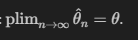

**Несмещённость:** $E\bar𝜃_{𝑛}= 𝜃.$

**Асимптотическая несмещённость:** $lim_{n \rightarrow \infty}E\hat𝜃𝑛= 𝜃.$

**Оптимальность:** $D\hat𝜃_{𝑛} = min_{\hat𝜃: E\hat𝜃=𝜃} D\hat𝜃.$

**Робастность:** устойчивость $\hat𝜃_{n}$относительно отклонений истинного распределения 𝑋 от модельного семейства выбросов, содержащихся в выборке

#### Основные характеристики точечных оценок:

1. **Несмещенность:**
   - Оценка называется несмещенной, если её математическое ожидание равно истинному значению оцениваемого параметра. Например, выборочное среднее является несмещенной оценкой математического ожидания.

2. **Состоятельность:**
   - Оценка называется состоятельной, если она сходится по вероятности к истинному значению параметра при увеличении размера выборки. То есть, по мере увеличения объема выборки, оценка становится более точной.

3. **Эффективность:**
   - Эффективная оценка имеет наименьшую возможную дисперсию среди всех несмещенных оценок данного параметра. Эффективные оценки обеспечивают наибольшую точность.

4. **Смещенность и дисперсия:**
   - Для оценки качества точечной оценки часто рассматриваются её смещенность и дисперсия. Смещенность показывает отклонение средней величины оценки от истинного значения параметра, а дисперсия — разброс оценок.

#### Примеры точечных оценок:

1. **Выборочное среднее (Mean):**
   - Выборочное среднее $\bar{X}$ используется для оценки математического ожидания $\mu$ популяции.

   $$\bar{X} = \frac{1}{n} \sum_{i=1}^{n} X_i$$

2. **Выборочная дисперсия (Sample Variance):**
   - Выборочная дисперсия $S^2$ используется для оценки дисперсии $\sigma^2$ популяции.

   $$S^2 = \frac{1}{n-1} \sum_{i=1}^{n} (X_i - \bar{X})^2$$

3. **Выборочная пропорция (Sample Proportion):**
   - Выборочная пропорция $\hat{p}$ используется для оценки доли элементов в популяции с определенным свойством.

   $$\hat{p} = \frac{k}{n}$$

   где $k$ — количество элементов с данным свойством, $n$ — общий размер выборки.

## Метод максимума правдоподобия

Популярный метод получения точечных оценок:

$X\sim f\left(x,\theta\right),$

$X^{n}=\left(X_{1},\ldots,X_{n}\right),$

$L\left(X^{n},\theta\right)=\prod_{i=1}^{n}\ f\left(X_{i},\theta\right),$

$\theta_{MLE}=\underset{\theta}{\operatorname{argmax}}\,L\left(X^{n},\theta\right).$

Удобно прологарифмировать:

$$\log L\left(X^{n},\theta\right)=\sum_{i=1}^{n}\log f\left(X_{i},\theta\right)$$

$$\hat{\theta}_{MLE}\equiv\operatorname*{argmax}_{\theta}\log L\left(X^{n},\theta\right).$$

## Производные функции правдоподобия

Score function:

$$S\left(\theta\right)\equiv\frac{\partial}{\partial\theta}\log L\left(\theta\right)$$

ОМП — решение score equation:

$$S\left(\theta\right)=0$$
Информация Фишера:

$$I\left(\theta\right)\equiv-\frac{\partial^{2}}{\partial\theta^{2}}\log L\left(\theta\right)$$

Дисперсия ОМП:

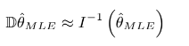

## Свойства ОМП

ОМП (оценка максимального правдоподобия) — это метод в статистическом анализе, используемый для оценки параметров статистической модели. ОМП находит такие значения параметров, которые делают наблюдаемые данные наиболее вероятными.

состоятельность: $plim_{𝑛→∞} \hat𝜃𝑀𝐿𝐸 = 𝜃$

асимптотическая нормальность: при 𝑛→∞
$𝜃_{𝑀𝐿𝐸} ∼ 𝑁 (︀ 𝜃, 𝐼^{-1} (𝜃) )$

эффективность: ОМП имеют наименьшую дисперсию среди всех состоятельных оценок 

инвариантность: $𝑔 (︁ \hat𝜃_{𝑀𝐿𝐸})︁$ — ОМП-оценка для 𝑔(𝜃)

## Интервальные оценки

Доверительный интервал:
$P(𝜃∈[𝐶_{𝐿}, 𝐶_{U}]) ⩾1 −𝛼,$
1 −𝛼— уровень доверия,
$[𝐶_{𝐿}, 𝐶_{U}]$— нижний и верхний доверительные пределы.

**Неверная интерпретация:** неизвестный параметр лежит в пределах построенного доверительного интервала с вероятностью 1 −𝛼.

**Верная интерпретация:** при бесконечном повторении процедуры построения доверительного интервала на аналогичных выборках в 100(1 −𝛼)% случаев он будет содержать истинное значение 𝜃.

### Для нормального распределения

$𝑋 ∼ 𝑁 (︀ 𝜇, 𝜎^2 )︀ , 𝑋^𝑛 = (𝑋1, . . . , 𝑋𝑛)$,

$\bar𝑋_{𝑛}$ — оценка $E𝑋 = 𝜇$
$\bar{X}_n \sim N\left(\mu, \frac{\sigma^2}{n}\right) \Rightarrow$

$\mathbf{P}\left(\mu-z_{1-\frac{\alpha}{2}} \frac{\sigma}{\sqrt{n}} \leqslant \bar{X}_n\right.\left.\leqslant \mu+z_{1-\frac{\alpha}{2}} \frac{\sigma}{\sqrt{n}}\right)=1-\alpha \Rightarrow$
доверительный интервал для 𝜇:

$\mathbf{P}\left(\bar{X}_n-z_{1-\frac{\alpha}{2}} \frac{\sigma}{\sqrt{n}} \leqslant \mu\right.\left.\leqslant \bar{X}_n+z_{1-\frac{\alpha}{2}} \frac{\sigma}{\sqrt{n}}\right)=1-\alpha \Rightarrow$
$𝑧1−\frac𝛼2$ - квантиль стандартного нормального распределения.

### Для ненормальных распределений

**ЦПТ**: Если $𝑋^𝑛$ — выборка из $𝐹(𝑥), 𝐹(𝑥)$ не слишком скошено и $𝑛> 30$, то

$${\bar{X}}_{n}\sim\approx N\left(\mathbb{E}X,{\frac{\mathbb{D}X}{n}}\right)\Rightarrow$$
доверительный интервал для $E𝑋$:

$$\mathbf{P}\!\left({\bar{X}}_{n}-z_{1-{\frac{\alpha}{2}}}{\sqrt{\ \frac{\nu\mathbf{A}}{n}}}\ \leqslant\mathbb{E}X\leqslant{\bar{X}}_{n}+z_{1-{\frac{\alpha}{2}}}{\sqrt{\frac {DX} n}}\ \right)\approx1-\alpha.$$

Если дисперсия неизвестна:

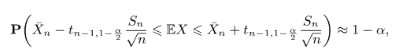

$𝑡𝑛−1,1−\frac𝛼2$ — квантиль распределения Стьюдента с 𝑛−1 степенью свободы.

## Квантили

Непараметрический доверительный интервал для медианы непрерывного распределения

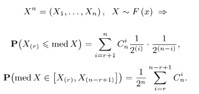

При  $n>10$ применима нормальная аппроксимация:

 $\mathbf{P}(\operatorname{med} X \in[X\left(\left\lfloor\frac{n-\sqrt{n} z_{1-\frac{\alpha}{2}}}{2}\right\rfloor\right), X\left(\left\lfloor\frac{n-\sqrt{n} z_{1-\frac{\alpha}{2}}}{2}\right\rfloor\right) ≈ 1 − \alpha$

Аналогично строится непараметрический доверительный интервал для любого квантиля $𝑋_𝛼, 𝛼 ∈ (0, 1)$:

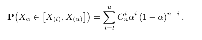

## Построение доверительных интервалов

Как можно оценить $𝐹_{\hat𝜃{_𝑛}}(𝑥)$ - выборочное распределение статистики $\hat𝜃{_𝑛}$?

### Параметрический метод

Параметрический метод используется, когда предполагается известная форма распределения данных и известные параметры этого распределения. Например, если данные приближаются нормальным распределением, то используются формулы для построения доверительных интервалов на основе стандартного нормального распределения или распределения Стьюдента в зависимости от известности или неизвестности дисперсии.

**Пример**

Доверительный интервал для среднего с известной дисперсией:
  $$\left( \overline{X} - z_{\alpha/2} \frac{\sigma}{\sqrt{n}}, \; \overline{X} + z_{\alpha/2} \frac{\sigma}{\sqrt{n}} \right)$$
  
  где $\overline{X}$ — выборочное среднее, $\sigma$ — известное стандартное отклонение, $z_{\alpha/2}$ — квантиль стандартного нормального распределения.

### Наивный метод

Наивный метод (или метод "по-быстрому") используется без предположений о распределении данных или их параметрах. Он основывается на статистической интуиции и может быть применен в ситуациях, когда нет точной информации о распределении или мало данных для более сложных методов.

**Пример:**

Доверительный интервал для доли:
  $$\left( \hat{p} - z_{\alpha/2} \sqrt{\frac{\hat{p}(1 - \hat{p})}{n}}, \; \hat{p} + z_{\alpha/2} \sqrt{\frac{\hat{p}(1 - \hat{p})}{n}} \right)$$

  где $\hat{p}$ — выборочная доля, $z_{\alpha/2}$ — квантиль стандартного нормального распределения.

### Бутстрэп

Бутстрэп — это метод, который позволяет оценить распределение выборочной статистики путем повторного выбора элементов из исходной выборки с возвращением. Этот метод особенно полезен, когда данные сложно распределены или необходимо оценить нестандартные статистики.

**Пример:**

Процесс бутстрэпа:
  1. Сгенерировать много подвыборок (бутстреп-выборок) из исходной выборки.
  2. Для каждой бутстреп-выборки вычислить интересующую статистику (например, среднее, медиану, долю и т.д.).
  3. Построить распределение статистики на основе бутстреп-выборок и вычислить доверительный интервал, например, через квантили полученного распределения.

Бутстрэп позволяет оценить доверительные интервалы для статистик даже в случае сложных данных или нестандартных распределений, где параметрические методы могут быть неприменимы.

## Бутстреп

Извлечение выборок из генеральной совокупности — сэмплирование из неизвестного распределения $𝐹_𝑋(𝑥) .$
Лучшая оценка $𝐹_𝑋(𝑥)$ , которая у нас есть — $𝐹_{𝑋^𝑛}(𝑥)$:

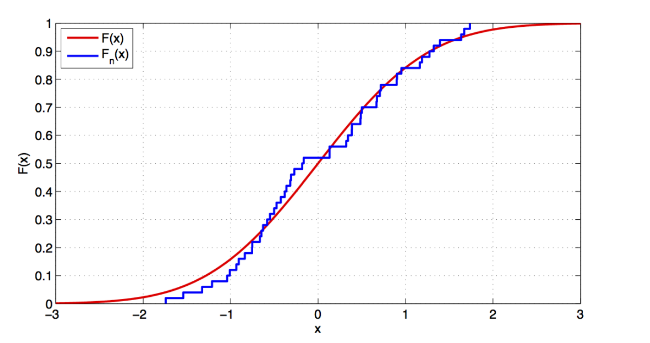

Сэмплировать из неё — это то же самое, что делать из $𝑋^𝑛$​ выборки с возвращением объёма 𝑛.

Бутстреп (bootstrap) — это метод, который используется для оценки распределения выборочной статистики путём многократного извлечения выборок из исходной выборки с возвращением. Он позволяет оценивать стандартные ошибки и доверительные интервалы для различных статистик без необходимости предполагать конкретное распределение исходной генеральной совокупности.

### Принцип работы бутстрепа:

1. **Исходная выборка**: Представляет собой набор данных, доступных для анализа.

2. **Ресемплирование с замещением**: Из исходной выборки случайным образом выбираются выборки того же размера, что и исходная, с замещением (то есть одни и те же элементы могут попасть в бутстрепную выборку несколько раз).

3. **Вычисление статистики интереса**: На каждой бутстрепной выборке вычисляется статистика интереса (например, среднее значение, медиана, стандартное отклонение и т.д.).

4. **Формирование распределения**: Собираются значения статистики интереса из множества бутстрепных выборок.

5. **Оценка доверительного интервала**: На основе полученного распределения вычисляются квантили для получения доверительного интервала заданного уровня.

### Преимущества бутстрепа:

- **Непараметрический метод**: Не требует предположений о форме распределения исходной генеральной совокупности.
- **Универсальность**: Может быть применён для оценки практически любой статистики, включая квантили, корреляции, регрессионные коэффициенты и другие.
- **Робастность**: Обычно дает хорошие результаты даже при наличии небольших выборок или выбросов.

### Пример бутстреповского доверительного интервала:

Предположим, что у нас есть выборка размера $n$, и мы хотим построить 95%-й бутстреповский доверительный интервал для среднего значения. Мы бы ресемплировали выборки из исходной выборки, вычисляли бы среднее значение на каждой бутстрепной выборке и затем находили бы 2.5% и 97.5% квантили полученного распределения для получения доверительного интервала.

## Бутстреп-распределение

𝑋1**, . . . , 𝑋*𝑁* — бутстреп-псевдовыборки из $𝑋^𝑛$ объёма 𝑛,
$𝜃^{1*}_𝑛 , . . . , 𝜃^{N*}_𝑛 $ — значения статистики на них
$F^{boot}_{\hat𝜃_n} (x)$ — бутстреп-распределение $\hat𝜃_n$​ — эмпирическая функция распределения, построенная по значениям статистики на псевдовыборках.

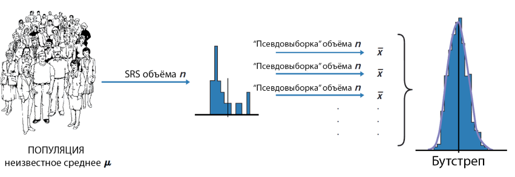

По $F^{boot}_{\hat𝜃_n}$ (x) можно строить доверительные интервалы для $𝜃$!

## Доверительные интервалы

Возьмём выборочные квантили бутстреп-распределения:

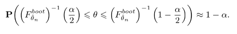

Это базовый бутстреп.

Посчитаем $S^{boot}_n$— выборочное стандартное отклонение  $\hat𝜃_n$ на псевдовыборках:

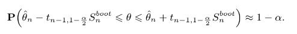

Это стьюдентизированный бутстреп.

Слегка изменим наивный бутстреп:

$$\mathbf{P}\!\left(\left(F_{\hat{\theta}_{n}}^{boot}\right)^{-1}\left(\alpha_{1}\right)\leqslant\theta\leqslant\left(F_{\hat{\theta}_{n}}^{boot}\right)^{-1}\left(\alpha_{2}\right)\right)\approx1-\alpha,$$

$$\alpha_{1}=\Phi\left(\hat{z}_{0}+\frac{\hat{z}_{0}+z_{\frac{\alpha}{2}}}{1-\hat{a}\left(\hat{z}_{0}+z_{\frac{\alpha}{2}}\right)}\right),$$

$$\alpha_{2}=\Phi\left(\hat{z}_{0}+\frac{\hat{z}_{0}+z_{1-\frac{\alpha}{2}}}{1-\hat{a}\left(\hat{z}_{0}+z_{1-\frac{\alpha}{2}}\right)}\right),$$

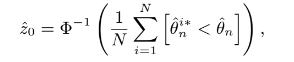

Это несмещённый ускоренный бутстреп.

### Свойства Бутстрепа

Асимптотическая состоятельность

Простота использования даже для самых сложных статистик

Плохо работает для статистик, значение которых зависит от небольшого числа элементов выборки

## Проверка Гипотез

выборка: $𝑋^𝑛= (𝑋_1, . . . , X_𝑛), 𝑋 ∼ P∈ Ω$​

нулевая гипотеза: $𝐻0 : P∈ 𝜔, 𝜔 ∈ Ω $

альтернатива: $𝐻1 : P\notin 𝜔$

статистика:

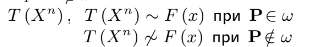

реализация выборки: $𝑥^𝑛 = (𝑥1, . . . , 𝑥𝑛)$

реализация статистики:  $𝑡= 𝑇(𝑥_𝑛)$

достигаемый уровень значимости: $𝑝(𝑥^𝑛)$ - вероятность при $𝐻_0$ получить
$𝑇(𝑋^𝑛) = 𝑡$​​ или ещё более экстремальное

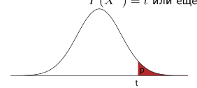

$𝑝 (𝑥^𝑛 ) = P(𝑇 ≥ 𝑡|𝐻0 )$

Гипотеза отвергается при $𝑝(𝑥^𝑛) ⩽ 𝛼, 𝛼$​ — уровень значимости

## Достигаемый уровень значимости

$𝑝= P(𝑇⩾𝑡|𝐻0)\neq P(𝐻0)$

**Пример:** утверждается, что осьминог предсказывает результаты матчей с участием сборной Германии на чемпионате мира по футболу 2010 года, выбирая кормушку с флагом страны-победителя. По результатам 13 испытаний ему удаётся верно угадать результаты 11 матчей. Применяя подходящий статистический критерий, мы получаем 𝑝≈0.0112.

0.0112 — не вероятность того, что осьминог выбирает кормушку наугад! Эта вероятность равна единице.

## Ошибки I И II Рода

|                | 𝐻0 верна                             | 𝐻0 неверна                           |
| -------------- | ------------------------------------ | ------------------------------------ |
| 𝐻0 неверна     | 𝐻0 верно принята                     | Ошибка второго рода (False negative) |
| 𝐻0 отвергается | Ошибка первого рода (False positive) | 𝐻0 верно отвергнута                  |

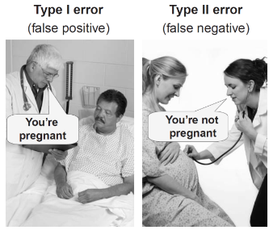

Задача проверки гипотез несимметрична относительно пары (𝐻0, 𝐻1): вероятность ошибки первого рода ограничивается сверху величиной 𝛼, а второго рода - минимизируется путём выбора критерия.

Корректный критерий: $P(𝑝(𝑇) ⩽𝛼|𝐻0 ) ⩽𝛼∀P∈Ω$.

Мощность: $pow = P(𝑝(𝑇) ⩽𝛼|𝐻1 )$ .

Состоятельный критерий: pow →1 для всех альтернатив $𝐻_1$ при$ 𝑛→∞$.

𝑇1 — **равномерно наиболее мощный** критерий, если $∀𝑇_2$
	$P(𝑝(𝑇_1) ⩽𝛼|𝐻1 ) ⩾P(𝑝(𝑇_2) ⩽𝛼|𝐻1 ) ∀𝐻1 \neq 𝐻0$,

​	$P(𝑝(𝑇_1) ⩽𝛼|𝐻0 ) = P(𝑝(𝑇_2) ⩽𝛼|𝐻0 )$ ,

 причём хотя бы для одной 𝐻1 неравенство строгое.

 ## Интерпретация результата

Если величина 𝑝 достаточно мала, то данные свидетельствуют против нулевой гипотезы в пользу альтернативы.

Если величина 𝑝 недостаточно мала, то данные не свидетельствуют против нулевой гипотезы в пользу альтернативы.

При помощи инструмента проверки гипотез нельзя доказать справедливость нулевой гипотезы! Absence of evidence ⇏ evidence of absence.

## Статистическая и практическая значимость

Вероятность отвергнуть нулевую гипотезу зависит не только от того, насколько она отличается от истины, но и от размера выборки.

По мере увеличения 𝑛 нулевая гипотеза может сначала приниматься, но потом выявятся более тонкие несоответствия выборки гипотезе $𝐻_0$, и она будет отвергнута.

При любой проверке гипотез нужно оценивать **размер эффекта** — степень отличия нулевой гипотезы отличается от истины, и оценивать его практическую значимость.

(Lee et al, 2010): за три года женщины, упражнявшиеся не меньше часа в день, набрали значимо меньше веса, чем женщины, упражнявшиеся меньше 20 минут в день (𝑝< 0.001). Разница в набранном весе составила 150 г. Практическая значимость такого эффекта сомнительна.

Подробности: http://youtu.be/oqDZO-mfN4Q.

(Ellis, 2010, гл. 2): в 2002 году клинические испытания гормонального препарата Премарин, облегчающего симптомы менопаузы, были досрочно прерваны. Было обнаружено, что его приём ведёт к значимому увеличению риска развития рака груди на 0.08%, риска инсульта на 0.08% и инфаркта на 0.07%. Формально эффект крайне мал, но с учётом численности населения он превращается в тысячи дополнительных смертей.

(Kirk, 1996): если при испытании гипотетического лекарства, позволяющего замедлить прогресс ослабления интеллекта больных Альцгеймером, оказывается, что разница в IQ контрольной и тестовой групп составляет 13 пунктов, возможно, изучение лекарства стоит продолжить, даже если эта разница статистически незначима.

## Односторонняя альтернатива

$𝐻_1$ : Джеймс Бонд предпочитает взболтанный мартини.

При справедливости такой альтернативы более вероятны большие значения 𝑇(т.е., большие 𝑇
свидетельствуют против $𝐻_0$ в пользу $𝐻_1$).

Вероятность того, что Джеймс Бонд предпочтёт взболтанный мартини в 12 или более случаях из 16 при справедливости $𝐻_0$, равна $\frac{2517} {65536} ≈0.0384$​​.

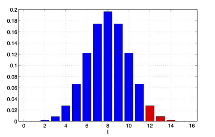

0.0384 — достигаемый уровень значимости при реализации 𝑡 = 12.

## Двусторонняя альтернатива

$𝐻_1$ : Джеймс Бонд предпочитает какой-то определённый вид мартини.

При справедливости такой альтернативы и большие, и маленькие значения 𝑇 свидетельствуют против $𝐻_0$ в пользу $𝐻_1$).

Вероятность того, что Джеймс Бонд предпочтёт взболтанный мартини в ⩾12 случаях из 16 при справедливости 𝐻_0, равна $\frac {5034} {65536} ≈ 0.0768$​​.

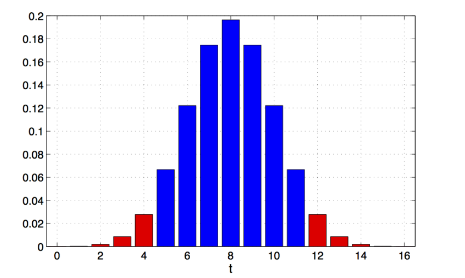

0.0768 — достигаемый уровень значимости при реализации 𝑡 = 12.
