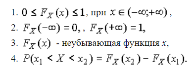
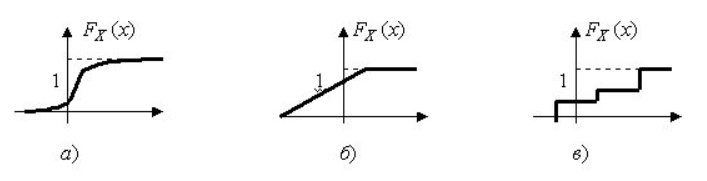
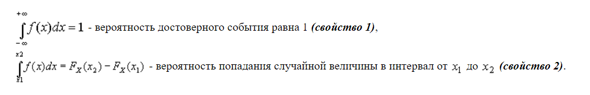
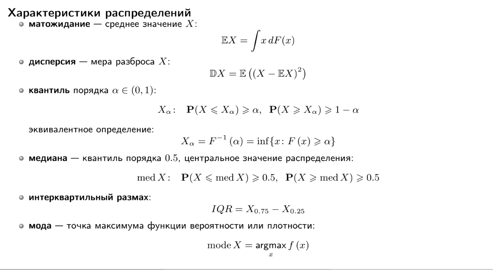
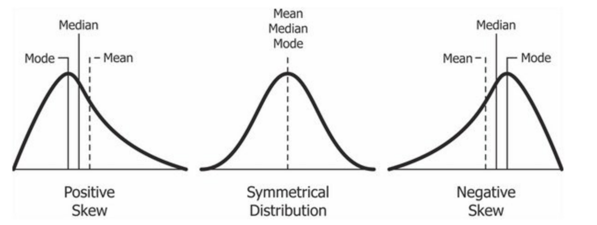

# Введение в курс

## Зачем нужен этот курс

- Изучение специфических статистических методов для конкретных постановок задач

- Определение границ применимости методов

  (Marriott, 1974): If the results disagree with informed opinion, do not admit a simple logical interpretation, and do not show up clearly in a graphical presentation, they are probably wrong. There is no magic about numerical methods, and many ways in which they can break down. They are a valuable aid to the interpretation of data, not sausage machines automatically transforming bodies of numbers into packets of scientific fact.

- Развитие статистического мышления
  
  (Begg et al., 1992): Понимание механизмов работы статистики позволяет находить менее стереотипные и более осознанные решения повседневных задач.

## Изучение случайности

**Вероятность события** — доля испытаний, завершившихся наступлением события, в бесконечном эксперименте.

**Закон больших чисел (ЗБЧ)** — принцип, описывающий результат выполнения одного и того же эксперимента много раз. Согласно закону, среднее значение конечной выборки из фиксированного распределения близко к математическому ожиданию этого распределения.

Другими словами, чем больше объём выборки, тем чаще проводятся измерения какого-либо параметра, тем выше вероятность, что результаты окажутся близки к ожидаемым.

Закон больших чисел важен, поскольку он гарантирует устойчивость для средних значений некоторых случайных событий при достаточно длинной серии экспериментов.

Важно помнить, что закон применим только тогда, когда рассматривается большое количество испытаний.

Дискретная случайная величина 𝑋 принимает счётное множество значений 𝐴= {𝑎1, 𝑎2, ..., 𝑎n} с вероятностями 𝑝1, 𝑝2,...,𝑝n

$\sum_i p_1=1$

𝑓𝑋(𝑎𝑖) = P(𝑋=𝑎𝑖) = 𝑝𝑖— **функция вероятности**. 

Для описания как дискретных, так и непрерывных случайных величин используется **функция распределения вероятности**. Пусть Х - случайная величина и х - ее любое значение. Функция распределения вероятности определяется следующим образом:

$$ F_X(x)=\mathbf{P}(X \leqslant x)$$

Поскольку функция распределения вероятности представляет собой вероятность, то она удовлетворяет следующим свойствам:

Примеры функций распределения вероятности:

Функция распределения вероятности не всегда удобна для расчетов. Часто удобнее использовать не саму функцию $F_X(x)$, а ее производную. Она называется **плотностью распределения вероятности**.

Физический смысл $f(x)$ состоит в том, что произведение $f(x)dx$ представляет вероятность попадания случайной величины $Х$ в интервал от $х$ до $х+dx$ , т.е.

$$ f(x)dx=\mathbf{P}(x \leqslant X \leqslant x+dx)$$

Свойства плотности распределения вероятности имеют вид:

## Характеристики распределений

Важнейшими среди них являются математическое ожидание, дисперсия, среднее квадратическое отклонение, коэффициент вариации, моменты, центральные моменты, коэффициент асимметрии, коэффициент эксцесса, медиана, мода, первая квартиль, третья квартиль, интерквартильный размах, квантили.

### Математическое ожидание

**Математическое ожидание** (или среднее значение) случайной величины является одной из наиболее фундаментальных характеристик её распределения. Оно описывает центральную тенденцию значений, которые случайная величина принимает.

#### Определение

Математическое ожидание $E(X)$ случайной величины $X$ — это взвешенная сумма всех возможных значений этой случайной величины, где веса соответствуют вероятностям этих значений.

Для дискретной случайной величины $X$, которая принимает значения $x_1, x_2, ..., x_n$ с вероятностями $p_1, p_2, ..., p_n$, математическое ожидание определяется как:

$$ E(X) = \sum_{i=1}^n x_i p_i $$

Для непрерывной случайной величины $X$ с плотностью вероятности $f_X(x)$, математическое ожидание определяется как:

$$ E(X) = \int_{-\infty}^\infty x f_X(x) \, dx $$

#### Свойства математического ожидания

1. **Линейность**:
   
   Если $X$ и $Y$ — случайные величины, а $a$ и $b$ — константы, то:
     $ E(aX + bY) = aE(X) + bE(Y) $

2. **Математическое ожидание константы**:
   
   Если $C$ — константа, то:
     $ E(C) = C $

3. **Математическое ожидание суммы**:
   
   Для случайных величин $X_1, X_2, \ldots, X_n$:
     $ E\left(\sum_{i=1}^n X_i\right) = \sum_{i=1}^n E(X_i) $

### Дисперсия

Дисперсия случайной величины является одной из основных характеристик её распределения. Она измеряет степень разброса значений случайной величины относительно её математического ожидания.

#### Определение

Дисперсия $ \mathrm{Var}(X) $ случайной величины $ X $ — это математическое ожидание квадрата отклонения случайной величины от её математического ожидания.

Для дискретной случайной величины $ X $, которая принимает значения $ x_1, x_2, \ldots, x_n $ с вероятностями $ p_1, p_2, \ldots, p_n $, дисперсия определяется как:

$$
\mathrm{Var}(X) = E[(X - E(X))^2] = \sum_{i=1}^n (x_i - E(X))^2 p_i
$$

Для непрерывной случайной величины $ X $ с плотностью вероятности $ f_X(x) $:

$$
\mathrm{Var}(X) = E[(X - E(X))^2] = \int_{-\infty}^{\infty} (x - E(X))^2 f_X(x) \, dx
$$

#### Альтернативное выражение

Дисперсию можно также выразить через математическое ожидание квадрата случайной величины:

$$
\mathrm{Var}(X) = E[X^2] - (E[X])^2
$$

#### Свойства дисперсии

1. **Неотрицательность**: Дисперсия всегда неотрицательна, то есть $ \mathrm{Var}(X) \geq 0 $. Она равна нулю тогда и только тогда, когда случайная величина является константой почти наверное.
2. **Линейность**: Для любых двух случайных величин $ X $ и $ Y $ и чисел $ a $ и $ b $ справедливо:
    $$
    \mathrm{Var}(aX + bY) = a^2 \mathrm{Var}(X) + b^2 \mathrm{Var}(Y) + 2ab \, \mathrm{Cov}(X, Y)
    $$
    где $ \mathrm{Cov}(X, Y) $ — ковариация случайных величин $ X $ и $ Y $.
3. **Смещение и масштабирование**: Для любой случайной величины $ X $ и чисел $ a $ и $ b $:
    $$
    \mathrm{Var}(aX + b) = a^2 \mathrm{Var}(X)
    $$

Дисперсия является важной характеристикой, так как она показывает, насколько сильно значения случайной величины разбросаны относительно её среднего значения.

### Квантиль

**Квантиль** — это значение, которое делит распределение случайной величины на части с заданной вероятностью. Квантили используются для описания распределения случайной величины и для оценки вероятностей.

#### Определение

Квантиль порядка $ p $ случайной величины $ X $ — это значение $ x_p $, такое что вероятность того, что $ X $ меньше или равно $ x_p $, равна $ p $. 

Иными словами, квантиль порядка $ p $ — это значение $ x_p $, удовлетворяющее следующему условию:

$$
P(X \leq x_p) = p
$$

где $ 0 < p < 1 $.

#### Примеры квантилей

1. **Медиана** — квантиль порядка $ p = 0.5 $:
    $ x_{0.5} $
    Медиана делит распределение случайной величины на две равные части.
   
2. **Квартили**:
   - Первый квартиль (нижний квартиль) — квантиль порядка $ p = 0.25 $:
     $
     x_{0.25}
     $
   - Третий квартиль (верхний квартиль) — квантиль порядка $ p = 0.75 $:
     $
     x_{0.75}
     $

3. **Перцентили**: Перцентили — это квантили, определяющие значения, ниже которых падает определённый процент распределения. Например, 90-й перцентиль — квантиль порядка $ p = 0.90 $:
    $
    x_{0.90}
    $

#### Свойства квантилей

1. **Уникальность**: Для непрерывного распределения функция распределения $ F_X(x) $ строго возрастает, что гарантирует уникальность квантиля $ x_p $ для каждого $ p $.
2. **Инвариантность при монотонных преобразованиях**: Если $ Y = g(X) $, где $ g $ — строго возрастающая функция, то квантиль порядка $ p $ для $ Y $ равен $ g(x_p) $, где $ x_p $ — квантиль порядка $ p $ для $ X $.
3. **Масштабирование и сдвиг**: Для любой случайной величины $ X $ и чисел $ a > 0 $ и $ b $:
    $$
    Q_{X}(p) = x_p \implies Q_{aX + b}(p) = a x_p + b
    $$

Квантили дают важную информацию о распределении данных и широко используются в статистике и анализе данных для описания и сравнения распределений.

### Интерквартильный размах

Интерквартильный размах (IQR, Interquartile Range) — это мера статистического разброса, которая показывает диапазон значений средней половины данных. Он используется для оценки вариативности и выявления выбросов в данных.

#### Определение

Интерквартильный размах определяется как разница между третьим квартилем ($Q3$) и первым квартилем ($Q1$):

$$
\text{IQR} = Q3 - Q1
$$

- **Первый квартиль ($Q1$)** — это значение, ниже которого находится 25% наблюдений.
- **Третий квартиль ($Q3$)** — это значение, ниже которого находится 75% наблюдений.

#### Вычисление

Для вычисления интерквартильного размаха необходимо:

1. Упорядочить данные в порядке возрастания.
2. Найти первый квартиль ($Q1$) и третий квартиль ($Q3$).
3. Вычесть $Q1$ из $Q3$.

### Мода 

В статистике **мода** (от фр. mode) — это значение, которое встречается в наборе данных наиболее часто. Она является одной из мер центральной тенденции наряду с медианой и средним арифметическим.

#### Определение

Пусть $X = \{x_1, x_2, \ldots, x_n\}$ — выборка данных. Модой набора данных $X$ называется значение $x_m$, такое что количество элементов в $X$, равных $x_m$, максимально. Формально:

$$
\text{Mode}(X) = \{x_i \mid \forall x_j \neq x_i, \, f(x_i) \geq f(x_j) \}
$$

где $f(x)$ — функция частоты (число вхождений $x$ в набор данных $X$).

#### Свойства

1. **Множественные моды**: В некоторых наборах данных может быть более одной моды. Такие наборы данных называются мультимодальными.
2. **Отсутствие моды**: Если все значения в наборе данных встречаются одинаково часто, говорят, что мода отсутствует.
3. **Применимость**: Мода полезна для описания данных, которые имеют категорические или номинальные значения.

### Коэффициент асимметрии

Коэффициент асимметрии (или коэффициент скошенности) используется для описания степени асимметрии распределения данных относительно его среднего значения. Формула коэффициента асимметрии следующая:

$$
\gamma_1 = \frac{\mu_3}{\sigma^3}
$$

где $\mu_3$ — третий центральный момент, а $\sigma$ — стандартное отклонение.

Третий центральный момент вычисляется как:

$$
\mu_3 = \mathbb {E} \left[(X-\mathbb {E} X)^{3}\right]
$$

А стандартное отклонение:
$$
\sigma ={\sqrt {\mathrm {D} [X]}}
$$

### Коэффициент эксцесса

Коэффициент эксцесса (или куртозис) измеряет степень пиковости распределения данных. Он вычисляется по следующей формуле:

$$
\gamma_2 = \frac{\mu_4}{\sigma^4} - 3
$$

где $\mu_4$ — четвертый центральный момент, а $\sigma$ — стандартное отклонение.

Четвертый центральный момент вычисляется как:

$$
\mu_4 = \mathbb {E} \left[(X-\mathbb {E} X)^{4}\right]
$$

## Нормальное распределение

