# Проверка параметрических гипотез

Содержание:

1. [**Проверка гипотез**](#проверка-гипотез)
2. [**Виды задач: одновыборочные**](#виды-задач-одновыборочные)
3. [**Виды задач: двухвыборочные**](#виды-задач-двухвыборочные)
4. [**Z-критерий**](#z-критерий)
5. [**Критерий хи-квадрат**](#критерий-хи-квадрат)
6. [**t-критерий Стьюдента**](#t-критерий-стьюдента)
7. [**Альтернатива**](#альтернатива)
8. [**Боксплот**](#боксплот)
9. [**t-критерий Стьюдента / Аспина-Уэлша (проблема Беренца-Фишера)**](#t-критерий-стьюдента--аспина-уэлша-проблема-беренца-фишера)
10. [**t-критерий Стьюдента для связанных выборок**](#t-критерий-стьюдента-для-связанных-выборок)
11. [**F-критерий Фишера**](#f-критерий-фишера)
12. [**Коэффициент ассиметрии**](#коэффициент-ассиметрии)
13. [**Коэффициент экcцесса**](#коэффициент-экcцесса)
14. [**Критерий Харке-Бера**](#критерий-харке-бера)
15. [**Критерий согласия Пирсона (хи-квадрат)**](#критерий-согласия-пирсона-хи-квадрат)
16. [**Критерии, основанные на эмпирической функции распределения**](#критерии-основанные-на-эмпирической-функции-распределения)
17. [**Критерий Колмогорова (Лиллиефорса)**](#критерий-колмогорова-лиллиефорса)
18. [**Q-Q plot**](#q-q-plot)
19. [**Критерий Шапиро-Уилка**](#критерий-шапиро-уилка)
20. [**Итого о проверке нормальности**](#итого-о-проверке-нормальности)
21. [**Критерии на основе правдоподобия**](#критерии-на-основе-правдоподобия)
22. [**Критерий Вальда**](#критерий-вальда)
23. [**Критерий отношения правдоподобия**](#критерий-отношения-правдоподобия)
24. [**Критерий меток**](#критерий-меток)
25. [**Распределение Бернулли**](#распределение-бернулли)
26. [**Z-критерий меток для доли**](#z-критерий-меток-для-доли)

----
### [Вернуться ко всем лекциям](Navigation_lections.md)

## Проверка Гипотез

выборка: $𝑋^𝑛= (𝑋_1, . . . , X_𝑛), 𝑋 ∼ P∈ Ω$​

нулевая гипотеза: $𝐻0 : P∈ 𝜔, 𝜔 ∈ Ω $

альтернатива: $𝐻1 : P\notin 𝜔$

статистика: $𝑇 (𝑋^𝑛)$,

​					$𝑇 (𝑋^𝑛 ) ∼ 𝐹 (𝑥)$ при $P∈ 𝜔 $

​					$𝑇 (𝑋^𝑛) \cancel{\sim} 𝐹 (𝑥)$ при $P\notin 𝜔$​

реализация выборки: $𝑥^𝑛 = (𝑥1, . . . , 𝑥𝑛)$

реализация статистики:  $𝑡= 𝑇(𝑥_𝑛)$
достигаемый уровень значимости: $𝑝(𝑥^𝑛)$ - вероятность при $𝐻_0$ получить
$𝑇(𝑋^𝑛) = 𝑡$​​ или ещё более экстремальное

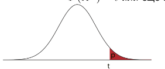

$𝑝 (𝑥^𝑛 ) = P(𝑇 ≥ 𝑡|𝐻0 )$

Гипотеза отвергается при $𝑝(𝑥^𝑛) ⩽ 𝛼, 𝛼$​ — уровень значимости

$$
\mathbf{p} \text {-value } \leq \mathrm{C}
$$

## Виды задач: одновыборочные

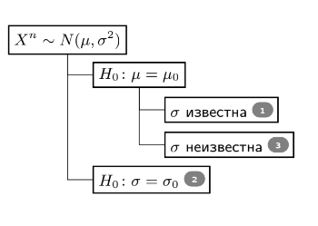

## Виды задач: двухвыборочные

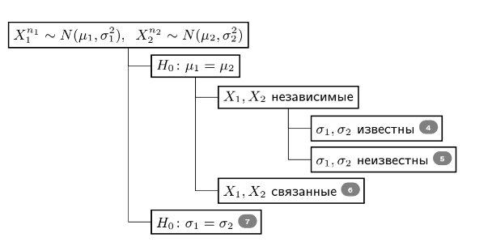

## Z-критерий

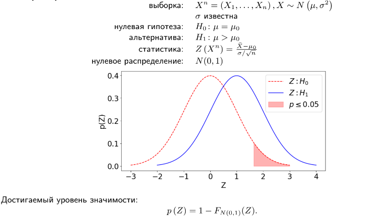

Z-тест, известный также как z-критерий Фишера, представляет собой набор статистических методов для проверки гипотез, которые базируются на предположении о нормальном распределении данных. Эти методы часто используются для анализа, являются ли средние значения двух наборов данных одинаковыми, при условии, что дисперсия генеральной совокупности известна. Еще они применяются для анализа стандартизированных выборочных средних. Расчёт Z-статистики производится путём деления разности между анализируемой случайной величиной и её математическим ожиданием на стандартную ошибку этой величины:

$$z={\frac {{\overline {X}}-\,m}{\mathrm {SE} }}$$

где X случайная величина выборочного среднего, m - значение математического ожидания, SE - стандартная ошибка этой величины.

### Условия для проведения теста

Чтобы результаты Z-теста были валидными, необходимо использовать случайную выборку из генеральной совокупности. Случайная выборка дает репрезентативность данных, что важно для точности выводов, сделанных на основе статистического анализа.

Z-тест требует, чтобы анализируемые данные были непрерывными. Непрерывные данные могут принимать любое значение внутри определенного диапазона и часто измеряются с использованием дробных или десятичных чисел.

Данные должны следовать нормальному распределению. Однако благодаря центральной предельной теореме, это предположение можно игнорировать, если размер выборки достаточно велик , что позволяет распределению средних выборочных значений приближаться к нормальному распределению даже если распределение в генеральной совокупности отличается от нормального.

В случае сравнения двух выборок, Z-тест требует, чтобы выборки были независимы. Это означает, что данные одной выборки не должны влиять на данные другой.

Ну и наконец, необходимо знать стандартное отклонение генеральной совокупности. Это требование отличает Z-тест от t-теста, который используется, когда стандартное отклонение генеральной совокупности неизвестно.

### Нулевая и альтернативная гипотеза

Нулевая гипотеза представляет собой предположение о том, что между исследуемыми переменными нет значимой разницы или связи. В контексте Z-теста, который часто используется для сравнения средних, H0 обычно утверждает, что разница между средним значением выборки и средним значением генеральной совокупности равна нулю или что средние значения двух сравниваемых групп равны.

Альтернативная гипотеза представляет собой предположение, противоположное нулевой гипотезе. Она утверждает наличие разницы, эффекта или связи между исследуемыми переменными. В контексте Z-теста, Ha может утверждать, что среднее значение выборки отличается от среднего значения генеральной совокупности, или что средние значения двух групп не равны.

В процессе Z-теста сначала формулируются H0 и Ha, после чего собираются и анализируются данные. Результаты анализа сравниваются с значениями из стандартного нормального распределения. Если рассчитанное Z-значение выходит за пределы критических значений, заданных уровнем значимости α, нулевая гипотеза отвергается в пользу альтернативной.

### Виды Z-теста

#### Одновыборочный Z-тест

Одновыборочный Z-тест — это статистический метод, используемый для сравнения среднего значения выборки с известным средним значением генеральной совокупности при известном стандартном отклонении генеральной совокупности. Тест помогает определить, есть ли статистически значимая разница между средним значением выборки и средним значением генеральной совокупности.

Допустим, у нас есть данные о результатах теста группы студентов, и мы хотим проверить, значимо ли отличается их средний балл от предполагаемого среднего балла генеральной совокупности. Предположим, что средний балл генеральной совокупности составляет 50 баллов, а стандартное отклонение генеральной совокупности — 10 баллов. Наша выборка включает средний балл 20 студентов:

#### Двухвыборочный Z-тест

Двухвыборочный Z-тест применяется для сравнения средних значений двух независимых выборок, чтобы определить, есть ли между ними статистически значимые различия. Часто юзают, когда известны стандартные отклонения генеральных совокупностей, и размеры обеих выборок достаточно велики.

## Пример, Kanji, Z-критерий

Линия по производству пудры должна обеспечивать средний вес пудры в упаковке 4 грамма, заявленное стандартное отклонение - 1 грамм.
В ходе инспекции выбрано 9 упаковок, средний вес продукта в них составляет 4.6 грамма.

$H_{0}:$ средний вес пудры в упаковке соответствует норме.

$H_{1}$ : средний вес пудры в упаковке не соответствует норме $\Rightarrow p=0.0719,95 \%$ доверительный интервал для среднего веса - $[3.95,5.25]$ г.

$H_{1}$ : средний вес пудры в упаковке превышает норму $\Rightarrow p=0.0359$, нижний $95 \%$ доверительный предел для среднего веса - 4.05 г.

**Одностороннюю альтернативу можно использовать, если знак изменения среднего известен заранее.**

## Критерий хи-квадрат

Критерий хи-квадрат — любая статистическая проверка гипотезы, в которой выборочное распределение критерия имеет распределение хи-квадрат при условии верности нулевой гипотезы. Считается, что критерий хи-квадрат — это критерий, который асимптотически верен, то есть, выборочное распределение можно сделать как угодно близким к распределению хи-квадрат путём увеличения размера выборки.

Понятие критерия хи-квадрат общее. В него входят разные методы. Но критерий Пирсона – самый популярный из них, поэтому названия иногда используют как синонимы. Критерий Пирсона помогает проверять гипотезы с помощью таблиц сопряженности, которые уже существуют и рассчитаны для многих распространенных ситуаций. Поэтому его удобно использовать.

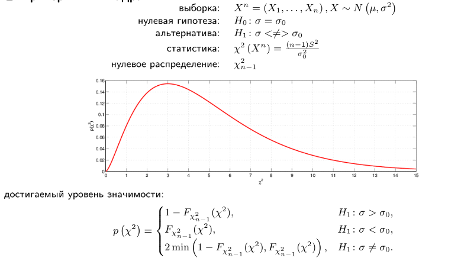

## Когда применяют критерий 

Критерий хи-квадрат используют, когда нужно определить наличие или отсутствие связи между двумя категориальными переменными — такими, которые могут принимать ограниченное количество уникальных значений. Категориальные переменные обычно не имеют числовых значений: например, цвет волос или любимое блюдо. Еще употребляют фразу «переменные, распределенные по номинальной шкале» – это означает примерно то же.

Например, исследование может пытаться установить, есть ли связь между образованием и доходом, или между полом и предпочтениями в музыке. В обоих случаях переменные категориальные – значит, критерий хи-квадрат использовать можно.

Есть еще несколько правил:

- С самого начала нужно отобрать правильные показатели – такие, которые вероятнее окажутся наглядными и репрезентативными. Они должны быть качественными и целочисленными, категориальными.
- Группы, которые сравниваются между собой, должны быть независимы друг от друга. Например, для сравнения одной и той же группы «до» и «после» какой-то манипуляции критерий не подойдет.
- Количество наблюдений для точных результатов – не менее 20 (иногда считается, что не менее 50).
- Ожидаемая частота – то, сколько раз значение теоретически должно появиться в выборке – должна быть больше или равна 5-10 для критерия Пирсона. Если она меньше, понадобится критерий Фишера.

## Как выглядит распределение хи-квадрат

В критерии хи-квадрат используют определенное распределение – то, как распределяются показатели из выборки на графике. Распределение хи-квадрат описывается как «распределение суммы квадратов n независимых стандартных нормальных случайных величин». На практике это означает вот что:

Если реальные показатели распределяются по хи-квадрату – значит, наблюдаемые величины независимы друг от друга.

## Пример, Kanji, критерий хи-квадрат

При производстве микрогидравлической системы делается инъекция жидкости. Дисперсия объёма жидкости - критически важный параметр, установленный стандартом на уровне 9 кв. мл. В выборке из 25 микрогидравлических систем выборочная дисперсия объёма жидкости составляет 12 кв. мл.

$H_{0}$ : дисперсия объёма жидкости соответствует стандарту.

$H_{1}$ : дисперсия объёма жидкости не соответствует стандарту $\Rightarrow p=0.254,95 \%$ доверительный интервал для дисперсии - $[7.3,23.2]$ кв. мл.

$H_{1}$ : дисперсия объёма жидкости превышает допустимое значение $\Rightarrow p=0.127$, односторонний нижний $95 \%$ доверительный предел -7.9 кв. мл.

## t-критерий Стьюдента

t-критерий Стьюдента — общее название для класса методов статистической проверки гипотез (статистических критериев), основанных на распределении Стьюдента. Наиболее частые случаи применения t-критерия связаны с проверкой равенства средних значений в двух выборках.

t-статистика строится обычно по следующему общему принципу: в числителе — случайная величина с нулевым математическим ожиданием (при выполнении нулевой гипотезы), а в знаменателе — выборочное стандартное отклонение этой случайной величины, получаемое как квадратный корень из несмещённой оценки дисперсии.

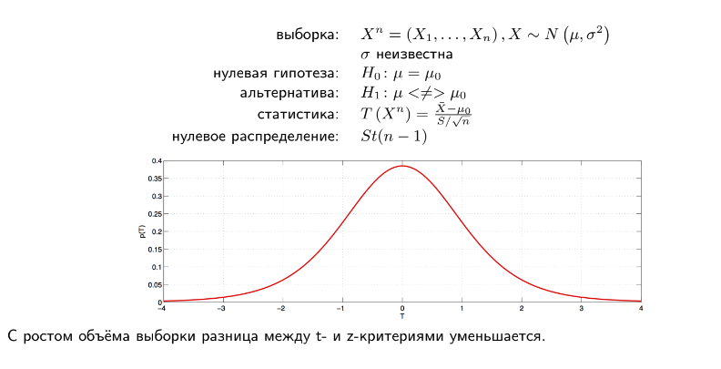

### Требования к данным

Для применения данного критерия необходимо, чтобы выборочные средние имели нормальное распределение. При маленьких выборках это означает требование нормальности исходных значений. В случае применения двухвыборочного критерия для независимых выборок также необходимо соблюдение условия равенства дисперсий. Существуют, однако, альтернативы критерию Стьюдента для ситуации с неравными дисперсиями.

Также не вполне корректно применять t-критерий Стьюдента при наличии в данных значительного числа выбросов. При несоблюдении этих условий при сравнении выборочных средних должны использоваться аналогичные методы непараметрической статистики, среди которых наиболее известными являются U-критерий Манна — Уитни (в качестве двухвыборочного критерия для независимых выборок), а также критерий знаков и критерий Уилкоксона (используются в случаях зависимых выборок).

### Одновыборочный t-критерий

Применяется для проверки нулевой гипотезы $H_{0}:E(X)=m$ о равенстве математического ожидания $E(X)$ некоторому известному значению 𝑚.

Очевидно, при выполнении нулевой гипотезы 
$E({\overline {X}})=m$. С учётом предполагаемой независимости наблюдений $V({\overline {X}})=\sigma ^{2}/n$. Используя несмещённую оценку дисперсии 

$$s_{X}^{2}=\sum _{t=1}^{n}(X_{t}-{\overline {X}})^{2}/(n-1)$$ 

получаем следующую t-статистику:

$$t={\frac {{\overline {X}}-m}{s_{X}/{\sqrt {n}}}}.$$

При нулевой гипотезе распределение этой статистики $t(n-1)$. Следовательно, при превышении (в абсолютном измерении) значения статистики критического значения данного распределения (при заданном уровне значимости), нулевая гипотеза отвергается.

### Двухвыборочный t-критерий для независимых выборок

Пусть имеются две независимые выборки объёмами $n_{1}$, 
$n_{2}$ нормально распределённых случайных величин $X_{1}$, 
$X_{2}$. Необходимо проверить по выборочным данным нулевую гипотезу равенства математических ожиданий этих случайных величин $H_{0}\colon M_{1}=M_{2}$.

Рассмотрим разность выборочных средних 
$\Delta ={\overline {X}}_{1}-{\overline {X}}_{2}$. Очевидно, если нулевая гипотеза выполнена, 
$E(\Delta )=M_{1}-M_{2}=0$. Исходя из независимости выборок дисперсия этой разности равна 

$$V(\Delta )={\frac {\sigma _{1}^{2}}{n_{1}}}+{\frac {\sigma _{2}^{2}}{n_{2}}}$$

Тогда, используя несмещённую оценку дисперсии 

$$s^{2}={\frac {\sum _{t=1}^{n}(X_{t}-{\overline {X}})^{2}}{n-1}}$$

получаем несмещённую оценку дисперсии разности выборочных средних: 

$$s_{\Delta }^{2}={\frac {s_{1}^{2}}{n_{1}}}+{\frac {s_{2}^{2}}{n_{2}}}.$$ 

Следовательно, 𝑡-статистика для проверки нулевой гипотезы равна

$$t={\frac {{\overline {X}}_{1}-{\overline {X}}_{2}}{\sqrt {{\dfrac {s_{1}^{2}}{n_{1}}}+{\dfrac {s_{2}^{2}}{n_{2}}}}}}.$$

Эта статистика при справедливости нулевой гипотезы имеет распределение $t(df)$, где 

$$df={\frac {\left({\dfrac {s_{1}^{2}}{n_{1}}}+{\dfrac {s_{2}^{2}}{n_{2}}}\right)^{2}}{{\cfrac {1}{n_{1}-1}}\left({\cfrac {s_{1}^{2}}{n_{1}}}\right)^{2}+{\cfrac {1}{n_{2}-1}}\left({\cfrac {s_{2}^{2}}{n_{2}}}\right)^{2}}}$$

### Случай одинаковой дисперсии

В случае, если дисперсии выборок предполагаются одинаковыми, то

$$V(\Delta)=\sigma^2\left(\frac {1}{n_1}+ \frac {1}{n_2}\right)$$

Тогда 𝑡-статистика равна:

$$t = \frac{\overline X_1 - \overline X_2}{s_X \sqrt{\dfrac{1}{n_1}+\dfrac{1}{n_2}}}, \quad s_X=\sqrt {\frac{(n_1 - 1)s_1^2 + (n_2 - 1)s_2^2}{n_1 + n_2 - 2}}.$$

Эта статистика имеет распределение $t(n_1 + n_2 - 2)$

## Двухвыборочный t-критерий для зависимых выборок

Для вычисления эмпирического значения 𝑡-критерия в ситуации проверки гипотезы о различиях между двумя зависимыми выборками (например, двумя пробами одного и того же теста с временным интервалом) применяется следующая формула:

$$t = \frac {M_d}{s_d / \sqrt {n}},$$

где $𝑀_d$ — средняя разность значений, $𝑠_d$ — стандартное отклонение разностей, а $n$ — количество наблюдений.

Эта статистика имеет распределение $t(n-1)$.

### Примечание

Одновыборочный тест для математических ожиданий можно свести к проверке линейного ограничения на параметры линейной регрессии. В одновыборочном тесте это «регрессия» на константу. Поэтому 
$s^{2}$ регрессии и есть выборочная оценка дисперсии изучаемой случайной величины, матрица $X^{T}X$ равна 
$n$, а оценка «коэффициента» модели равна выборочному среднему. Отсюда и получаем выражение для t-статистики, приведённое выше для общего случая.

Аналогично можно показать, что двухвыборочный тест при равенстве дисперсий выборок также сводится к проверке линейных ограничений. В двухвыборочном тесте это «регрессия» на константу и фиктивную переменную, идентифицирующую подвыборку в зависимости от значения (0 или 1): 
$y=a+bD$. Гипотеза о равенстве математических ожиданий выборок может быть сформулирована как гипотеза о равенстве коэффициента b этой модели нулю. Можно показать, что соответствующая t-статистика для проверки этой гипотезы равна t-статистике, приведённой для двухвыборочного теста.

Также к проверке линейного ограничения можно свести и в случае разных дисперсий. В этом случае дисперсия ошибок модели принимает два значения. Исходя из этого можно также получить t-статистику, аналогичную приведённой для двухвыборочного теста.

### Пример

Средний вес детей при рождении составляет 3300 г. В то же время, если мать ребёнка живёт за чертой бедности, то средний вес таких детей - 2800 г.

С целью увеличить вес тех детей, чьи матери живут за чертой бедности, разработана экспериментальная программа ведения беременности. Чтобы проверить ее эффективность, проводится эксперимент. В нём принимают участие 25 женщин, живущих за чертой бедности. У всех них рождаются дети, и их средний вес составляет 3075 г, выборочное стандартное отклонение - 500 г.

Эффективна ли программа?

$H_{0}$ : программа не влияет на вес детей, $\mu=2800$

$H_{1}$ : программа как-то влияет на вес детей, $\mu \neq 2800 \Rightarrow p=0.0111,95 \%$ доверительный интервал для изменения веса - $[68.6,481.4]$ г.

$H_{1}$ : программа увеличивает вес детей, $\mu>2800 \Rightarrow p=0.0056,95 \%$ нижний доверительный предел для увеличения веса - 103.9 г.

## Альтернатива

Одностороннюю альтернативу можно использовать, если знак изменения среднего известен заранее.

Альтернатива должна выбираться до получения данных!

## Боксплот

Ящик с усами - способ визуализации основных характеристик распределения:

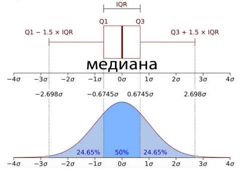

Длина усов отличается в разных реализациях.

## t-критерий Стьюдента / Аспина-Уэлша (проблема Беренца-Фишера)

Критерий Аспина-Уэлша (Aspin-Welch test), также известный как t-критерий Уэлша, используется для сравнения средних значений двух независимых выборок, когда дисперсии выборок не равны. Этот тест является модификацией классического t-теста Стьюдента, который предполагает равенство дисперсий.

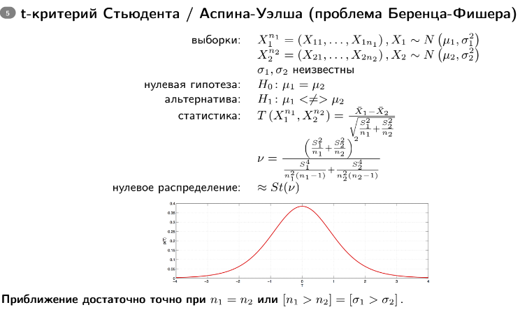

## Формулировка задачи

- **Нулевая гипотеза ($H_0$)**: Средние значения двух групп равны ($\mu_1 = \mu_2$).
- **Альтернативная гипотеза ($H_1$)**: Средние значения двух групп не равны ($\mu_1 \neq \mu_2$).

## Формулы

Для проведения критерия Аспина-Уэлша необходимо вычислить несколько величин.

1. **Средние значения выборок**:

где $X_{1i}$ и $X_{2i}$ — наблюдения в выборках 1 и 2 соответственно, $n_1$ и $n_2$ — размер выборок.

2. **Дисперсии выборок**:

$$S_1^2 = \frac{1}{n_1 - 1} \sum_{i=1}^{n_1} (X_{1i} - \bar{X}_1)^2$$ 

$$\quad S_2^2 = \frac{1}{n_2 - 1} \sum_{i=1}^{n_2} (X_{2i} - \bar{X}_2)^2$$

3. **Статистика теста**:

$$
t = \frac{\bar{X}_1 - \bar{X}_2}{\sqrt{\frac{S_1^2}{n_1} + \frac{S_2^2}{n_2}}}
$$

4. **Степени свободы**:

$$
df = \frac{\left( \frac{S_1^2}{n_1} + \frac{S_2^2}{n_2} \right)^2}{\frac{\left( \frac{S_1^2}{n_1} \right)^2}{n_1 - 1} + \frac{\left( \frac{S_2^2}{n_2} \right)^2}{n_2 - 1}}
$$

#### Процедура теста

1. Рассчитайте средние значения и дисперсии для обеих выборок.
2. Вычислите t-статистику с использованием формулы.
3. Найдите степени свободы.
4. Определите критическое значение t из таблицы распределения Стьюдента для заданного уровня значимости и вычисленных степеней свободы.
5. Сравните вычисленное значение t с критическим значением, чтобы принять или отвергнуть нулевую гипотезу.

#### Пример

В 1974 году 108 респондентов GSS работали неполный день, в 2014 - 196. Для каждого из них известно количество рабочих часов за неделю, предшествующую опросу.

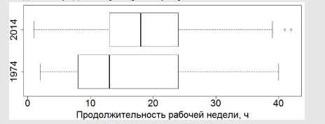

Изменилось ли среднее время работы у работающих неполный день?

$H_{0}$ : среднее время работы не изменилось, $\mu_{1}=\mu_{2}$.

$H_{0}$ : среднее время работы изменилось, $\mu_{1} \neq \mu_{2}$.

$\mathrm{t}$-критерий: $p=0.02707$, средняя продолжительность рабочей недели увеличилась на 2.57 часов $(95 \%$ доверительный интервал - $[0.29,4.85]$ ч).

## t-критерий Стьюдента для связанных выборок

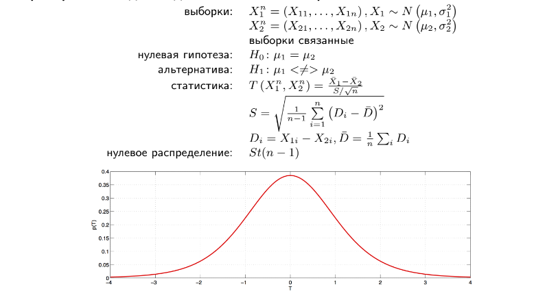

### Пример, Kanјi, t-критерий Стьюдента для связанных выборок

На 10 испытуемых сравниваются два лекарства против респираторного заболевания. Каждый из испытуемых вдыхает первое лекарство с помощью ингалятора, после чего проходит упражнение беговой дорожке. Измеряется время достижения максимальной нагрузки. Затем после периода восстановления эксперимент повторяется со вторым лекарством.

$H_{0}$ : время достижения максимальной нагрузки не отличается для исследуемых лекарств.

$H_{1}$ : время достижения максимальной нагрузки для исследуемых лекарств отличается $\Rightarrow p=0.916 ; 95 \%$ доверительный интервал для разницы - $[-2.1,0.9]$.

Пусть имеются следующие связные выборки:

$$
\begin{aligned}
& X_{1}^{n}, \quad X_{1} \sim N(0,1) \\
& X_{2}^{n}, \quad X_{2}=X_{1}+\varepsilon, \quad \varepsilon \sim N(0.1,0.25) \Rightarrow X_{2} \sim N(0.1,1.25)
\end{aligned}
$$

требуется оценить разность $\Delta=\mathbb{E} X_{1}-\mathbb{E} X_{2}$.

1. Если **попарные соответствия элементов известны**, лучшая оценка $\hat{\Delta}_{p}=\frac{1}{n} \sum_{i=1}^{n}\left(X_{1 i}-X_{2 i}\right)$ имеет дисперсию

$$
\mathbb{D} \hat{\Delta}_{p}=\frac{1}{n^{2}} \sum_{i=1}^{n} \mathbb{D}\left(X_{1 i}-X_{2 i}\right)=\frac{1}{n} \mathbb{D} \varepsilon=\frac{1}{2 n}
$$

мощность 0.8 достигается при $n \approx 200$.

2. Если же **попарные соответствия неизвестны**, лучшая оценка $-\hat{\Delta}_{i}=\bar{X}_{1}-\bar{X}_{2}$; её дисперсия:

$$
\mathbb{D} \hat{\Delta}_{i}=\frac{1}{n^{2}} \sum_{i=1}^{n} \mathbb{D} X_{1 i}+\frac{1}{n^{2}} \sum_{i=1}^{n} \mathbb{D} X_{2 i}=\frac{1}{n}+\frac{5}{4 n}=\frac{9}{4 n}
$$

- в 4.5 раза больше; мощность 0.8 достигается при $n \approx 1900$.

## F-критерий Фишера

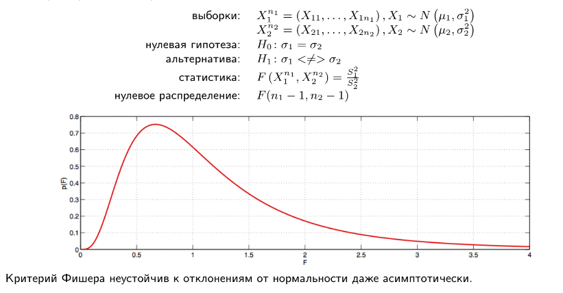

F-тест или критерий Фишера (F-критерий, φ*-критерий) — статистический критерий, тестовая статистика которого при выполнении нулевой гипотезы имеет распределение Фишера (F-распределение).

Статистика теста так или иначе сводится к отношению выборочных дисперсий (сумм квадратов, деленных на «степени свободы»). Чтобы статистика имела распределение Фишера, необходимо, чтобы числитель и знаменатель были независимыми случайными величинами и соответствующие суммы квадратов имели распределение Хи-квадрат. Для этого требуется, чтобы данные имели нормальное распределение. Кроме того, предполагается, что дисперсия случайных величин, квадраты которых суммируются, одинакова.

Тест проводится путём сравнения значения статистики с критическим значением соответствующего распределения Фишера при заданном уровне значимости. Известно, что если 
$F\sim F(m,n)$, то 
$1/F\sim F(n,m)$. Кроме того, квантили распределения Фишера обладают свойством 
$F_{1-\alpha }=1/F_{\alpha }$. Поэтому обычно на практике в числителе участвует потенциально большая величина, в знаменателе — меньшая и сравнение осуществляется с «правой» квантилью распределения. Тем не менее тест может быть и двусторонним, и односторонним. В первом случае при уровне значимости 
$\alpha$ используется квантиль 
$F_{\alpha /2}$, а при одностороннем тесте — 
$F_{\alpha }$.

Более удобный способ проверки гипотез — с помощью p-значения 
$p(F)$ — вероятностью того, что случайная величина с данным распределением Фишера превысит данное значение статистики. Если 
$p(F)$ (для двустороннего теста — 
$2p(F)$) меньше уровня значимости 
$\alpha$, то нулевая гипотеза отвергается, в противном случае принимается.

### Описание критерия

Заданы две выборки $x^n=(x_1,\ldots,x_n),\; x_i \in \mathbb{R};\;\;$
$y^m = (y_1,\ldots,y_m),\; y_i \in \mathbb{R}.$

Обозначим через $\sigma_1^2$ и $\sigma_2^2$ дисперсии выборок $x^n$ и $y^m$, $s_1^2$ и $s_2^2$ — выборочные оценки дисперсий $\sigma_1^2$ и $\sigma_2^2$:

$$s_1^2=\frac{1}{n-1}\sum_{i=1}^n {(x_i-\overline{x})}^2;$$

$$s_2^2=\frac{1}{m-1}\sum_{i=1}^m {(y_i-\overline{y})}^2,$$

где

$$\overline{x}=\frac{1}{n}\sum_{i=1}^n {x_i};\;\; \overline{y}=\frac{1}{m}\sum_{i=1}^m {y_i}$$

— выборочные средние выборок $x^n$ и $y^m$.

Дополнительное предположение: выборки $x^n$ и $y^m$ являются нормальными. Критерий Фишера чувствителен к нарушению предположения о нормальности.

Нулевая гипотеза $H_0$: $\sigma_1^2=\sigma_2^2$

Статистика критерия Фишера:

$$F=\frac{s_1^2}{s_2^2}$$

имеет распределение Фишера с $n-1$ и $m-1$ степенями свободы. Обычно в числителе ставится большая из двух сравниваемых дисперсий. Тогда критической областью критерия является правый хвост распределения Фишера, что соотвествует альтернативной гипотезе $H_1$.

**Пример, NIST/industry ceramics consortium for strength optimization of ceramic, 1996**

Собраны данные о прочности материала 440 керамических изделий из двух партий по 220 в каждой.

Одинакова ли дисперсия прочности в разных партиях?

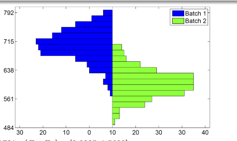

Критерий Фишера: $p=0.1721,\left[C_{L}, C_{U}\right]=[0.9225,1.5690]$.

## Коэффициент ассиметрии

коэффициент ассиметрии (skewness):

$$
\gamma_{1}=\mathbb{E}\left(\frac{X-\mathbb{E} X}{\sqrt{\mathbb{D} X}}\right)^{3}
$$

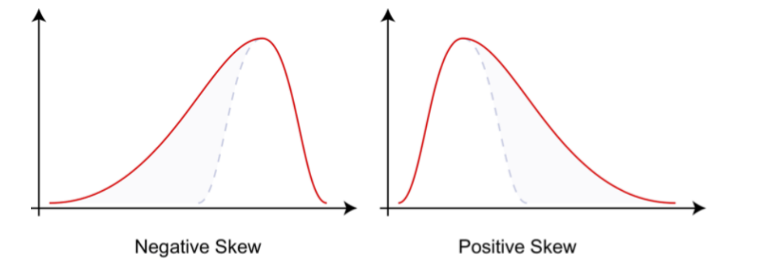

## Коэффициент экcцесса

**коэффициент эксцесса** (excess, без вычитания тройки - kurtosis):

$$
\gamma_{2}=\frac{\mathbb{E}(X-\mathbb{E} X)^{4}}{(\mathbb{D} X)^{2}}-3
$$

## Критерий Харке-Бера

$$
\begin{aligned}
\text { выборка: } & X^{n}=\left(X_{1}, \ldots, X_{n}\right) \\
\text { нулевая гипотеза: } & H_{0}: X \sim N\left(\mu, \sigma^{2}\right) \\
\text { альтернатива: } & H_{1}: H_{0} \text { неверна } \\
\text { статистика: } & \chi^{2}\left(X^{n}\right)=\frac{n}{6}\left(\gamma_{1}^{2}+\frac{1}{4} \gamma_{2}^{2}\right) \\
\text { нулевое распределение: } & \chi_{2}^{2}
\end{aligned}
$$

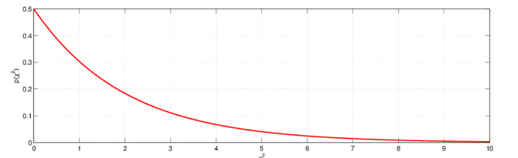

достигаемый уровень значимости:

$$
p\left(\chi^{2}\right)=1-F_{\chi_{2}^{2}}\left(\chi^{2}\right)
$$

## Критерий согласия Пирсона (хи-квадрат)

$$
\text { выборка: } \quad X^{n}=\left(X_{1}, \ldots, X_{n}\right)
$$

$$
\text { нулевая гипотеза: } \quad H_{0}: X \sim N\left(\mu, \sigma^{2}\right)
$$

альтернатива: $H_{1}: H_{0}$ неверна

статистика: $\quad \chi^{2}\left(X^{n}\right)=\sum_{i=1}^{K} \frac{\left(n_{i}-n p_{i}\right)^{2}}{n p_{i}}$

$\left[a_{i}, a_{i+1}\right], i=1, \ldots, K$ - интервалы гистограммы $n_{i}$ - число элементов выборки в $\left[a_{i}, a_{i+1}\right]$ $p_{i}=F\left(a_{i+1}\right)-F\left(a_{i}\right)-$ вероятность попадания в $i$-й интервал при $H_{0}$

нулевое распределение:

$$
\begin{cases}\chi_{K-1}^{2}, & \mu, \sigma \text { заданы, } \\ \chi_{K-3}^{2}, & \mu, \sigma \text { оцениваются, }\end{cases}
$$

**Недостатки:**

- разбиение на интервалы неоднозначно
- требует больших выборок ( $n p_{i}>5$ в $80 \%$ ячеек)

## Критерии, основанные на эмпирической функции распределения

Ряд критериев согласия основаны на различиях между $F(x)$ и $F_{n}(x)$ :

- Джини:

$$
\int\left|F_{n}(x)-F(x)\right| d x
$$

- Крамера-фон Мизеса:

$$
\int\left(F_{n}(x)-F(x)\right)^{2} d x
$$

- Колмогорова (одновыборочный Колмогорова-Смирнова):

$$
\sup _{-\infty<x<\infty}\left|F_{n}(x)-F(x)\right|
$$

- Смирнова-Крамера-фон Мизеса:

$$
\int\left(F_{n}(x)-F(x)\right)^{2} d F(x)
$$

- Андерсона-Дарлинга:

$$
\int \frac{\left(F_{n}(x)-F(x)\right)^{2}}{F(x)(1-F(x))} d F(x)
$$

- Купера:

$$
\sup _{-\infty<x<\infty}\left(F_{n}(x)-F(x)\right)+\sup _{-\infty<x<\infty}\left(F(x)-F_{n}(x)\right)
$$

- Ватсона:

$$
\int\left(F_{n}(x)-F(x)-\int\left(F_{n}(x)-F(x)\right) d F(x)\right) d F(x)
$$

- Фроцини:

$$
\int\left|F_{n}(x)-F(x)\right| d F(x)
$$

Предполагается, что $F(x)$ известна с точностью до параметров (если они оцениваются по выборке, нулевое распределение корректируется).

## Критерий Колмогорова (Лиллиефорса)

$$
\begin{aligned}
\text { выборка: } & X^{n}=\left(X_{1}, \ldots, X_{n}\right) \\
\text { нулевая гипотеза: } & H_{0}: X \sim N\left(\mu, \sigma^{2}\right) \\
\text { альтернатива: } & H_{1}: H_{0} \text { неверна } \\
\text { статистика: } & D\left(X^{n}\right)=\sup _{-\infty<x<\infty}\left|F_{n}(x)-\Phi(x)\right| \\
\text { нулевое распределение: } & \text { табличное }
\end{aligned}
$$

Недостатки:

- имеет низкую мощность
- не чувствителен к различиям на хвостах распределений

## Q-Q plot

Визуальный метод проверки согласия выборки и распределения - q-q plot (для нормального распределения называется также normal probability plot)

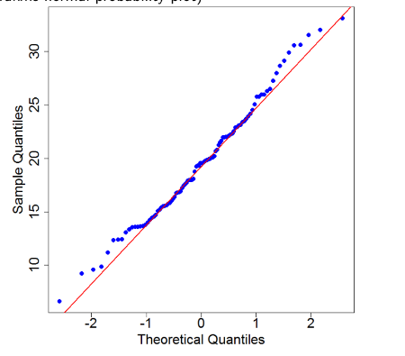

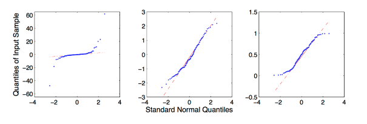

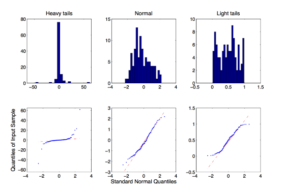

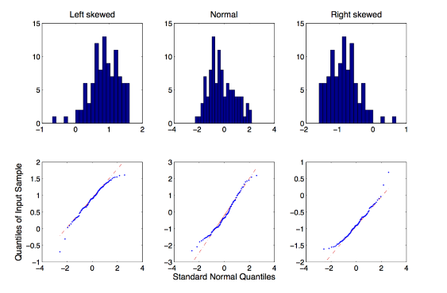

## Критерий Шапиро-Уилка

выборка: $𝑋^𝑛 = (𝑋_1, . . . , 𝑋_𝑛)$

нулевая гипотеза: $𝐻_0 : 𝑋 ∼ 𝑁 (︀ 𝜇, 𝜎^2 )︀$

альтернатива: $\quad H_{1}: H_{0}$ неверна

статистика: $W\left(X^{n}\right)=\frac{\left(\sum_{i=1}^{n} a_{i} X_{(i)}\right)^{2}}{\sum_{i=1}^{n}\left(X_{i}-\bar{X}\right)^{2}}$

$\left(a_{1}, \ldots, a_{n}\right)=\frac{m^{T} V^{-1}}{\left(m^{T} V^{-1} V^{-1} m\right)^{1 / 2}}$

$m=\left(m_{1}, \ldots, m_{n}\right)^{T}$ - матожидания порядковых статистик $N(0,1), V-$​ их ковариационная матрица

нулевое распределение: табличное

Значения $a_{i}$ также табулированы.

## Итого о проверке нормальности

- **выбросы**: сильно влияют на выборочные коэффициенты асимметрии и эксцесса
- **критерий Лиллиефорса**: представляет только исторический интерес
- **критерий хи-квадрат**: слишком общий, не самый мощный, потеря информации из-за разбиения на интервалы

Сравнение критериев проверки

нормальности распределения случайных величин

|            Наименование критерия (раздел)             | Характер альтернативного распределения |                |                |                |                        | Ранг |
| :---------------------------------------------------: | :------------------------------------: | :------------: | :------------: | :------------: | :--------------------: | :--: |
|                                                       |             асимметричное              |                |  симметричное  |                |     нормаль-  ное      |      |
|                                                       |             $\alpha_{4}<3$             | $\alpha_{4}>3$ | $\alpha_{4}<3$ | $\alpha_{4}>3$ | $\alpha_{4} \approx 3$ |      |
|            Критерий Шапиро-Уилка (3.2.2.1)            |                   1                    |       1        |       3        |       2        |           2            |  1   |
|             Критерий $K^{2}(3.2 .2 .16)$              |                   7                    |       8        |       10       |       6        |           4            |  2   |
|              Критерий Дарбина (3.1.2.7)               |                   11                   |       7        |       7        |       15       |           1            |  3   |
|            Критерий Д'Агостино (3.2.2.14)             |                   12                   |       9        |       4        |       5        |           12           |  4   |
|           Критерий $\alpha_{4}(3.2 .2 .16)$           |                   14                   |       5        |       2        |       4        |           18           |  5   |
|            Критерий Васичека $(3.2 .2 .2)$            |                   2                    |       14       |       8        |       10       |           10           |  6   |
|    Критерий Дэвида-Хартли-Пирсона  $(3.2 .2 .10)$     |                   21                   |       2        |       1        |       9        |           1            |  7   |
|            Критерий $\chi^{2}(3.1 .1 .1)$             |                   9                    |       20       |       9        |       8        |           3            |  8   |
|         Критерий Андерсона-Дарлинга (3.1.2.4)         |                   18                   |       3        |       5        |       18       |           7            |  9   |
|             Критерий Филлибена (3.2.2.5)              |                   3                    |       12       |       18       |       1        |           9            |  10  |
|   Критерий Колмогорова-Смирнова   $(3.1 .2 .1)$    |                   16                   |       10       |       6        |       16       |           5            |  11  |
|    Критерий Мартинеса-Иглевича   $(3.2 .2 .14)$    |                   10                   |       16       |       13       |       3        |           15           |  12  |
|          Критерий Лина-Мудхолкара (3.2.2.13)          |                   4                    |       15       |       12       |       12       |           16           |  13  |
|           Критерий $\alpha_{3}(3.2 .2 .16)$           |                   8                    |       6        |       21       |       7        |           19           |  14  |
|          Критерий Шпигельхальтера (3.2.2.11)          |                   19                   |       13       |       11       |       11       |           8            |  15  |
|              Критерий Саркади (3.2.2.12)              |                   5                    |       18       |       15       |       14       |           13           |  16  |
| Критерий Смирнова-Крамера-фон Ми-   зеса (3.1.2.2) |                   17                   |       11       |       20       |       17       |           6            |  17  |
|            Критерий Локка-Спурье (3.2.2.7)            |                   13                   |       4        |       19       |       21       |           17           |  18  |
|                 Критерий Оя (3.2.2.8)                 |                   20                   |       17       |       14       |       13       |           14           |  19  |
|            Критерий Хегази-Грина (3.2.2.3)            |                   6                    |       19       |       16       |       19       |           21           |  20  |
|          Критерий Муроты-Такеучи (3.2.2.17)           |                   15                   |       21       |       17       |       20       |           20           |  21  |

Кобзарь, 3.2.2.19, табл. 80.

- **очень маленькие выборки:** любой критерий может пропустить отклонения от нормальности, графические методы бесполезны
- **очень большие выборки:** любой критерий может выявлять небольшие статистически, но не практически значимые отклонения от нормальности; значительная часть методов, предполагающих нормальность, демонстрируют устойчивость к отклонениям от неё

- если данные явно ненормальны (например, бинарны или дискретны), нужно выбрать метод, специфичный для такого распределения
- если на ку-ку графике не видно существенных отклонений от нормальности, можно сразу использовать методы, устойчивые к небольшим отклонениям (например, критерии Стьюдента)
- если метод чувствителен к отклонениям от нормальности (например, критерий Фишера), проверять её рекомендуется критерием Шапиро-Уилка
- если нормальность отвергается, чувствительные методы, предполагающие нормальность, использовать нельзя!

## Критерии на основе правдоподобия

$$
X^{n}=\left(X_{1}, \ldots, X_{n}\right), X \sim f(x, \theta)
$$

ОМП для $\theta$ :

$$
\begin{aligned}
\log L\left(X^{n}, \theta\right) & =\sum_{i=1}^{n} \log f\left(X_{i}, \theta\right) \\
\hat{\theta}_{M L E} & =\underset{\theta}{\operatorname{argmax}} \log L\left(X^{n}, \theta\right) \\
I(\theta) & =-\frac{\partial^{2}}{\partial \theta^{2}} \log L(\theta) \\
\mathbb{D} \hat{\theta}_{M L E} & =I^{-1}\left(\hat{\theta}_{M L E}\right) \\
S(\theta) & =\frac{\partial}{\partial \theta} \log L(\theta)
\end{aligned}
$$

$\hat{\theta}_{M L E}$ и $S\left(\hat{\theta}_{M L E}\right)$ асимптотически нормально распределены.

## Критерий Вальда

выборка: $X^{n}=\left(X_{1}, \ldots, X_{n}\right), X \sim F(x, \theta)$

нулевая гипотеза: $H_{0}: \theta=\theta_{0}$

альтернатива: $\quad H_{1}: \theta<\neq>\theta_{0}$

статистика: $\quad Z_{W}\left(X^{n}\right)=\frac{\hat{\theta}_{M L E}-\theta_{0}}{\sqrt{\mathbb{D} \hat{\theta}_{M L E}}}$

нулевое распределение: $\quad Z_{W}\left(X^{n}\right) \sim N(0,1)$ при $H_{0}$

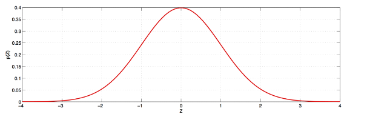

достигаемый уровень значимости:

$$
p\left(Z_{W}\right)= \begin{cases}1-F_{N(0,1)}\left(Z_{W}\right), & H_{1}: \theta>\theta_{0} \\ F_{N(0,1)}\left(Z_{W}\right), & H_{1}: \theta<\theta_{0} \\ 2\left(1-F_{N(0,1)}\left(\left|Z_{W}\right|\right)\right), & H_{1}: \theta \neq \theta_{0}\end{cases}
$$

## Критерий отношения правдоподобия

выборка: $X^{n}=\left(X_{1}, \ldots, X_{n}\right), X \sim F(x, \theta)$

нулевая гипотеза: $\quad H_{0}: \theta=\theta_{0}$

альтернатива: $H_{1}: \theta \neq \theta_{0}$

статистика: $\quad L R\left(X^{n}\right)=-2 \log \frac{L\left(X^{n}, \theta_{0}\right)}{L\left(X^{n}, \hat{\theta}_{M L E}\right)}$

нулевое распределение: $\quad L R\left(X^{n}\right) \sim \chi_{1}^{2}$ при $H_{0}$

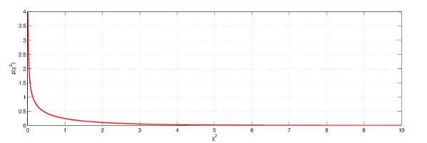

достигаемый уровень значимости:

$$
p(L R)=1-F_{\chi_{1}^{2}}(L R)
$$

Если $\theta$ - вектор размерности $k$, то нулевое распределение критерия — $\chi_{k}^{2}$.

## Критерий меток

выборка: $X^{n}=\left(X_{1}, \ldots, X_{n}\right), X \sim F(x, \theta)$

нулевая гипотеза: $H_{0}: \theta=\theta_{0}$

альтернатива: $\quad H_{1}: \theta<\neq>\theta_{0}$​

статистика: $Z_{S}\left(X^{n}\right)=\frac{S\left(\theta_{0}\right)}{\sqrt{I\left(\theta_{0}\right)}}$

нулевое распределение: $\quad N(0,1)$

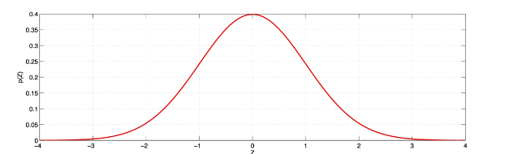

достигаемый уровень значимости:

$$
p\left(Z_{S}\right)= \begin{cases}1-F_{N(0,1)}\left(Z_{S}\right), & H_{1}: \theta>\theta_{0} \\ F_{N(0,1)}\left(Z_{S}\right), & H_{1}: \theta<\theta_{0} \\ 2\left(1-F_{N(0,1)}\left(\left|Z_{S}\right|\right)\right), & H_{1}: \theta \neq \theta_{0}\end{cases}
$$

## Распределение Бернулли

$$
X^{n}=\left(X_{1}, \ldots, X_{n}\right), X \sim \operatorname{Ber}(p), T=\sum_{i=1}^{n} X_{i}
$$

ОМП для $p$ :
$$
\begin{aligned}
L(p) & =p^{T}(1-p)^{(n-T)} \\
\log L(p) & =T \ln p+(n-T) \ln (1-p) \\
\hat{p} & =\frac{T}{n} \\
I(p) & =-\frac{\partial^{2} \log L(p)}{\partial p^{2}}=\frac{n}{p(1-p)} \\
\mathbb{D} \hat{p} & =\frac{\hat{p}(1-\hat{p})}{n} \\
S(p) & =\frac{T}{p}-\frac{n-T}{1-p}
\end{aligned}
$$

$$
\begin{aligned}
L R & =-2 \log \frac{L\left(p_{0}\right)}{L(\hat{p})} \sim \chi_{1}^{2} \\
Z_{W} & =\frac{\hat{p}-p_{0}}{\sqrt{1 / I(\hat{p})}}=\frac{\hat{p}-p_{0}}{\sqrt{\frac{\hat{p}(1-\hat{p})}{n}}} \sim N(0,1) \\
Z_{S} & =\frac{S\left(p_{0}\right)}{\sqrt{I\left(p_{0}\right)}}=\frac{\hat{p}-p_{0}}{\sqrt{\frac{p_{0}\left(1-p_{0}\right)}{n}}} \sim N(0,1)
\end{aligned}
$$

## Z-критерий меток для доли

выборка: $X^{n}=\left(X_{1}, \ldots, X_{n}\right), X \sim \operatorname{Ber}(p)$

нулевая гипотеза: $\quad H_{0}: p=p_{0}$

альтернатива: $\quad H_{1}: p<\neq>p_{0}$

статистика: $\quad Z_{S}\left(X^{n}\right)=\frac{\hat{p}-p_{0}}{\sqrt{\frac{p_{0}\left(1-p_{0}\right)}{n}}}$

нулевое распределение: $\quad N(0,1)$

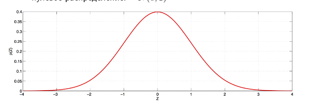