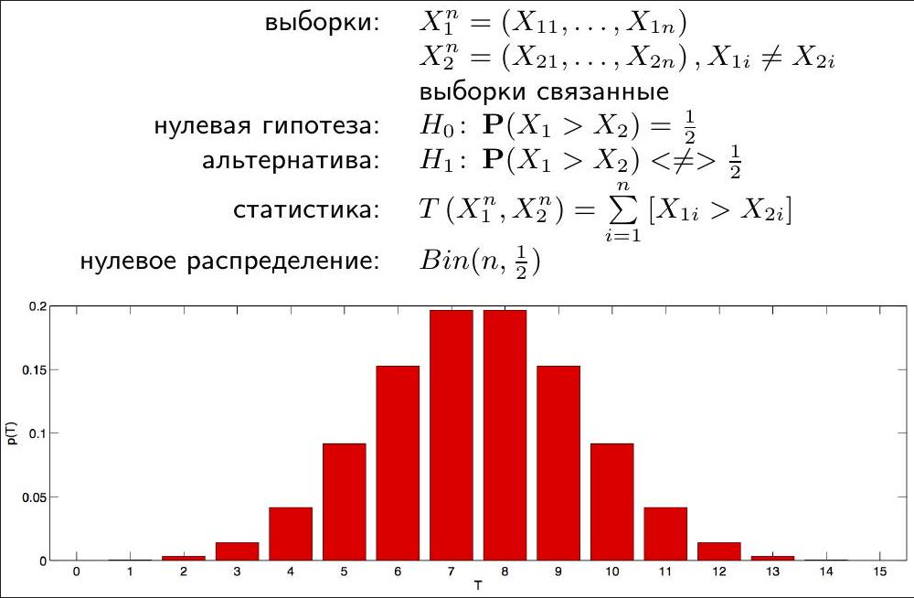
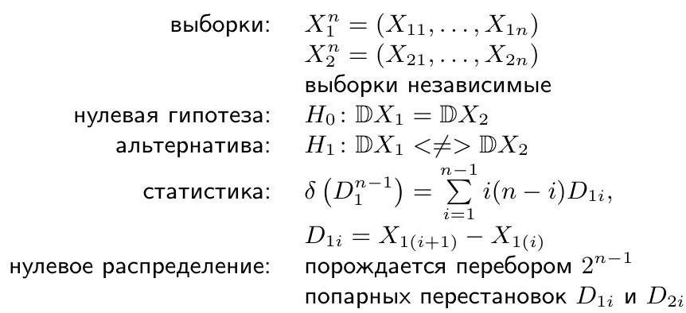

# Проверка непараметрических гипотез

Содержание:

1. [**Виды задач**](#виды-задач)
2. [**Варианты двухвыборочных гипотез**](#варианты-двухвыборочных-гипотез)
3. [**Биномиальный критерий**](#биномиальный-критерий)
4. [**Одновыборочный критерий знаков**](#одновыборочный-критерий-знаков)
5. [**Двухвыборочный критерий знаков**](#двухвыборочный-критерий-знаков)
6. [**Причины использовать критерий знаков**](#причины-использовать-критерий-знаков)
7. [**Вариационный ряд, ранги, связки**](#вариационный-ряд-ранги-связки)
8. [**Одновыборочный критерий знаковых рангов Уилкоксона**](#одновыборочный-критерий-знаковых-рангов-уилкоксона)
9. [**Критерий знаковых рангов Уилкоксона для связанных выборок**](#критерий-знаковых-рангов-уилкоксона-для-связанных-выборок)
10. [**Критерий Манна-Уитни-Уилкоксона**](#критерий-манна-уитни-уилкоксона)
11. [**Критерий Ансари-Брэдли**](#критерий-ансари-брэдли)
12. [**Перестановочные критерии**](#перестановочные-критерии)
13. [**Коэффициент экcцесса**](#коэффициент-экcцесса)
14. [**Критерий Харке-Бера**](#критерий-харке-бера)
15. [**Одновыборочный перестановочный критерий, гипотеза о среднем**](#одновыборочный-перестановочный-критерий-гипотеза-о-среднем)
16. [**Статистика Али**](#статистика-али)
17. [**Особенности перестановочных критериев**](#особенности-перестановочных-критериев)
18. [**Перестановки и бутстреп**](#перестановки-и-бутстреп)
19. [**BCa**](#bca)
20. [**Кофеин и респираторный обмен**](#кофеин-и-респираторный-обмен)
21. [**Перестановки vs. бутстреп**](#перестановки-vs-бутстреп)
22. [**Различия между моментами высокого порядка**](#различия-между-моментами-высокого-порядка)
23. [**Двухвыборочные критерии согласия**](#двухвыборочные-критерии-согласия)
24. [**Критерий Смирнова**](#критерий-смирнова)

----
### [Вернуться ко всем лекциям](Navigation_lections.md)
----

## Виды задач

Одновыборочные:

(1) Одновыборочный критерий знаков

(3) Одновыборочный критерий знаковых рангов Уилкоксона

(8) Одновыборочный перестановочный критерий, гипотеза о среднем

Двухвыборочные:

$X_{1}^{n_{1}}, X_{2}^{n_{2}}$

средние выборок равны

$X_{1}, X_{2}$ связанные 2 (4) 9

$X_{1}, X_{2}$ независимые 510

дисперсии выборок равны

## Варианты двухвыборочных гипотез

О положении:

$$
\begin{aligned}
& H_{0}: \mathbb{E} X_{1}=\mathbb{E} X_{2} \\
& H_{0}: \operatorname{med} X_{1}=\operatorname{med} X_{2} \\
& H_{0}: \mathbf{P}\left(X_{1}>X_{2}\right)=0.5 \\
& H_{0}: F_{X_{1}}(x)=F_{X_{2}}(x) \\
& H_{0}: F_{X_{1}}(x)=F_{X_{2}}(x)
\end{aligned}
$$

$H_{1}: \mathbb{E} X_{1}<\neq> \mathbb{E} X_{2};$

$H_{1}: \operatorname{med} X_{1}<\neq>\operatorname{med} X_{2}$;

$H_{1}: \mathbf{P}\left(X_{1}>X_{2}\right)<\neq>0.5$;

$H_{1}: F_{X_{1}}(x)=F_{X_{2}}(x+\Delta), \Delta<\neq>0$;

$H_{1}: F_{X_{1}}(x)<\neq>F_{X_{2}}(x)$.

О рассеянии:

$$
\begin{aligned}
& H_{0}: \mathbb{D} X_{1}=\mathbb{D} X_{2} \\
& H_{0}: F_{X_{1}}(x)=F_{X_{2}}(x+\Delta)
\end{aligned}
$$

$$
\begin{aligned}
& H_{1}: \mathbb{D} X_{1}<\neq>\mathbb{D} X_{2} \\
& H_{1}: F_{X_{1}}(x)=F_{X_{2}}(\sigma x+\Delta), \sigma<\neq>1
\end{aligned}
$$

## Биномиальный критерий

$$
\text { выборка: } \quad X^{n}=\left(X_{1}, \ldots, X_{n}\right), X \sim \operatorname{Ber}(p)
$$

нулевая гипотеза: $\quad H_{0}: p=p_{0}$

альтернатива: $H_{1}: p<\neq>p_{0}$

статистика: $\quad T\left(X^{n}\right)=\sum_{i=1}^{n} X_{i}$

нулевое распределение: $\operatorname{Bin}\left(n, p_{0}\right)$

достигаемый уровень значимости:

$$
p(T)= \begin{cases}1-F_{\operatorname{Bin}\left(n, p_{0}\right)}(T-1), & H_{1}: p>p_{0} \\ F_{\operatorname{Bin}\left(n, p_{0}\right)}(T), & H_{1}: p<p_{0} \\ \text { через бета-распределение, } & H_{1}: p \neq p_{0}\end{cases}
$$

## Одновыборочный критерий знаков

выборка: $\quad X^{n}=\left(X_{1}, \ldots, X_{n}\right), X_{i} \neq m_{0}$

нулевая гипотеза: $\quad H_{0}: \operatorname{med} X=m_{0}$

альтернатива: $\quad H_{1}: \operatorname{med} X<\neq>m_{0}$

статистика: $\quad T\left(X^{n}\right)=\sum_{i=1}^{n}\left[X_{i}>m_{0}\right]$

нулевое распределение: $\operatorname{Bin}\left(n, \frac{1}{2}\right)$

### Пример, Dinse, 1982

Выживаемость пациентов с лимфоцитарной лимфомой (в неделях):

$$
49,58,75,110,112,132,151,276,281,362^{*}
$$

Исследование длилось 7 лет, поэтому для пациентов, проживших дольше, выживаемость неизвестна (выборка цензурирована сверху).

Превышает ли среднее время дожития 200 недель?

$H_{0}$ : медиана времени дожития не больше 200 недель.

$H_{1}$ : медиана времени дожития больше 200 недель.

Критерий знаков: $p=0.9453$.

## Пример, Shervin, 2004

16 лабораторных мышей были помещены в двухкомнатные клетки, в одной из комнат висело зеркало. Измерялась доля времени, которое каждая мышь проводила в каждой из своих двух клеток.

Tunnel

Общая постановка:

$H_{0}$ : мышам всё равно, висит в клетке зеркало или нет.

$H_{1}$ : у мышей есть какие-то предпочтения насчёт зеркала.

Средняя доля времени, проводимого в клетке с зеркалом $-47.6 \pm 4.7 \%$.

$H_{0}$ : медиана доли времени, проводимого в клетке с зеркалом, равна $\frac{1}{2}$.

$H_{1}$ : медиана доли времени, проводимого в клетке с зеркалом, не равна $\frac{1}{2}$.

Редуцированные данные: 0 - мышь провела больше времени в комнате с зеркалом, 1 - в комнате без зеркала.

Статистика: $T$ - число единиц в выборке.

13 из 16 мышей провели больше времени в комнате без зеркала.

Критерий знаков: $p=0.0213$; доверительный интервал для медианы доли времени, проведённого в комнате с зеркалом:

- $[0.4507,0.4887]$ - с уровнем доверия $92.32 \%$
- $[0.4263,0.4894]$ - с уровнем доверия $97.87 \%$
- $[0.4389,0.4890]$ - приближённый $95 \%$ (линейная интерполяция)

## Двухвыборочный критерий знаков

### Пример, Hollander \& Wolfie, $29 f$

Депрессивность 9 пациентов была измерена по шкале Гамильтона до и после первого приёма транквилизатора. Подействовал ли транквилизатор?

$H_{0}:$ уровень депрессивности не изменился.

$H_{1}$ : уровень депрессивности снизился.

Критерий знаков: $p=0.09,95 \%$ нижний доверительный предел для медианы изменения - -0.041 .

### Пример, Laureysens et al., 2004

Для 13 разновидностей тополей, растущих в зоне интенсивного загрязнения, в августе и ноябре измерялась средняя концентрация алюминия в микрограммах на грамм древесины.

$H_{0}$ : концентрация алюминия не менялась.

$H_{1}$ : концентрация алюминия изменилась.

Для тополей 10 из 13 разновидностей концентрация алюминия увеличилась.

Критерий знаков: $p=0.0923,95 \%$ доверительный интервал для медианы изменения $[-0.687,10.107]$.

## Причины использовать критерий знаков

- Точные разности $\Delta x_{i}$ неизвестны, известны только их знаки (сравнение агрессивности комаров).
- Разности $\Delta x_{i}$ при $H_{1}$ могут быть небольшими по модулю, но иметь систематический характер по знаку (пример с мышами).
- Разности $\Delta x_{i}$ при $H_{0}$ могут быть большими по модулю, но случайными но знаку (влияние меди на число личинок комаров).

## Вариационный ряд, ранги, связки

$$
X_{1}, \ldots, X_{n} \Rightarrow X_{(1)} \leqslant \ldots<\underbrace{X_{\left(k_{1}\right)}=\ldots=X_{\left(k_{2}\right)}}_{\text {связка размера } k_{2}-k_{1}+1}<\ldots \leqslant X_{(n)}
$$

Ранг наблюдения $X_{i}$ :

если $X_{i}$ не в связке, то $\operatorname{rank}\left(X_{i}\right)=r: X_{i}=X_{(r)}$,

если $X_{i}$ в связке $X_{\left(k_{1}\right)}, \ldots, X_{\left(k_{2}\right)}$, то $\operatorname{rank}\left(X_{i}\right)=\frac{k_{1}+k_{2}}{2}$.

## Одновыборочный критерий знаковых рангов Уилкоксона

Откуда берётся табличное распределение?

Всего $2^{n}$ вариантов.

| 1 | 2 | 3 | 4 | 5 | $W$ |
| :---: | :---: | :---: | :---: | :---: | :---: |
| - | - | - | - | - | -15 |
| + | - | - | - | - | -13 |
| - | + | - | - | - | -11 |
| + | + | - | - | - | -9 |
| - | - | + | - | - | -9 |
| $\cdots$ | $\cdots$ | $\cdots$ | $\cdots$ | $\cdots$ | $\cdots$ |
| + | + | - | + | + | 9 |
| - | - | + | + | + | 9 |
| + | - | + | + | + | 11 |
| - | + | + | + | + | 13 |
| + | + | + | + | + | 15 |

$n=5$ :

$n=10$ :

Аппроксимация для $n>20$ :

$$
W \approx \sim N\left(0, \frac{n(n+1)(2 n+1)}{6}\right)
$$

Пример 1 (Bonnini, табл. 1.4): диаметры шайб на производстве ( $n=24$ ):

Соответствуют ли шайбы стандартному размеру 10 мм?

$H_{0}:$ средний диаметр шайбы -10 мм, $\operatorname{med} X=10$.

$H_{1}$ : средний диаметр шайбы не соответствует стандарту, $\operatorname{med} X \neq 10$.

Критерий знаковых рангов: $p=0.0673$, выборочная медиана диаметра -10.5 мм ( $95 \%$ доверительный интервал - $[9.95,11.15]$ мм).

Пример 2 (зеркала в клетках мышей):

$H_{0}$ : медиана доли времени, проводимого в клетке с зеркалом, равна $\frac{1}{2}$.

$H_{1}$ : медиана доли времени, проводимого в клетке с зеркалом, не равна $\frac{1}{2}$.

Критерий знаковых рангов: $p=0.0934$.

## Критерий знаковых рангов Уилкоксона для связанных выборок

### Пример, Капji, критерий 48

Управляемый вручную станок на каждом шаге процесса производит пару пружин. Для 14 пар измерена прочность:

$$
\begin{aligned}
& X_{1}:\{1.38,0.39,1.42,0.54,5.94,0.59,2.67,2.44,0.56,0.69,0.71,0.95,0.50,9.69\} \\
& X_{2}:\{1.42,0.39,1.46,0.55,6.15,0.61,2.69,2.68,0.53,0.72,0.72,0.93,0.53,10.37\}
\end{aligned}
$$

Одинакова ли прочность пружин в паре?

$H_{0}$ : средние значение прочности пружин в паре равны.

$H_{1}$ : средние значение прочности пружин в паре не равны $\Rightarrow p=0.0142,95 \%$ доверительный интервал для медианной разности - $[0.005,0.14]$.

Пример 2 (алюминий в тополях):

$H_{0}$ : медиана изменения концентрации алюминия равна нулю.

$H_{1}$ : медиана изменения концентрации алюминия не равна нулю $\Rightarrow 0.0398,95 \%$ доверительный интервал для медианы изменения - $[0.35,9.3]$.

## Критерий Манна-Уитни-Уилкоксона

$$
\begin{array}{ll}
\text { выборки: } & X_{1}^{n_{1}}=\left(X_{11}, \ldots, X_{1 n_{1}}\right) \\
& X_{2}^{n_{2}}=\left(X_{21}, \ldots, X_{2 n_{2}}\right)
\end{array}
$$

$$
\begin{aligned}
& \text { выборки независимые } \\
\text { нулевая гипотеза: } & H_{0}: F_{X_{1}}(x)=F_{X_{2}}(x) \\
\text { альтернатива: } & H_{1}: F_{X_{1}}(x)=F_{X_{2}}(x+\Delta), \Delta<\neq>0 \\
\text { статистика: } & X_{(1)} \leqslant \ldots \leqslant X_{\left(n_{1}+n_{2}\right)}-\text { вариационный ряд } \\
& \text { объединённой выборки } X=X_{1}^{n_{1}} \cup X_{2}^{n_{2}} \\
& R_{1}\left(X_{1}^{n_{1}}, X_{2}^{n_{2}}\right)=\sum_{i=1}^{n_{1}} \operatorname{rank}\left(X_{1 i}\right)
\end{aligned}
$$

нулевое распределение: табличное

Откуда берётся табличное распределение?

Всего $C_{n_{1}+n_{2}}^{n_{1}}$ вариантов.

| $X_{1}$ | $X_{2}$ | $R_{1}$ |
| :---: | :---: | :---: |
| $\{1,2,3\}$ | $\{4,5,6,7\}$ | 6 |
| $\{1,2,4\}$ | $\{3,5,6,7\}$ | 7 |
| $\{1,2,5\}$ | $\{3,4,6,7\}$ | 8 |
| $\{1,2,6\}$ | $\{3,4,5,7\}$ | 9 |
| $\{1,2,7\}$ | $\{3,4,5,6\}$ | 10 |
| $\{1,3,4\}$ | $\{2,5,6,7\}$ | 8 |
| $\ldots$ | $\ldots$ | $\ldots$ |
| $\{3,5,7\}$ | $\{1,2,4,6\}$ | 15 |
| $\{3,6,7\}$ | $\{1,2,4,5\}$ | 16 |
| $\{4,5,6\}$ | $\{1,2,3,7\}$ | 15 |
| $\{4,5,7\}$ | $\{1,2,3,6\}$ | 16 |
| $\{4,6,7\}$ | $\{1,2,3,5\}$ | 17 |
| $\{5,6,7\}$ | $\{1,2,3,4\}$ | 18 |

$$
n_{1}=n_{2}=5
$$

$n_{1}=n_{2}=10$ :

Аппроксимация для $n_{1}, n_{2}>10$ :

$$
R_{1} \sim N\left(\frac{n_{1}\left(n_{1}+n_{2}+1\right)}{2}, \frac{n_{1} n_{2}\left(n_{1}+n_{2}+1\right)}{12}\right)
$$

## Пример, Kanji, критерий 52

Сотрудник налоговой службы хочет сравнить средние значения в двух выборках заявленных трат на компенсацию командировочных расходов в одной и той же компании в двух разных периодах (расходы скорректированы на инфляцию).

$$
\begin{aligned}
& X_{1}:\{50.5,37.5,49.8,56.0,42.0,56.0,50.0,54.0,48.0\} \\
& X_{2}:\{57.0,52.0,51.0,44.2,55.0,62.0,59.0,45.2,53.5,44.4\}
\end{aligned}
$$

Равны ли средние расходы?

$H_{0}:$ средние расходы равны.

$H_{1}$ : средние расходы не равны $\Rightarrow p=0.3072,95 \%$ доверительный интервал для медианной разности $[-9,4]$.

RER - соотношение числа молекул $\mathrm{CO}_{2}$ и $\mathrm{O}_{2}$ в выдыхаемом воздухе.

В эксперименте измерялся респираторный обмен 18 испытуемых в процессе физических упражнений. За час до этого 9 из них получили таблетку кофеина, 9 - плацебо.

Повлиял ли кофеин на значение RER?

$H_{0}$ : среднее значение показателя респираторного обмена не отличается в двух группах.

$H_{1}$ : среднее значение показателя респираторного обмена отличается в двух группах.

| Ранг | Наблюдение | Номер наблюдения | Наблюдение | Ранг |
| :---: | :---: | :---: | :---: | :---: |
| 16.5 | 105 | 1 | 96 | 9 |
| 18 | 119 | 2 | 99 | 13 |
| 14 | 100 | 3 | 94 | 5.5 |
| 11 | 97 | 4 | 89 | 3 |
| 9 | 96 | 5 | 96 | 9 |
| 15 | 101 | 6 | 93 | 4 |
| 5.5 | 94 | 7 | 88 | 1.5 |
| 7 | 95 | 8 | 105 | 16.5 |
| 12 | 98 | 9 | 88 | 1.5 |

Статистика $R_{1}$ - сумма рангов в одной из групп.

$p=0.0521$, сдвиг между средними -6 пунктов, ( $95 \%$ доверительный интервал $-[-0.00005,12]$ пт).

## Критерий Ансари-Брэдли

$\begin{array}{ll}\text { выборки: } & X_{1}^{n_{1}}=\left(X_{11}, \ldots, X_{1 n_{1}}\right) \\ & X_{2}^{h_{2}}=\left(X_{21}, \ldots, X_{2 n_{2}}\right)\end{array}$

выборки независимые, $\operatorname{med}\left(X_{1}\right)=\operatorname{med}\left(X_{2}\right)$

нулевая гипотеза: альтернатива: статистика:

нулевое распределение:

$H_{0}: \mathbb{D} X_{1}=\mathbb{D} X_{2}$

$H_{1}: \mathbb{D} X_{1}<\neq>\mathbb{D} X_{2}$

$X_{(1)} \leqslant \ldots \leqslant X_{(N)}$ - вариационный ряд

объединённой выборки $X^{N}=X_{1}^{n_{1}} \bigcup X_{2}^{n_{2}}, N=n_{1}+n_{2}$ $R_{1}\left(X_{1}^{n_{1}}, X_{2}^{n_{2}}\right)=\sum_{i=1}^{n_{1}} \widetilde{\operatorname{rank}}\left(X_{1 i}\right)$

Ранги присваиваются от краёв к центру:

### Пример, Bonnini, табл. 2.1

Два поставщика шестнадцатикилограммовых свинцовых слитков выслали по выборке образцов. Средний вес образцов в обеих выборках соответствует норме; различаются ли дисперсии?

$H_{0}$ : дисперсия веса слитков не отличается для двух поставщиков.

$H_{1}$ : дисперсия веса слитков для двух поставщиков отличается $\Rightarrow p=0.014$.

## Перестановочные критерии

Ранговые критерии:

(1) выборки $\Rightarrow$ ранги

(2) дополнительное предположение (о равенстве распределений / медиан и пр.)

(3) перестановки $\Rightarrow$ нулевое распределение статистики

Что если пропустить пункт 1 ?

Пример (зеркала в клетках мышей):

$H_{0}$ : в клетке с зеркалом мыши проводят в среднем половину времени.

$H_{1}$ : в клетке с зеркалом мыши проводят в среднем не половину времени.

Проинтерпретируем задачу по-другому:

$H_{0}$ : матожидание времени в клетке с зеркалом равняется 0.5 .

$H_{1}$ : матожидание времени в клетке с зеркалом не равняется 0.5

## Предположение:

время, проведенное мышами в клетке с зеркалом симметрично относительно матожидания.

Тогда при верности $H_{0}: X-0.5$ - симметрично относительно нуля.

## Статистика:

$T=\sum_{i=1}^{n}\left(X_{i}-0.5\right)$.

Как получить нулевое распределение:

будем переставлять элементы смещенной выборки $X-0.5$ относительно нуля.

## Пример:

$H_{0}$ : в клетке с зеркалом мыши проводят в среднем половину времени.

$H_{1}$ : в клетке с зеркалом мыши проводят в среднем не половину времени.

Статистика: $T=\sum_{i=1}^{n}\left(X_{i}-0.5\right) ; t=-0.3784$.

$p=\frac{\#[|T| \geqslant|t|]}{2^{n}}=0.2292$.

$95 \%$ доверительный интервал для доли времени в клетке с зеркалом (ВСа бутстреп) - $[0.447,0.511]$.

## Одновыборочный перестановочный критерий, гипотеза о среднем

Достигаемый уровень значимости - доля перестановок знаков, на которых получилось такое же или ещё более экстремальное значение статистики.

Пример (диаметры шайб):

Критерий знаковых рангов:

$p=0.0673$

Перестановочный критерий:

$T=14.6, p=0.1026$

$95 \%$ доверительный интервал для среднего диаметра (ВСа бутстреп) - $[10.11,11.20]$.

(9) Двухвыборочный перестановочный критерий, гипотеза о средних, связанные выборки

(9) Двухвыборочный перестановочный критерий, гипотеза о средних, связанные выборки

Пример (лечение депрессии):

Критерий знаковых рангов:

$$
p=0.019
$$

Перестановочный критерий:

$$
T=3.887, p=0.0137
$$

$95 \%$ доверительный интервал для среднего уменьшения депрессивности (ВСа бутстреп) - $[0.1658,0.6834]$.

(10) Двухвыборочный перестановочный критерий, гипотеза о средних, независимые выборки

$$
\begin{aligned}
\text { выборки: } & X_{1}^{n_{1}}=\left(X_{11}, \ldots, X_{1 n_{1}}\right) \\
& X_{2}^{n_{2}}=\left(X_{21}, \ldots, X_{2 n_{2}}\right) \\
\text { нулевая гипотеза: } & H_{0}: F_{X_{1}}(x)=F_{X_{2}}(x) \\
\text { альтернатива: } & H_{1}: F_{X_{1}}(x)=F_{X_{2}}(x+\Delta), \Delta<\neq>0 \\
\text { статистика: } & T\left(X_{1}^{n_{1}}, X_{2}^{n_{2}}\right)=\frac{1}{n_{1}} \sum_{i=1}^{n_{1}} X_{1 i}-\frac{1}{n_{2}} \sum_{i=1}^{n_{2}} X_{2 i} \\
\text { нулевое распределение: } & \text { порождается перебором } C_{n_{1}+n_{2}}^{n_{1}} \\
& \text { размещений объединённой выборки }
\end{aligned}
$$

(10) Двухвыборочный перестановочный критерий, гипотеза о средних, независимые выборки

Пример (кофеин и респираторный обмен):

Критерий Манна-Уитни:

$$
p=0.0521
$$

Перестановочный критерий:

$T=6.33, p=0.0578$

$95 \%$ доверительный интервал для разности средних (ВСа бутстреп) - $[1.556,13.667]$.

## Статистика Али

## Особенности перестановочных критериев

- Статистику критерия можно выбрать разными способами. В некоторых случаях разные статистики приведут к одному и тому же достигаемому уровню значимости:

$$
\begin{gathered}
X^{n}, \quad H_{0}: \mathbb{E} X=0, H_{1}: \mathbb{E} X \neq 0 \\
T_{1}\left(X^{n}\right)=\sum_{i=1}^{n} X_{i} \sim T_{2}\left(X^{n}\right)=\bar{X}
\end{gathered}
$$

В других случаях достигаемый уровень значимости будет зависеть от выбора статистики:

$$
T_{2}\left(X^{n}\right)=\bar{X} \quad \nsim \quad T_{3}\left(X^{n}\right)=\frac{\bar{X}}{S / \sqrt{n}}
$$

- Если множество перестановок $G$ слишком велико, для оценки нулевого распределения $T$ достаточно взять случайное подмножество $G^{\prime} \in G$. При этом стандартное отклонение достигаемого уровня значимости будет равно примерно $\sqrt{\frac{p(1-p)}{\left|G^{\prime}\right|}}$.

## Перестановки и бутстреп

Перестановочные критерии:

(1) выборки, статистика

(2) дополнительное предположение

(3) перестановки $\Rightarrow$ нулевое распределение статистики

Бутстреповые доверительные интервалы:

(1) выборки, статистика, оценивающая параметр

(2) бутстреп-псевдовыборки $\Rightarrow$ приближённое распределение статистики

Сгенерировать $N$ «псевдовыборок» объёма $n$ и оценить выборочное распределение $\hat{\theta}_{n}$ «псевдоэмпирическим».

- Возьмём выборочные квантили бутстреп-распределения:

$$
\mathbf{P}\left(\left(F_{\hat{\theta}_{n}}^{b o o t}\right)^{-1}\left(\frac{\alpha}{2}\right) \leqslant \theta \leqslant\left(F_{\hat{\theta}_{n}}^{b o o t}\right)^{-1}\left(1-\frac{\alpha}{2}\right)\right) \approx 1-\alpha
$$

Это базовый бутстреп.

- чем менее симметрично распределение, тем хуже работает метод.
- ошибка аппроксимации обратна корню из мощности выборки $\mathbf{P}\left(\theta<C_{L}\right)=\alpha+$ Const $\cdot(n)^{-0.5}$.
- Посчитаем $S_{n}^{\text {boot }}$ - выборочное стандартное отклонение $\hat{\theta}_{n}$ на псевдовыборках;

$$
\mathbf{P}\left(\hat{\theta}_{n}-t_{n-1,1-\frac{\alpha}{2}} S_{n}^{b o o t} \leqslant \theta \leqslant \hat{\theta}_{n}+t_{n-1,1-\frac{\alpha}{2}} S_{n}^{b o o t}\right) \approx 1-\alpha
$$

Это стьюдентизированный бутстреп.

- имеет меньшую ошибку аппроксимации.

## BCa

- Слегка изменим наивный бутстреп:

$$
\begin{gathered}
\mathbf{P}\left(\left(F_{\hat{\theta}_{n}}^{\text {boot }}\right)^{-1}\left(\alpha_{1}\right) \leqslant \theta \leqslant\left(F_{\hat{\theta}_{n}}^{\text {boot }}\right)^{-1}\left(\alpha_{2}\right)\right) \approx 1-\alpha \\
\alpha_{1}=\Phi\left(\hat{z}_{0}+\frac{\hat{z}_{0}+z_{\frac{\alpha}{2}}}{1-\hat{a}\left(\hat{z}_{0}+z_{\frac{\alpha}{2}}\right)}\right) \\
\alpha_{2}=\Phi\left(\hat{z}_{0}+\frac{\hat{z}_{0}+z_{1-\frac{\alpha}{2}}}{1-\hat{a}\left(\hat{z}_{0}+z_{1-\frac{\alpha}{2}}\right)}\right) \\
\hat{z}_{0}=\Phi^{-1}\left(\frac{1}{N} \sum_{i=1}^{N}\left[\hat{\theta}_{n}^{i *}<\hat{\theta}_{n}\right]\right) \\
\hat{a} \text { не поместится на этом слайде. }
\end{gathered}
$$

Это несмещённый ускоренный бутстреп.

- корректно работает с трансформациями: $C_{L}(g(\theta)), C_{U}(g(\theta))=g\left(C_{L}(\theta)\right), g\left(C_{U}(\theta)\right)$.
- Как следствие, можно перевести оценку параметра к оценка нормально распределенной случайной величины (Bias correction)
- ошибка аппроксимации обратна мощности выборки $\mathbf{P}(\theta)<C_{L}=\alpha+$ Const $\cdot$ $(n)^{-1}$. (Acceleration)

## Кофеин и респираторный обмен

$H_{0}$ : среднее значение показателя респираторного обмена не отличается в двух группах.

$H_{1}$ : под воздействием кофеина среднее значение показателя респираторного обмена снижается. $\bar{X}_{1 n}-\bar{X}_{2 n}=6.33$

Нулевое распределение перестановочного критерия со статистикой $\bar{X}_{1 n}-\bar{X}_{2 n}$ :

Бутстреп-распределение статистики $\bar{X}_{1 n}-\bar{X}_{2 n}$ :

Нулевое распределение перестановочного критерия со статистикой $\bar{X}_{1 n}-\bar{X}_{2 n}$ :

Доля перестановок, на которых среднее больше либо равно $6.33-0.0289$.

Это точный достигаемый уровень значимости перестановочного критерия.

Бутстреп-распределение статистики $\bar{X}_{1 n}-\bar{X}_{2 n}$ :

Доля псевдовыборок, на которых среднее меньше либо равно нулю - 0.011 . Это приближённый достигаемый уровень значимости бутстреп-критерия.

## Перестановки vs. бутстреп

| Перестановочный критерий | Бутстреп-критерий |
| :---: | :---: |
| Центр в нуле | Центр в точечной оценке |
| Точный | Приближенный |
| $H_{0}: F_{X_{1}}(x)=F_{X_{2}}(x)$ | $H_{0}: \mathbb{E} X_{1}=\mathbb{E} X_{2}$ |
| $H_{1}: F_{X_{1}}(x)=F_{X_{2}}(x+\Delta), \Delta>0$ | $H_{1}: \mathbb{E} X_{1}>\mathbb{E} X_{2}$ |

## Различия между моментами высокого порядка

$$
X_{1} \sim \chi_{4}^{2}, \quad X_{2} \sim N(4,8)
$$

$$
\mathbb{E} X_{1}=\mathbb{E} X_{2}, \quad \mathbb{D} X_{1}=\mathbb{D} X_{2}
$$

## Двухвыборочные критерии согласия

$$
\begin{aligned}
\text { выборки: } & X_{1}^{n_{1}}=\left(X_{11}, \ldots, X_{1 n_{1}}\right) \\
& X_{2}^{n_{2}}=\left(X_{21}, \ldots, X_{2 n_{2}}\right) \\
& \text { выборки независимые } \\
\text { нулевая гипотеза: } & H_{0}: F_{X_{1}}(x)=F_{X_{2}}(x) \\
\text { альтернатива: } & H_{1}: H_{0} \text { неверна }
\end{aligned}
$$

## Критерий Смирнова

$$
\text { статистика: } \quad D\left(X_{1}^{n_{1}}, X_{2}^{n_{2}}\right)=\sup _{-\infty<x<\infty}\left|F_{n_{1} X_{1}}(x)-F_{n_{2} X_{2}}(x)\right|
$$

Критерий Андерсона (модификация критерия Смирнова-Крамерафон Мизеса)

$$
\begin{array}{r}
\text { статистика: } \quad T\left(X_{1}^{n_{1}}, X_{2}^{n_{2}}\right)=\frac{1}{n_{1} n_{2}\left(n_{1}+n_{2}\right)}\left(n_{1} \sum_{i=1}^{n_{1}}\left(\operatorname{rank}\left(X_{1 i}\right)-i\right)^{2}+\right. \\
\left.+n_{2} \sum_{j=1}^{n_{1}}\left(\operatorname{rank}\left(X_{2 j}\right)-j\right)^{2}\right)-\frac{4 n_{1} n_{2}-1}{6\left(n_{1}+n_{2}\right)}
\end{array}
$$

Статистики имеют табличные распределения при $H_{0}$.