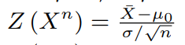

# Z-критерий

Это статистический метод, который используется для проверки статистических гипотез о средних значениях
нормально распределённых генеральных совокупностей, когда известна дисперсия или стандартное отклонение совокупностей.
Этот тест основан на Z-статистике, которая следует стандартному нормальному распределению (Z-распределению).

## Математическое описание

Z-статистика для одной выборки вычисляется по формуле:

## Применение Z-критерия
Тестирование одной выборки: Используется для проверки гипотезы о том, что среднее значение выборки равно предполагаемому
среднему генеральной совокупности.
Тестирование двух независимых выборок: Применяется для сравнения средних двух разных генеральных совокупностей.
Для пропорций: Может использоваться для проверки гипотез о пропорциях, например, в задачах бинарной классификации.
Предпосылки для использования Z-критерия
Нормальное распределение: Данные в выборках должны быть распределены нормально, особенно для малых выборок. Для больших
выборок (примерно от 30 наблюдений) центральная предельная теорема позволяет пренебречь этим требованием.
Известная дисперсия генеральной совокупности: Это одно из ключевых требований для применения Z-теста. Если дисперсия
неизвестна, чаще используется t-критерий.

## Практическое применение
Z-критерий находит широкое применение в различных областях науки и бизнеса, например, в медицинских испытаниях для
сравнения эффективности лекарств, в маркетинговых исследованиях для оценки реакции на рекламные кампании, и в
социологических опросах для сравнения ответов разных групп.

## Оценка результатов
Результат Z-теста интерпретируется через p-значение, которое показывает, насколько вероятно получить наблюдаемые или
более экстремальные различия между выборками, если бы нулевая гипотеза была верна. Обычно, если p-значение меньше
установленного уровня значимости (например, 0.05), то нулевая гипотеза отвергается.